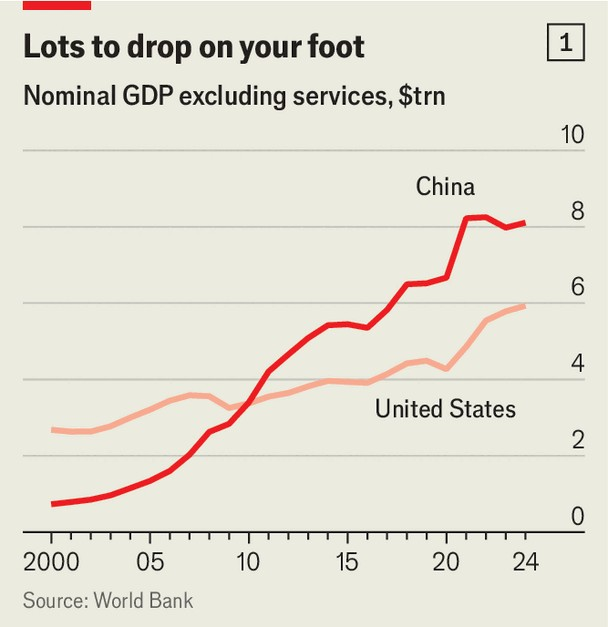
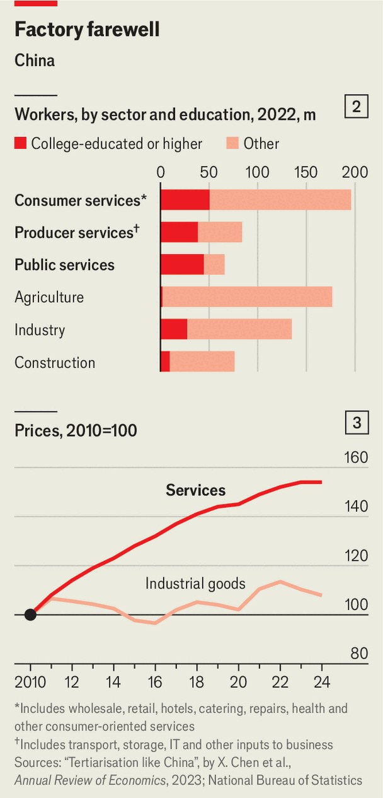

Finance & economics | Pressed into service
Can China cope with a deindustrialised future?
Communist Party officials face a difficult ideological turn

August 21st 2025
  

  
Amid all the trouble facing China—trade war, covid-19, a property slump—  
the country’s leaders have remained confident about the source of future  
economic growth. In their view, the country’s manifest destiny lies in high-  
tech manufacturing. Their “Made in China 2025” plan, released ten years  
ago, aimed to turn China into a leading factory “powerhouse” by mid-  
century. The government covets what it calls a “complete” industrial system,  
which will reduce China’s reliance on foreigners and raise their reliance on  
it. Xi Jinping, China’s ruler, wants to cultivate “new productive forces” by  
applying cutting-edge technology to emerging industries, and some  
traditional ones, too.
This strategy has met with considerable success. In February the government  
said that high-tech manufacturing had grown by 8.9% last year, much faster  
than the economy as a whole. The country’s breakthroughs in artificial  
intelligence, batteries, drones and robots have given America a fright. And  
although China’s GDP, when converted into dollars at market exchange  
rates, still lags behind America’s, its output of goods—things you can drop  
on your foot—has long since surpassed its rival’s (see chart 1).

But China’s preoccupation with high-tech industry is running into limits.  
The fast expansion of manufacturing capacity has flooded markets abroad  
and led to vicious price wars at home. For the past year, China’s leaders  
have inveighed against “involutionary” competition—efforts to gain market  
share that oblige rivals to follow suit, hurting everyone’s profits. This  
campaign may be beginning to bite. In July fixed-asset investment in  
manufacturing fell compared with a year earlier.

China’s leaders are also starting to emphasise an alternative, less familiar  
source of growth: services. In July the Communist Party’s Politburo  
announced that “new growth areas for service consumption must be  
fostered.” This month the central government said that it will subsidise loans  
for firms in consumer-facing services, such as entertainment, tourism, sport,  
and child, health and elderly care. Many people now spend more on services

than they do on goods, pointed out Wang Bo of the Ministry of Commerce.  
That shift will accelerate as incomes rise, he argued, creating significant  
“growth potential”.

Services, sometimes called the “tertiary” sector, now contribute 57% of  
China’s GDP and employ 49% of its citizens, many well educated (see chart  
2). According to Zheng Song of the Chinese University of Hong Kong, over  
36% of them have some college education. But services do not loom large in  
Communist ideology or iconography. The flag of the People’s Republic  
features a hammer and sickle (symbols of industry and agriculture) but no  
quill or till to represent the rest of the economy. In its early decades, the state  
hardly bothered to count many of these contributions. Its early statistical  
system, based on a Soviet model, tracked only “material” services, which  
included catering, transport, post and telecommunications. That would leave  
out 60% of today’s service economy.

Even now, some services fly under the government’s radar. The authorities  
find it hard to price the housing services enjoyed by people who own the  
flats they occupy. According to Nick Lardy of the Peterson Institute for  
International Economics, a think-tank, housing services are still probably  
undercounted by several percentage points of GDP. And official sources do  
not always agree with one another. The latest economic census, released

earlier this year, found 411m people working in the service sector in 2023,  
including the self-employed. That is 55m more than previously estimated  
from other official surveys.

The party’s five-year plans have in the past promised to lift the share of  
services in the economy as a step towards “rebalancing”. But that vow was  
dropped in the last plan, which covered the period from 2021 to 2025, points  
out Adam Wolfe of Absolute Strategy Research, a consultancy. Instead, it  
promised to keep manufacturing roughly stable as a share of GDP.

Mr Xi may fear a phenomenon christened “cost disease” by William  
Baumol, an economist. Many labour-intensive services, he wrote, have  
limited scope for productivity gains. His best example was musicians: if it  
took four people half an hour to perform a Boccherini string quartet in 1800,  
it requires the same labour today. And yet services must compete for  
workers with other sectors, such as manufacturing, in which productivity has  
soared.

Owing to these productivity improvements, manufacturers can pay higher  
wages without raising prices. Service industries, on the other hand, have to  
charge more if they wish to pay more—and they must do so if they want to  
match rising wages elsewhere in the economy. Baumol once calculated that  
a hypothetical manufactured good which cost the same as a concert ticket in  
1800 would have cost a twentieth as much in the 1980s.

In China, too, prices for services have grown faster than prices for industrial  
goods (see chart 3). If, as Mr Wang suspects, people spend a rising share of  
their income on services, then the country seems set to experience cost  
disease. More expensive services will become a growing share of the  
economy, dragging down the country’s average rate of growth.

The forces Baumol described are universal. But other constraints on China’s  
service industries are peculiar to the country. The state, for example, owns  
all   
the   
biggest   
banks.   
State-owned   
enterprises   
also   
dominate  
telecommunications, collecting 78% of revenues. China regulates  
accountancy, law, retail and even estate agents more tightly than the average  
member of the OECD, a club of mostly rich democracies. And China’s  
urban sprawl makes it difficult to reap the economies of density that big
cities usually provide. A recent study by Yuejun Zhong of East China  
Normal University and Libin Han of Dongbei University of Finance and  
Economics calculated that if the government were to permit greater  
population density in China’s biggest metropolises, it could raise GDP per  
person in these cities by 9%.

Relaxing some of these impediments could improve the performance of  
China’s services, letting them lift pay without raising prices so quickly. Even  
if that proves hard, China’s leaders should not worry too much about cost  
disease. Although it sounds painful, it is not, strictly speaking, a malady at  
all. Rising service prices are driven by rising wages, which are something to  
be celebrated. And the spur for higher wages is dynamism in other  
industries. The cost of a concert might go up from one manufactured good to  
20, but that is only because other parts of the economy have become 20  
times more productive.

Moreover, in China’s case, these forces would bring a consolation. The only  
reason America’s GDP remains so much bigger than China’s is because  
American services fetch a higher price. That gap could narrow if China  
continues to spend more on the neglected “tertiary” sector of its economy.  
Baumol’s cost disease is nothing to fear. It could even be the force that  
finally makes China number one. ■

For more expert analysis of the biggest stories in economics, finance and  
markets, sign up to Money Talks, our weekly subscriber-only newsletter.

This article was downloaded by zlibrary from [https://www.economist.com//finance-and-economics/2025/08/21/can-china-cope-with-a-](https://www.economist.com//finance-and-economics/2025/08/21/can-china-cope-with-a-)
deindustrialised-future