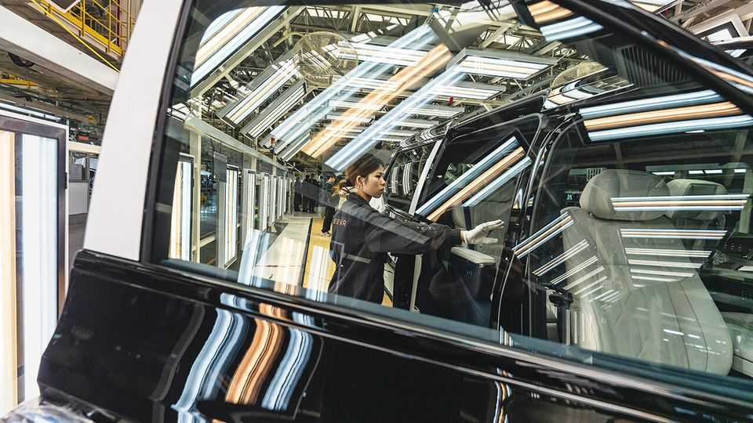

Finance & economics | Heading south
The green transition has a surprising new home
Forget about northern Europeans, with their coalition governments and  
love of cycling

August 21st 2025
  

  
Picture a country where renewables are being rapidly rolled out and electric-  
vehicle sales are surging, and you will probably have in mind somewhere  
smug and northern European; a place with tall people, coalition governments  
and a yen for cycling holidays. Or perhaps the first thing that pops into your  
head is the sheer scale of China, which manufactures the bulk of such  
equipment and last year contributed more than half of the global increase in  
solar and wind installation.

Think again. For a wave of Chinese-made electric vehicles is flooding new  
markets. In the past year sales of EVs have more than tripled in Turkey,  
where Togg, a local brand, is also popular—they now account for 27% of all
cars sold, making the country the fourth-largest European market. Last year  
more than 70% of cars imported into Nepal were electric. Some 60% of new  
cars sold in Ethiopia were battery-powered, after the state banned sales of  
internal-combustion-engine vehicles altogether. EV sales have doubled in  
Vietnam over the past year owing, in part, to VinFast, a local carmaker. Two-  
and three-wheelers are surging in popularity, too. The International Energy  
Agency (IEA), a forecaster, reckons that across developing countries in  
Africa, Asia and Latin America EV sales rose by 60% in 2024.

It is a similar story with renewables. In the first six months of the year,  
Pakistan generated 25% of its electricity from solar power—not far below  
the 32% managed by California, a clean-energy pioneer. The country’s  
battery imports are booming as well. Indeed, the Institute for Energy  
Economics and Financial Analysis, a think-tank, estimates that on current  
trends battery storage will cover 26% of Pakistan’s peak-electricity demand  
by 2030. Meanwhile, over the past year Morocco has increased its wind  
generation by 50%, becoming the country with the ninth most. India has  
seen four months of decline in coal-power generation, aided by an increase  
of 14% in renewable generation.

Although the principles of international climate diplomacy suggest that  
poorer countries, being less responsible for climate change, have less duty to  
go green, many face strong economic incentives to do so anyway. Most  
countries in the global south are energy importers, and therefore must use  
scarce foreign currency to buy oil and gas. China and India have coal  
reserves that play an important role in their economies and power  
generation, but neither has significant oil or gas reserves. For its part,  
Ethiopia’s ban on internal-combustion engines was not a green measure—it  
was designed to cut spending on fossil fuels and save foreign currency.

Moreover, across emerging markets, Chinese-made EVs are now about as  
cheap as traditional vehicles. In some places, they are even cheaper. The  
IEA reckons that last year the average Chinese EV sold for around $30,000  
in Thailand, compared with $34,000 for the typical petrol-engine car. At the  
bottom end of the market, old-fashioned vehicles still have an advantage, but  
only a relatively modest one. Government policies have also made a  
difference. In Turkey purchasers of EVs typically paid a tax of only 10%,  
compared with one of between 45% and 220% for petrol-powered vehicles.
The recent surge in part reflected car-buyers getting ahead of a reduction in  
the generosity of the policy.

Clean technology generally requires more upfront investment than fossil-  
fuel tech, even if it has lower lifetime costs. This has historically held it back  
in places where the cost of capital is high. The IEA has calculated that the  
typical cost of capital for a solar project in India, for instance, is 11%,  
compared with around half that in rich countries. But the Rocky Mountain  
Institute, an American pressure group, now estimates that, owing to falling  
prices, many clean technologies have reached “capex parity”, where initial  
costs are the same as fossil fuels on a per-unit basis. As a consequence, they  
have become more attractive in large parts of the world.

Tariffs have been helpful, too. As America and the EU attempt to shut out  
Chinese EVs, they are finding their way to other markets—at even cheaper  
prices. For the most part, emerging markets lack legacy manufacturers that  
will lobby their governments to keep out Chinese imports. Yet this relatively  
free trade is at risk as protectionism begins to spread. Until recently Brazil  
allowed EVs into its economy tariff-free; now it is gradually raising import  
taxes to 35% by 2026. India’s imports of finished solar panels have  
stagnated as the country seeks to build its own supply chain. Nigeria is  
considering banning solar-panel imports altogether in an effort to support  
domestic manufacturers.

Governments are at least also creating loopholes that allow Chinese imports  
to continue so long as the companies in question commit to local production.  
Brazil has carved out an exemption for BYD, a carmaker, while it  
establishes a factory in the country. Indonesia has reduced value-added tax  
on EVs from 11% to 1% for vehicles that meet a 40% local-content  
requirement; foreign manufacturers, meanwhile, can bring in equipment  
duty-free so long as they promise to increase domestic production by 2026  
and provide a guarantee for the forgone tariffs if they do not follow through.  
Such policies are far from perfect—but they are better than the alternative.  
Well-heeled northern Europeans have something to learn. ■

For more expert analysis of the biggest stories in economics, finance and  
markets, sign up to Money Talks, our weekly subscriber-only newsletter.
This article was downloaded by zlibrary from [https://www.economist.com//finance-and-economics/2025/08/21/the-green-transition-](https://www.economist.com//finance-and-economics/2025/08/21/the-green-transition-)
has-a-surprising-new-home