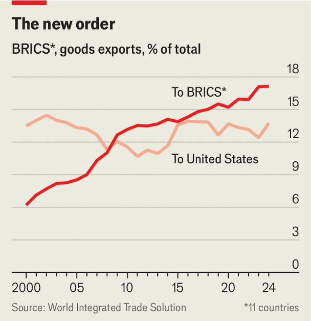

Finance & economics | Hedging against America
Trump’s trade victims are shrugging off his attacks
And China is gaining in the process
August 21st 2025

The “Trump Round” of trade negotiations, as Jamieson Greer, America’s trade representative, calls it, was meant to reassert American primacy. Peter Navarro, a longtime adviser to Donald Trump, even suggested that the president deserved a Nobel prize in economics for showing how the world’s biggest market can bend global commerce to its will. The White House’s bet is that dismantling the old order, once policed—however fitfully—by the World Trade Organisation, will usher in a new one with America at its centre. Yet by acting as if America remains the axis of world trade, Mr Trump may be accelerating its shift elsewhere. The world’s biggest market is less central

to global trade today than it once was. At the start of the century, America accounted for a fifth of global imports; today it makes up just an eighth. Even as countries strike tariff deals with Mr Trump to secure market access, they are drawing up alternatives. As one South Korean official puts it, “The first step is to make concessions to America. The second is to look elsewhere.”

Around the world, governments are hedging against the end of the old economic order in different ways. Some are propping up local firms with subsidies and protectionism. Others are seeking new markets. And the boldest are forging alliances to counterbalance America’s clout. The choice for many is not between deference to Washington or a Hobbesian state of nature, but between short-term fixes and longer-term alternatives.

Given Mr Trump’s predilection for levies and the tendency for taxes to outlast their creator, handouts to trade-war victims risk wasting money and distorting markets. Brazil has unveiled a $6bn credit package, which includes tax holidays and state-purchasing guarantees. With public finances already strained, the plan spooked investors. Canada has taken a similar approach, pledging nearly $1bn to support its lumber industry. South Africa’s trade ministry has proposed policies to let exporters co-ordinate on shipping costs and jointly build infrastructure, even if that means skirting antitrust rules.

Others are reaching for blunter tools. Canada and Japan are slapping new levies on metal imports. Meanwhile, India is doubling down on its “Made in India” campaign. On August 15th Narendra Modi, the country’s prime minister, extolled self-reliance in everything from energy to fighter jets. “If we continue to be vocal for local, we will achieve prosperity,” he declared. Although so far there has not been much retaliation against Mr Trump, the risk is that copycat protectionism multiplies, raising costs for everyone.

More promising is the search for new markets. From Asia to Africa, governments are nudging companies abroad with export funds and incentives. Singapore and South Korea, for instance, are bankrolling small firms to scout out opportunities in South Asia, the Middle East and Mexico. Some are already redirecting trade. South African farmers are sending more produce to China and pushing the EU to relax its citrus-health rules.

Lesotho’s garment-makers—once geared to American firms such as Gap and Levi’s—are turning to regional buyers and testing demand in Asia. Brazil’s coffee exporters, hit with an American tariff of 50%, are stepping up shipments to North Africa and the Middle East, where sales volumes rose by three-fifths last year. Yet even with such diversification, replacing America, still the destination for 16% of Brazil’s beans, will take time.

Most consequential are the new alliances. Canada and Mexico, America’s two neighbours and partners in the US-Mexico-Canada Agreement (USMCA) are edging closer as America becomes less reliable. Next month Mark Carney, Canada’s prime minister, will visit Mexico, where he is set to discuss supply-chain resilience, port-to-port trade and joint ventures in energy and artificial intelligence. With the USMCA up for review next year, the two countries are hoping to create leverage they can use against Mr Trump.

Many of the BRICS countries—a club of 11 emerging economies including Brazil, China, India, Russia and South Africa—have been targets of Mr Trump’s ire, most recently with his levies of 50% on Brazil and India. In response, Brazil’s president, Luiz Inácio Lula da Silva (known as Lula), has worked the phones to rally allies. On August 7th he and Mr Modi discussed closer ties, including digital-payments links that could chip away at the

dominance of American banks. Four days later Lula spoke with Xi Jinping, China’s leader, about deepening trade, after which Mr Xi declared relations with Brazil to be “at their best in history”. When it comes to trade, the bloc is hardly beholden to America. Uncle Sam buys only a sixth of Indian goods and a seventh of Brazilian exports, the latter down from a quarter two decades ago. As a group, the BRICS members now trade more goods with one another than with America and the gap is widening. Integration is accelerating after Mr Trump’s tariffs. Over a dozen countries, including Thailand and Vietnam, have sought partner-country status or applied to join.

The biggest winner from the new alliances may be China. Its exports to the global south have doubled since 2015—and it sells more to South and South-East Asia, Latin America and the Middle East than to America and western Europe. In July, even as exports to America collapsed, its overall exports grew by 7% from a year earlier. Mr Trump’s tariffs have deepened these links. In June Mr Xi pledged to scrap nearly all duties on imports from Africa, and he is attending summits with Latin American and South-East Asian leaders. China and the Association of South-East Asian Nations— together home to a quarter of the world’s people and a fifth of its GDP—are revamping their free-trade deal, due to be ratified by the year’s end. Relations with India, meanwhile, are thawing. Indian firms are exploring projects with Chinese counterparts in electric vehicles and batteries; Mr Modi is expected to visit China for the first time in seven years. Mr Trump wanted America at the centre of world trade. Things are not quite going to plan. ■

For more expert analysis of the biggest stories in economics, finance and markets, sign up to Money Talks, our weekly subscriber-only newsletter.

This article was downloaded by zlibrary from https://www.economist.com//finance-and-economics/2025/08/20/trumps-trade-victims- are-shrugging-off-his-attacks