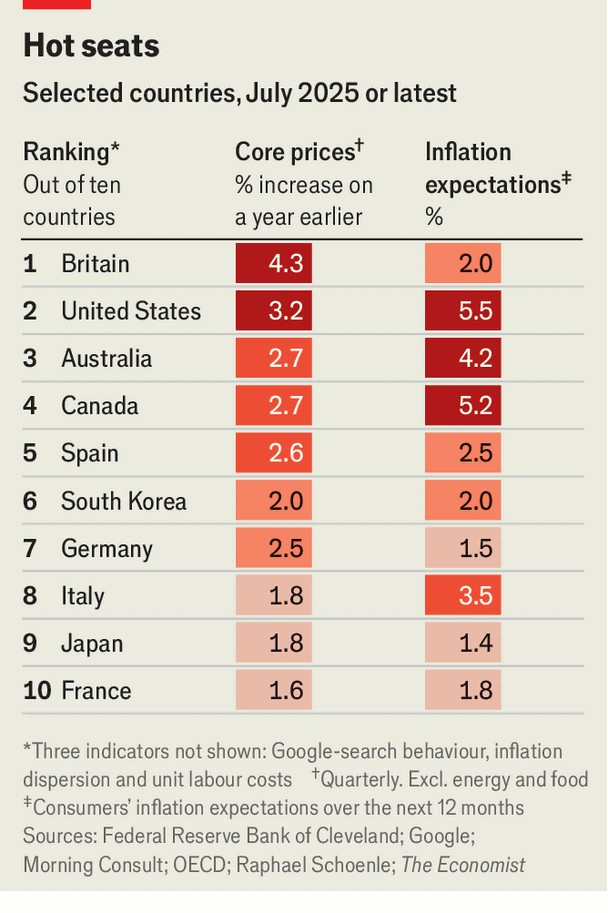

Finance & economics | Farshlepteh krenk
Where has the worst inflation problem?
We update our entrenchment measure
August 21st 2025

The Yiddish phrase “farshlepteh krenk”, untranslatable into English, describes an illness that just won’t go away. That is how some countries’ experience of inflation has felt. The rate of price rises has fallen since 2022, when across the OECD, excluding Turkey, it rose to 11%, its highest since the 1970s. In June average inflation across the club of mostly rich countries was 2.5%, only a smidge above most central banks’ targets. But many Anglophone countries still have lingering symptoms. To diagnose the malaise more accurately, we have updated our measure of “inflation entrenchment” for ten rich countries. We construct this from five indicators: core inflation, unit labour costs, inflation dispersion, inflation

expectations and Google-search behaviour. We rank each country on each indicator, then combine the rankings to form an overall score.

The results reveal a linguistic divide. Countries in the EU and Asia perform well. France now has the least entrenched inflation of all the countries we looked at. Chapeau bas to them. Japanese inflation, true to form, has a feeble grip.

In the English-speaking world, however, inflation looks chronic. Britain has done worst overall. In the year to the second quarter of 2025 the country’s core prices, which exclude food and energy, rose by 4.3%. Three-quarters of the items in a Briton’s consumer basket have risen in price by more than 2% —unusually high “inflation dispersion”. Australia is not far behind, with workers’ pay per unit of output nearly 5% higher in the first quarter than a year before. Despite a weaker economy than its southern neighbour, Canada’s inflation problem is almost as bad.

A few factors may explain inflation’s persistence in these places. From 2022 to 2024 the governments of Anglophone countries, on average, increased their budget deficits by 2% of GDP, while those elsewhere contracted. This largesse boosted demand—the equivalent of licking doorhandles in an attempt to fight off an illness. English-speaking countries have also

welcomed lots of immigrants in recent years. At least in the short run, the new arrivals may push up the prices of certain things, especially housing.

There is some good news, too. The absolute level of inflation entrenchment has ebbed: Japan, the country with the least bad problem when we updated this measure in 2024, would have ranked sixth-worst this time. The Bank of England can argue that Britons’ weak inflation expectations will help price pressures fade. The Bank of Canada can highlight low inflation dispersion. In addition, most Anglophone governments are tightening fiscal policy and slashing immigration.

America is the exception. Immigration is declining, but Uncle Sam still has his foot on the fiscal pedal. And tariffs have stoked fears of more price rises, as firms pass their higher costs on to consumers. Americans are more likely than others to Google inflation-related terms. Over the coming year, the public expects prices to rise by 5.5%, higher than people in any other country. A lingering illness is annoying; a worsening one is harder to bear. ■

For more expert analysis of the biggest stories in economics, finance and markets, sign up to Money Talks, our weekly subscriber-only newsletter.

This article was downloaded by zlibrary from https://www.economist.com//finance-and-economics/2025/08/17/where-has-the-worst- inflation-problem