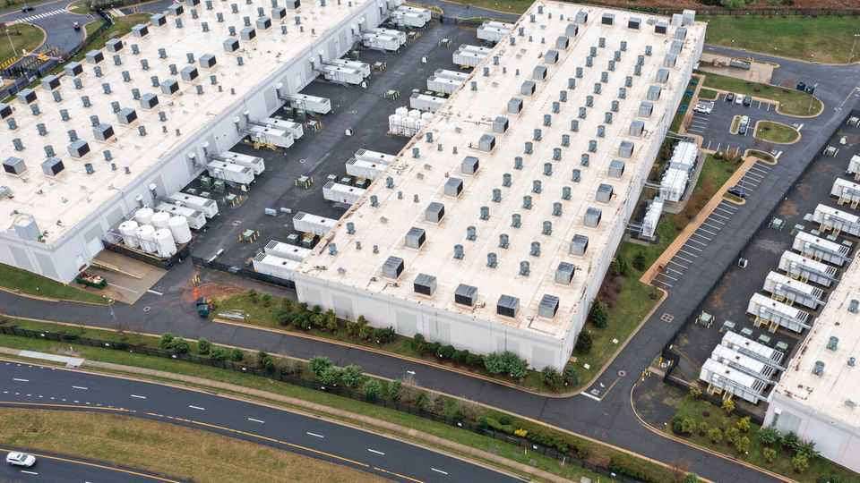
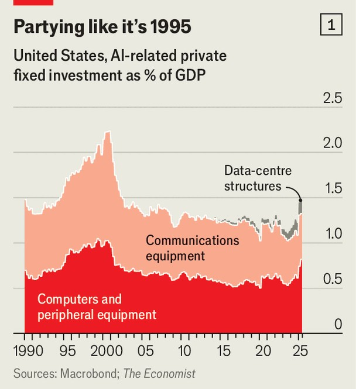
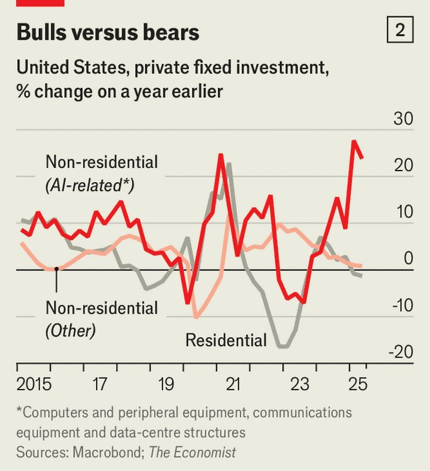

Finance & economics | Tech support
How America’s AI boom is squeezing the rest of
the economy

Beware the data-centre takeover

August 21st 2025
  

  
If artificial-intelligence models have a hometown, it is probably Ashburn,  
northern Virginia, just outside Washington, DC. Attentive window-seaters  
flying into Dulles airport might notice a clutch of white-roofed boxes jutting  
out next to rows of suburban culs-de-sacs. Those data centres are part of a  
cluster—the world’s biggest—which last year guzzled more than a quarter of  
the power produced by Virginia’s main electrical utility.

Fears of a slowdown abound in America, with high interest rates and tariff  
chaos weighing on most of the economy. But they are doing little to reduce  
the breakneck pace at which firms are building the infrastructure needed for  
AI. Something like a sixth of the 2% rise in American GDP over the past
year has come from investments in computer and communications  
equipment, including chips, and data centres. Add in the grid upgrades to  
power AI models, plus the intellectual-property value of the software itself,  
and one estimate puts the boom’s contribution to GDP growth at 40%. It is  
an astonishing figure for a sector that accounts for just a few per cent of  
America’s total GDP.

The AI build-out is not a normal investment boom. Until recently, big tech  
firms paid for most of it from their earnings and cash piles. Now the scale of  
construction is too great even for these giants, so they are turning to  
borrowing. They are building data centres in the belief that AI will drive  
explosive economic growth, and hence demand for computing power, within  
a matter of years. This is not like building houses or factories. It is a high-  
reward, winner-takes-all market, in which ordinary concerns such as the cost  
of borrowing are easy, and tempting, to wave away.

That is just what the big tech firms are doing. In the face of their  
determination to build AI infrastructure at any cost, higher interest rates  
offer little deterrence. Neither does the cost of electricity: schemes for  
gigawatt-scale data centres, demanding as much power as a small city, are  
increasingly in vogue. Grids across the country are bracing for a squeeze.

If the history of the dotcom boom in the late 1990s is anything to go by, the  
mania could have much further to run. Then, the roll-out of costly  
technology required to build the internet continued for many years, with a  
much sharper impact on GDP than America has experienced so far as a  
consequence of AI (see chart 1). And the early enthusiasm for AI has  
probably been even greater than that in the internet’s youth. For all the Y2K-  
era excitement, few expected the web to lead to mass automation or  
unprecedentedly fast economic growth. Both are now fairly mainstream  
predictions about AI among the Silicon Valley set, even if the incremental-  
seeming progress of OpenAI’s GPT-5 model has dampened the frenzy a  
touch.

The trouble is that the very industry powering so much of America’s  
economic growth is squeezing the rest of its output. Housebuilders, for  
instance, cannot afford to be blithe about higher borrowing costs. Nor can  
plenty of regular businesses. Data centres have also constrained the rest of  
the economy by keeping energy prices high. Average American electricity  
bills have risen by 7% so far in 2025, at least in part because of the extra  
strain that data centres have put on the country’s grids.

Sure enough, look beyond AI and much of the economy appears sluggish.  
Real consumption has flatlined since December. Jobs growth is weak.

Housebuilding has slumped, as has business investment in non-AI parts of  
the economy (see chart 2). Both activities are highly sensitive to interest  
rates, and so act as bellwethers for output more broadly.

In other words, an economy-wide reallocation is under way: interest-rate-  
and energy-sensitive sectors are contributing less to growth, while AI  
investment contributes more. And if it is to continue to do so, big tech firms  
must continue to increase spending. Any slowdown in capital expenditure—  
say, if constraints on power or chip availability bite—would mean less  
support for overall economic growth.

Should that happen, there would be the silver lining that interest rates and  
energy prices would probably fall, too, which would ease the pressure on the  
rest of the economy. History carries a warning, though. After the dotcom  
boom came a ferocious bust. A similar drop in AI investment would remove  
a sizeable source of America’s growth just as the rest of the economy has  
begun to look fragile. If desire for data centres cools, it is not just Ashburn  
that might be in trouble. ■

For more expert analysis of the biggest stories in economics, finance and  
markets, sign up to Money Talks, our weekly subscriber-only newsletter.

This article was downloaded by zlibrary from [https://www.economist.com//finance-and-economics/2025/08/18/how-americas-ai-boom-](https://www.economist.com//finance-and-economics/2025/08/18/how-americas-ai-boom-)
is-squeezing-the-rest-of-the-economy