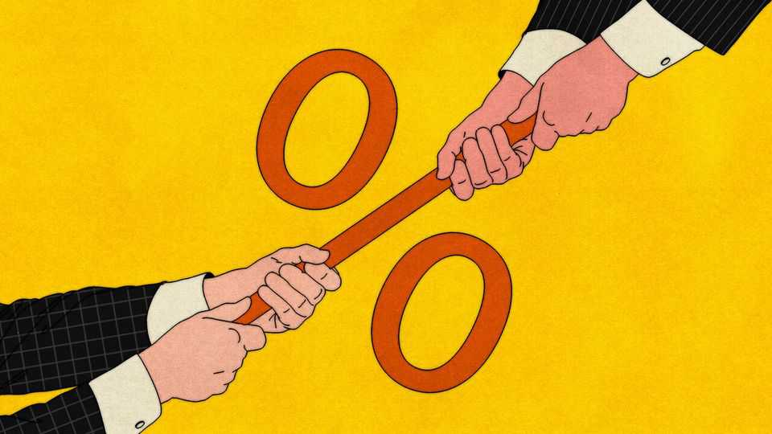

Finance & economics | Free exchange
Economists disagree about everything. Don’t they?
Their discipline is famous for its fissiparousness

August 21st 2025
  

  
When President Donald Trump fired Erika McEntarfer, America’s labour  
statistician, he achieved something supposedly rare: he got economists to  
unite. In a survey by the University of Chicago’s Clark Centre for Global  
Markets, 100% of the discipline’s most prominent practitioners agreed that  
there was no evidence the Bureau of Labour Statistics (BLS) was biased.

Over history, economists have disagreed a lot. The 18th century saw  
classical types spar with mercantilists; the mid-20th pitted Keynesians  
against monetarists. More recent decades have set champions of rational  
expectations and efficient markets against behavioralists. Sometimes  
disputes remain cloistered in academia; often they spill into the public
square, in arguments over minimum wages, debt sustainability and  
monetary-policy rules.

George Bernard Shaw is said to have joked that if all economists were laid  
end to end, they still would not reach a conclusion. Winston Churchill  
suggested that, if you wanted two opinions on a matter, you should put two  
economists in a room. The Trump era, however, has ushered in seemingly  
unprecedented unity. Each new White House directive invites the collective  
ire of a profession famous for its fissiparousness.

Since 2011 the Clark Centre has polled economists on topical issues such as  
cryptocurrencies, fracking and inequality. Some questions, such as that about  
the BLS survey, might seem straightfoward; others are trickier. Recent  
surveys have asked about the effectiveness of sanctions on Russia, if foreign  
aid can raise GDP growth and whether climate change threatens financial  
stability. And although Mr Trump has inspired consensus on a number of  
issues, even before his arrival economists were more united than their  
caricature suggests. On over a quarter of questions, respondents who register  
an opinion in one direction lean the same way as the others; on most, more  
than nine in ten are like-minded.

In almost every question on trade policy—be it about NAFTA or whether  
commerce with China has left Americans better off—economists defend free  
trade. None of them agrees with the statement that “higher import duties…to  
encourage producers to make [in America]…would be a good idea”; only a  
handful think such tools can even substantially affect the trade deficit. Taxes  
are another hot-button issue that elicit less controversy than might be  
expected. Pigouvian taxes are popular; Laffer curves are not. Few  
economists thought that extending tax cuts from Mr Trump’s first term  
would meaningfully boost GDP; most agree that restoring the top marginal  
rate to 39.6% would not impede growth.

The list of agreed-upon statements does often read like a catalogue of  
presidential rebukes: vaccine refusal imposes externalities; politicising  
monetary policy is folly; sovereign-wealth funds and strategic crypto  
reserves serve little purpose; bans on high-skilled immigration would sap  
America’s research-and-development leadership, push businesses abroad,  
hurt average workers and do little to boost employment.
A Trump supporter might survey this scene and reach an obvious  
conclusion: that economics is less a science than a guild dominated by  
conformist elites. But although many economists have an instinctive dislike  
of the president, such a charge cannot explain why the panel is equally  
sceptical of traditionally left-wing policies, like interest-rate caps and rent  
control, as of right-wing policies, like self-financing tax cuts. Or why  
experts are as likely to agree that “rising inequality is straining the health of  
liberal democracy” as they are to disagree with Thomas Piketty’s claim that  
the blame for this lies with the fact that returns on capital are rising faster  
than economic growth. There is, to be sure, shared respect for free markets,  
but one that is nuanced enough to accommodate support for bank bail-outs  
and congestion pricing.

That is why the disagreements revealed by the Clark Centre’s survey are  
more telling than the consensus. Antitrust is one fault line. Economists are  
split on whether American airline mergers should have been approved,  
whether big tech platforms ought to be broken up and whether artificial-  
intelligence firms merit scrutiny. Financial regulation is another. Economists  
broadly agree that oversight is required, including of the non-bank  
intermediaries that now make up much of the financial system. But ask what  
optimal regulation would look like and dissent quickly emerges. Would  
Americans be better off if the size of banks was capped at 4% of the  
industry’s assets? Should America increase the deposit insurance available  
to customers? On these questions, no more than 60% of experts populate a  
side.

What do antitrust and regulation share that tariffs and migration do not? Part  
of the answer concerns the nature of the trade-offs. Antitrust weighs the  
costs of market power against efficiencies of scale; financial regulation pits  
stability against growth. By contrast, the net effects of free trade or high-  
skilled immigration are clearer. On trade and migration there are reams of  
evidence across countries and decades. Antitrust cases and financial crises  
are rare, idiosyncratic and hard to generalise about. Thus it is easier to gauge  
the effects of a tariff than to know what would have happened had a bank  
run been allowed to proceed. Economists, in the end, can be only as  
confident as the data let them be.
This leads to the last category of interest from the Clark Centre’s polls: those  
questions on which economists report great uncertainty. If there is a common  
thread here, it is novelty. Will AI lead to larger increases in GDP per person  
than did the internet? Will stablecoins account for a substantial share of  
payment flows in ten years’ time? Does the growth of private credit raise  
systemic financial risk? Economists may be willing to take on the president;  
they are less willing to take a punt on the future. ■

Subscribers to The Economist can sign up to our Opinion newsletter, which  
brings together the best of our leaders, columns, guest essays and reader  
correspondence.

This article was downloaded by zlibrary from [https://www.economist.com//finance-and-economics/2025/08/21/economists-disagree-](https://www.economist.com//finance-and-economics/2025/08/21/economists-disagree-)
about-everything-dont-they
Science & technology
 
RFK Jr’s attack on mRNA technology endangers the world  
AI-powered robots can take your phone apart  
Old fossil-fuel plants are becoming green-energy hubs  
Should you use a standing desk?