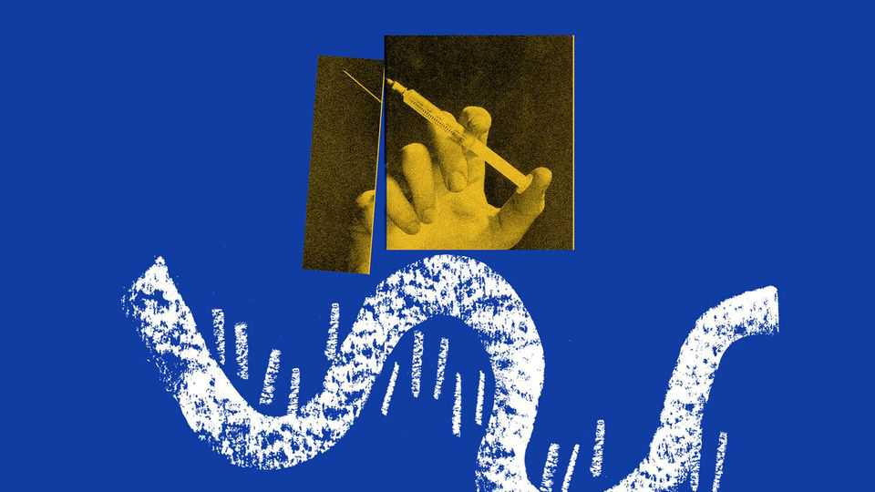
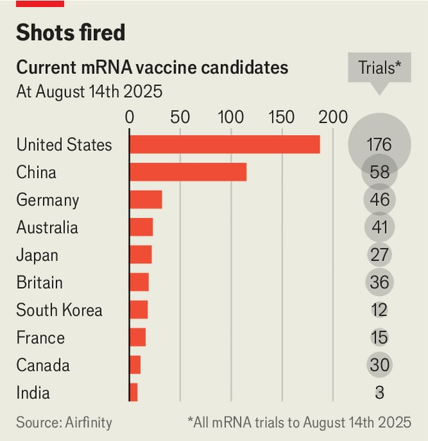

Science & technology | Shooting the messenger
RFK Jr’s attack on mRNA technology endangers the world
His cuts will not just hurt vaccines
August 21st 2025

DURING THE covid-19 pandemic new vaccines were rolled out with unprecedented speed. The fastest to arrive were jabs built from molecules of messenger RNA (mRNA) designed to teach the body how to fight off the disease-causing virus. By late 2021, mRNA vaccines had saved an estimated 7.7m lives globally, including most of the 3m Americans whom the Commonwealth Fund, an American health-care charity, estimates were saved by vaccines before 2023. President Donald Trump was one of the technology’s many supporters. He launched Operation Warp Speed, a programme that started the race to deliver vaccines. He even received an mRNA shot and advocated (albeit

gently) for their use. Yet today many Americans are suspicious of these jabs. The speed with which they were developed and approved, coupled with sweeping vaccine mandates and a political push by the Biden administration to give booster shots ahead of any such decision being made by scientists at the drug regulator, caused anger and mistrust. Rampant disinformation has further stirred the pot, leading many to wrongly believe that mRNA vaccines have killed or harmed millions of people.

Robert F. Kennedy junior, Mr Trump’s health secretary, is known for his opposition to vaccines in general and mRNA in particular. Earlier this month, citing safety concerns that scientists have discredited, his department terminated 22 mRNA-related contracts worth a total of nearly $500m across academia and industry. America, said Mr Kennedy, was moving beyond the “limitations of mRNA and investing in better solutions”. The move is not an isolated one. In May Mr Kennedy’s department cancelled $766m in funding for a late-stage human mRNA vaccine against bird flu and work on five subtypes of influenza with pandemic potential. America also gave up the rights to purchase bird-flu shots from Moderna, a company with which it had previously collaborated to deliver these vaccines.

Rick Bright, the former boss of the Biomedical Advanced Research and Development Authority—the division of the health department that had funded the grants—wrote in the New York Times that the latest decision undercut “one of the most significant medical advances in decades…that could protect millions more people from the threats ahead”. This is no understatement. In the years since the pandemic, mRNA has emerged as a powerful new “platform” technology; one that can be used not only to design new pandemic-busting vaccines, but also to create medicines for infectious diseases, rare genetic illnesses and cancer. The rapidity with which mRNA can be designed and manufactured makes it ideally suited for creating a new generation of personalised medicines. The cuts risk making the world a more dangerous place.

To assess the impact of these measures, The Economist spoke to more than half a dozen experts. Most declined to be quoted on the record. “Everyone is trying to do everything we can to avoid the glare of RFK,” said one source at a research-funding institution. He explained that his organisation was removing references to RNA wherever possible and trying to work out

alternative ways of describing it. This is an infuriating task, he says. “It is a bit like...saying you can’t use the word carbon.”

mRNA is similarly fundamental to biology. It is the specific type of RNA that acts as a messenger molecule, carrying instructions from a cell’s DNA to protein-production units known as ribosomes. The ability to harness mRNA—as well as related biological molecules in the cell—has given medicine an enormously powerful tool. Scientists can now instruct the body to manufacture therapeutic proteins; train the immune system to fight diseases, including cancers; and even silence harmful signals in cells, such as faulty instructions caused by a genetic disease or genetic information from a virus seeking to use the cell’s machinery to replicate itself.

Mr Kennedy has implied his department’s cuts are limited to mRNA vaccines for respiratory infections. But this does not appear to be the case. Biospace, an online publication, reports that research into filoviruses such as Ebola—which are not respiratory but cause haemorrhagic fevers through direct contact with bodily fluids—has also lost funding.

Other cuts target treatments rather than vaccines. One such casualty is ModeX, a biotech firm based in Massachusetts, which is developing therapeutic antibodies. An antibody infusion—which is distinct from a vaccine—can be lifesaving for patients struggling to fight off a virus. ModeX is engineering mRNA that, when introduced into the body, instructs it to create antibodies able to attach to more than one location on a given virus, which should make them more potent.

Some affected research appears to have nothing to do with mRNA at all. Fierce Biotech, another online outlet, noted that Tiba Biotech in Cambridge, Massachusetts, had been developing a flu treatment based on RNA interference (RNAi)—a different technology altogether—when it lost funding. It sought to create a tiny RNA molecule that would interfere with the production of viral proteins in the body, potentially blocking the virus from replicating.

But perhaps the most significant impact of the cuts will be on the world’s ability to produce vaccines against a future pandemic. America is the global leader in mRNA-vaccine research; according to Airfinity, a life-sciences data firm, it is currently home to trials for almost 40% of mRNA vaccine candidates (see chart). In the years prior to the pandemic the government spent $337m funding research related to mRNA technology that would eventually lead to the covid-19 vaccines, a figure unmatched by any other country.

Some hope that investors will work around the government’s disdain for respiratory mRNA vaccines and continue to invest in RNA therapeutics more broadly. But there are already signs of trouble: one industry source says that the administration’s hostility—particularly in the form of inaccurate comments made about the safety of mRNA vaccines—is already having a chilling effect. The cost of manufacturing mRNA will probably rise and young talent and seasoned experts could leave the field, hampering innovation in an area of biology rich in applications.

This may in particular hurt the development of personalised cancer vaccines, a promising mRNA-based technology to treat tumours. OncoDaily, an online publication, suggests that the funding cuts could increase per-patient manufacturing costs by 20-40% and extend production timelines by two to

six weeks. Slower speeds of delivery can give a tumour time to spread and may, therefore, reduce the efficacy of a vaccine. Trials may also be forced to slow down or move abroad.

There are few precedents for such a sequence of events. When George W. Bush’s administration restricted funding for embryonic stem-cell research in 2001, some scientists did eventually move abroad. Britain benefited; it became a global hub for research on embryonic stem cells. The cuts also pushed American researchers to innovate in other areas, leading to the advancement of pluripotent stem cells. The current administration hopes to repeat the trick by developing conventional whole-vaccine platforms to tackle pandemics. But it seems unlikely that these could ever be developed as quickly as mRNA jabs, which some experts reckon could be turned around in 100 days.

As for where mRNA expertise may go, there are whispers of interest from Saudi Arabia, Switzerland and the United Arab Emirates. Britain is actively competing for it, says one British source. Peter Piot, a professor of global health at the London School of Hygiene and Tropical Medicine and, until recently, an adviser to Ursula von der Leyen, president of the European Commission, thinks that the European Union should step forward and launch a special initiative to pick up the ball that America has dropped. One can only hope that his call is heeded before the next deadly pandemic arrives. ■

Curious about the world? To enjoy our mind-expanding science coverage, sign up to Simply Science, our weekly subscriber-only newsletter.

This article was downloaded by zlibrary from https://www.economist.com//science-and-technology/2025/08/20/rfk-jrs-attack-on- mrna-technology-endangers-the-world