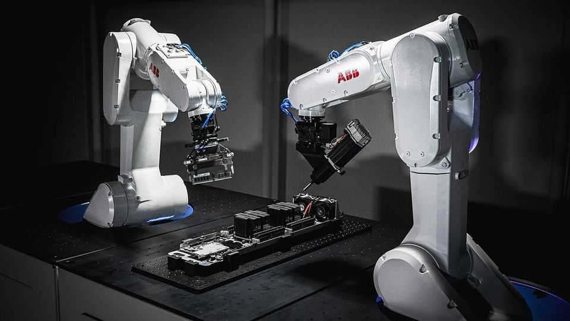
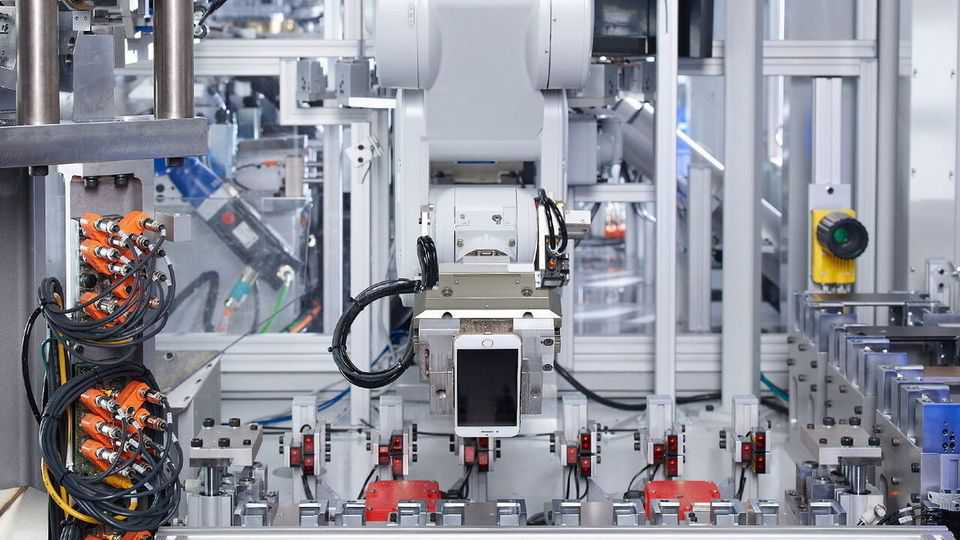

Science & technology | Pass the screwdriver
AI-powered robots can take your phone apart
They will make recycling electronics much more efficient
August 21st 2025

THE WORLD’S rubbish heaps are filling up with valuable electronics. According to the UN, some 62m tonnes of e-waste were produced in 2022, enough to fill a line of lorries parked bumper-to-bumper around the equator. Only 22% is recycled. Most of the rest ends up in landfills or incinerators, where in 2024 recoverable raw materials worth $63bn went to waste. That figure is expected to grow to more than $80bn by 2030. Getting those materials out of the rubbish is a challenge. Many are contaminated when e-waste is crushed during recycling, which can limit the effectiveness of specialist extraction techniques. The process is made more straightforward if products are disassembled and their components sorted by composition before crushing. Copper can then be recovered from wiring.

Gold, silver and other precious metals can be leached from circuit boards, along with cobalt, lithium, manganese and nickel from batteries. Rare-earth magnets can be pulled from electric motors.

The trouble is that disassembly is labour-intensive and costly. Automation is also tricky: robots are good at putting together a specific item but struggle to recognise and take apart the thousands of different devices that end up in the rubbish. A new generation of robots powered by artificial-intelligence (AI) models, however, looks to be up to the job.

Some of these AI-assisted robots are being developed for in-house recycling schemes run by manufacturers, who have an intimate knowledge of how their products are put together. Apple, for example, uses a system called Daisy. A decade ago, an early version could dismantle only one type of iPhone; now, with the help of AI, Daisy can handle more than 20. Microsoft is developing a robot to disassemble computer hard drives. These are usually crushed whole to destroy any sensitive data, but if the drives are dismantled, only the platters containing data need be crushed. ABB, a Swedish-Swiss electrical-engineering company, is working with Molg, an American recycler, on a network of robotic “minifactories” to dismantle and recover material from the electronics used in vast data centres.

José Saenz and his team at the Fraunhofer Institute for Factory Operation and Automation in Magdeburg, Germany, have a still more ambitious goal. They are deve-loping a robotic system that can be used in a general recycling centre, where it would need to be flexible enough to dismantle a wide variety of e-waste, ranging from phones to electric-vehicle batteries, LED screens and solar panels. Their starting-point is an AI-assisted robot that can disassemble old desktop PCs, many of which are more than a decade old.

The first thing the team’s robot does is identify any product it is offered. A camera photographs the item and compares the snap with pictures of different PCs. The robot also scans any labels and product codes to check whether service manuals or other disassembly tips are available online. It can search for other clues, in much the same way ChatGPT might, when asked a similar question, turn up videos posted online by people who have done the job before. All this information is analysed and stored in the robot’s memory, where it can be updated and used for reference the next time such a product comes into the recycling centre.

Once the identification is complete, the AI system then determines which components are worth removing, either in the form of raw materials or as complete parts to be refurbished and used again. It also checks the integrity of rivets, screws and other fasteners, because years of wear, tear and repair mean some parts may need to be cut out. Analysis done, the AI generates a disassembly sequence to operate the robot’s arms. These are equipped with a selection of tools, such as drills, grippers and screwdrivers, to remove and sort items.

So far, the team has got each stage in the disassembly process working in separate machines. They are now linking these together into a single robotic device able to complete the whole process.

Once dismantling PCs has been mastered the team will train robots to tackle other products. The learning process will take time. Dr Saenz thinks it could be five years until they develop a commercial disassembly robot that could usefully work at a recycling centre taking apart anything from PCs to white goods and televisions. Firms that want to recycle their own, limited range of products could probably put together something more quickly.

A multi-purpose robot would probably be popular, since companies are under increasingly fierce legislative pressure to take responsibility for the end-of-life management of their products, either directly or by employing specialists to recycle for them. The rise of smarter spanner-wielding robots, therefore, should encourage more firms to ensure their products are useful in death, as they were in life. ■

Curious about the world? To enjoy our mind-expanding science coverage, sign up to Simply Science, our weekly subscriber-only newsletter.

This article was downloaded by zlibrary from https://www.economist.com//science-and-technology/2025/08/20/ai-powered-robots-can- take-your-phone-apart