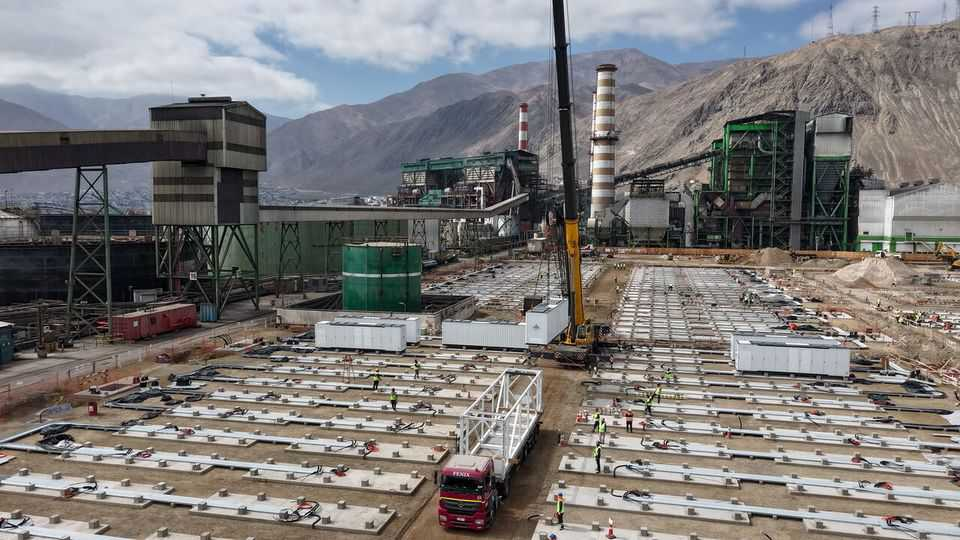

Science & technology | Oil’s well that ends well
Old fossil-fuel plants are becoming green-energy
hubs

The dirtiest parts of the energy system could help build the cleanest 

August 21st 2025
  

  
FOR MORE than a decade the Tamaya power station in the Atacama desert  
in northern Chile powered its local region using diesel. Today a shimmering  
array of solar panels stands in place of the dirty generator. Engie, the French  
utility that owns the power station, converted it into a solar-energy and  
battery-storage plant earlier this year. Juan Villavicencio, the company’s  
boss in Chile, describes the site as a place where “the past and future of  
energy infrastructure meet”.

Others share his vision. Developers, governments, startups and utilities  
around the world are turning former fossil-fuel power stations, and old oil  
and gas wells, into renewable-energy plants and testbeds for green
technology. This way the relics of the fossil-fuel era will be put to good use.  
“It makes no sense to just throw [them] away,” says Arash Dahi Taleghani,  
an engineer at Pennsylvania State University.

According to the Carnegie Endowment for International Peace (CEIP), a  
think-tank, there are around 170 ongoing or completed projects to transform  
old fossil-fuel power stations into renewable-energy plants (see map). The  
trend is spreading across the world, says Milo McBride, a research fellow at  
the CEIP. China, for instance, recently announced its first project—parts of  
the Baotou coal power plant in Inner Mongolia will be turned over to wind  
and solar generation, as well as battery storage.

The sites offer connections to the grid, which can save developers looking to  
get renewable-energy projects online lengthy delays. Researchers led by  
Umed Paliwal at the University of California, Berkeley, have found that  
1,000 gigawatts (GW) could be added to the American grid capacity if  
renewable-energy projects were hooked up to existing fossil-fuel plants and  
probably more if retired sites were exploited. According to the International  
Energy Agency, an official body, renewable-energy projects that could  
generate about 3,000 gigawatts (GW) worldwide are waiting for a grid  
connection. Repurposing could help resolve that issue.

Old oil and gas wells could also be attractive. A study by Mary Kang at  
McGill University found that most idle wells in America and Canada might  
be suitable for at least some kind of geothermal-energy production.  
Benjamin Burke, the boss of Gradient Geothermal, an American startup,  
says that the cost of drilling a new well deep enough to host the technology  
can be prohibitive. Using old wells is comparably cheap, even if their  
location and build are more suited to oil and gas production.

Yet repurposing facilities presents challenges. Some former fossil-fuel sites  
are too compact to host vast wind and solar farms. Many will not be able to  
generate as much power as they did before. Around 35% of projects in  
CEIP’s database partly or wholly deploy technologies that produce carbon  
emissions, such as bioenergy (burning organic matter to produce heat) and  
hydrogen blending (mixing green hydrogen with natural gas).
What’s more, regulatory roadblocks may limit progress. Alexandra Klass  
and Hannah Wiseman, legal scholars at the University of Michigan and Penn  
State Law, say that obtaining permits to develop brownfield sites in America  
is often costlier than getting permits for pristine land. And, although some  
support may exist at state level, President Donald Trump has axed federal  
renewable-energy tax credits that reduced the cost of repurposing.

Nevertheless, demand for more ambitious green projects should continue to  
grow. Over the next 15 years, 300GW of coal power capacity is set to be  
retired around the world, and the cost of producing renewable energy could  
fall by up to 49%, according to BloombergNEF, a data provider. Other  
countries have created a more nurturing environment than America. Keith  
Hirsche, founder of RenuWell Energy Solutions, a renewable-energy  
company, says Canadian authorities fast-tracked his firm’s permit to build  
because it was on a brownfield site. In Indonesia the national energy-  
transition strategy includes plans to transform old fossil-fuel assets. Many  
more plants will soon be pumping out green power. ■

Curious about the world? To enjoy our mind-expanding science coverage,  
sign up to Simply Science, our weekly subscriber-only newsletter.

This article was downloaded by zlibrary from [https://www.economist.com//science-and-technology/2025/08/20/old-fossil-fuel-](https://www.economist.com//science-and-technology/2025/08/20/old-fossil-fuel-)
plants-are-becoming-green-energy-hubs