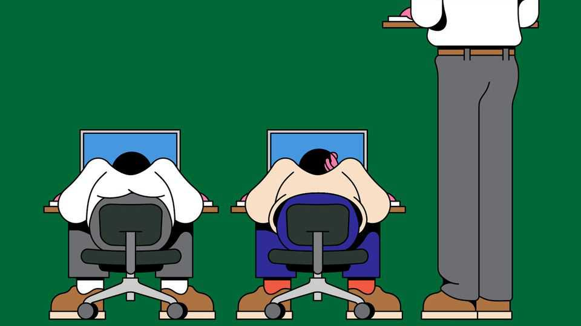

Science & technology | Well informed
Should you use a standing desk?
The benefits are real, but seem to vary with age
August 21st 2025

THE HUMAN body evolved to forage and hunt on the African savannahs, not to sit in a cubicle all day. The risks associated with sitting—from increased blood-sugar levels to greater odds of dying from cancer—lead many health authorities to warn against spending too much time doing so. The sit-to-stand desk is a popular way of helping people get upright. But how effective is it? Several arguments are made in its favour. As standing makes the heart work harder, proponents say it improves cardiovascular health, enhances attention and reduces fatigue. Physiotherapists claim that standing also improves posture, reducing lower back pain. Some studies even suggest that standing workers report lower stress and greater happiness than sitters do.

Dozens of studies have been run on the potential health effects of sit-stand desks. A recent review, led by María Eugenia Visier-Alfonso at University of Castilla-La Mancha in Spain and published in BMC Public Health in May, selected 17 for examination. Dr Visier-Alfonso limited her analysis to those that looked mainly at university students.

Of the four studies that looked at mental health, three confirmed that sit- stand desk use reduced anxiety and improved mood. Of the four on back pain, however, only one revealed significant pain reduction among sit-stand desk users compared with control groups. The one study Dr Visier-Alfonso found that looked at the cardiovascular and metabolic benefits of sit-stand desks suggested that they do result in users having lower blood pressure. (The remainder mostly looked at academic outcomes, which were mixed.)

Studies conducted on more varied groups reach different conclusions. A general review of over 50 papers on sit-stand desk use, led by April Chambers at the University of Pittsburgh and published in Applied Ergonomics in 2019, found only weak evidence that their use improves cardiovascular health.

The heart rates of sit-stand desk users were 7.5-13.7 beats per minute faster on average than those of people at ordinary desks, indicating that they might be working harder. But the studies that examined the question found no notable differences in blood pressure or VO2 (the efficiency with which the body transports oxygen to the muscles).

Analysis of other health-related biomarkers, like glucose, insulin and cholesterol, were also no different in most studies. This suggested that the desks were not providing metabolic benefits that might, say, stave off diseases like type 2 diabetes. Improvements in levels of energy and attention among those who used sit-stand desks were similarly difficult to spot. What’s more, Dr Chambers found no evidence that their use influenced mood.

However, notable benefits did emerge in the area of lower-back pain. Of 17 papers that studied this question, eight revealed evidence that giving participants the option to stand significantly reduced their lower-back pain (the remaining nine showed no clear effect). This suggests that standing may

help some people with this condition, an effect that may be more noticeable among people past university age.

So what is the aching desk jockey to do? Both reviews agree that no significant harm is associated with the use of sit-stand desks. And although some of the differences between their conclusions may stem from chance or sample size, it is also possible that different benefits accrue to users of different ages. ■

Curious about the world? To enjoy our mind-expanding science coverage, sign up to Simply Science, our weekly subscriber-only newsletter.

This article was downloaded by zlibrary from https://www.economist.com//science-and-technology/2025/08/15/should-you-use-a- standing-desk

Culture

Covid-19 sent the world mad How publishers became scared of books How Rajinikanth, a 74-year-old actor, drives fans into a frenzy High priests: why scientists gave magic mushrooms to the clergy An anonymous chef serves up stories of food and flings Farewell to Carrie Bradshaw, TV’s exasperating, enduring heroine