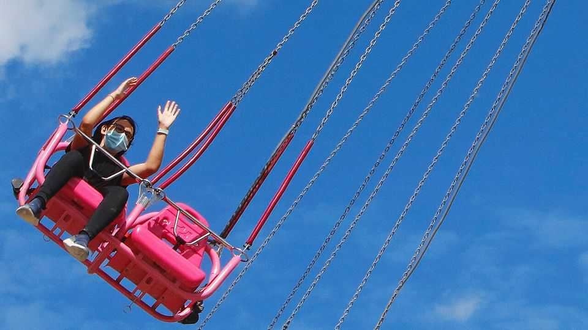

Culture | A plague on both your houses
Covid-19 sent the world mad
The pandemic polarised voters and undermined trust in institutions
August 21st 2025

Pandemics do not just sicken and kill. They have political and economic effects, too. After the Black Death wiped out a third of the people in Europe, fake news proliferated: rumours that the plague was caused by Jews poisoning the wells led to pogroms. Wages soared (because there were too few labourers) and rents collapsed (because so many homes were empty). Rulers tried brute force to block change, banning farmworkers from leaving their lord’s land to go and work for another who paid better. But this provoked uprisings, such as the Peasants’ Revolt in England in 1381, an impulse that ultimately led to the end of serfdom in most of Europe. Covid-19 was less deadly. But two recent books argue that it, too, had far- reaching and unexpected consequences. It fed a global surge in inflation, a

breakdown of trust in experts and an aggravation of political polarisation.

Before covid, few scientists believed that ordering people to wear masks or stay at home could stop the spread of a virus that passed easily from human to human, assert Stephen Macedo and Frances Lee of Princeton University in “In Covid’s Wake”. Lockdowns are hard to sustain and immensely costly. Yet when the novel coronavirus emerged in China, the Chinese government imposed draconian lockdowns, which it claimed were highly successful. The World Health Organisation accepted this. Lockdowns swiftly became conventional wisdom around the world.

It is unclear how well lockdowns worked. China suppressed the virus by occasionally shutting down whole neighbourhoods, sometimes bolting people into their apartments. But even these controls failed when the highly infectious Omicron variant required more extensive lockdowns, leading to protests in 2022. Because the government had not vaccinated enough people, when controls were lifted between 1m and 2m people died.

Rich democracies could not hope to enforce lockdowns as brutally, but most closed bars, restaurants and schools, banned large gatherings and encouraged people to work from home. This hurt the poor more than the rich. The laptop-tapping class, including the people who made covid policy, could work from their comfortable homes. Drivers and factory hands, by contrast, had to go out to work, even as schools ceased to look after their children. Multitudes of service workers were laid off.

The sacrifice was necessary to save lives, politicians claimed. New York’s governor, Andrew Cuomo, put it pithily: “Economic hardship? Yes, very bad. Not death. Emotional stress, from being locked in a house? Very bad. Not death.” Leaders insisted they were “following the science”, meaning the advice of public-health experts. But such experts tend to focus on minimising the harms caused by disease. They are not experts on the trade- offs between covid deaths and economic losses, children missing school or locked-down populations becoming lonely and depressed. Consideration of such trade-offs was “systematically swept aside in 2020-21”, fume Ms Lee and Mr Macedo. “This was plainly irrational.”

Rich-country governments borrowed huge sums to pay furloughed workers or send out cheques. Direct federal spending on covid relief in America was $5trn, equivalent to a quarter of GDP in 2020. The spending binge exacerbated a global surge in inflation, which infuriated voters and eventually spurred many to vote for Donald Trump in 2024. Poor countries fared even worse. As lockdowns crushed economic activity, global poverty rose for the first time in a generation.

It is hard to show that lockdowns saved many lives, though many scientists believe they did. People may take precautions without being forced, or kick against compulsion. Sweden never mandated masks or staying at home, and kept most schools open. To protect the old, Swedes were advised not to visit nursing homes. The New York Times called Sweden a “pariah”. Yet its excess-death rate after a year of covid was one of the lowest in Europe. In America states that locked down hard fared no better on this score than those that did not—that is, until vaccines arrived. Then their excess-death rates diverged sharply; Ms Lee and Mr Macedo suggest this is because the states that refused to lock down also included a lot of vaccine sceptics.

Public opinion was guided less by evidence than by partisanship, especially in America. Democrats were more likely to believe in lockdowns and vaccines; Republicans in neither. In Democratic states “people routinely cycled and jogged outside with masks on,” the authors observe. Schools in those states stayed closed far longer than those in Republican ones, causing students to fall behind and reducing their future earnings potential. People in Republican states avoided such folly but were more likely to die because they refused to get jabbed. Of the 25 states with lower than median vaccination rates, 19 had Republican governors.

The certainty and ferocity with which the two camps disagreed is hard to overstate. In “Summer of Our Discontent” Thomas Chatterton Williams, a journalist, explores how partisans of left and right stopped listening to each other and came to regard the other side as morally beyond the pale. When the state of Georgia decided to ease lockdowns early, the Atlantic, a liberal magazine, called it an “experiment with human sacrifice”.

And then, in May 2020, George Floyd, a black man, was choked to death by a cop who suspected him of using a forged $20 bill. Suddenly it was every

progressive’s moral duty to join crowds decrying racism and police brutality. “In the space of two weeks, and without really thinking it through, we went from shaming people for being in the street to shaming them for not being in the street,” writes Mr Williams. “How could this not feel like gaslighting?”

Mr Williams speculates that Floyd might never have got into trouble had he not been one of the 40m Americans out of work because of covid restrictions. (He was a bouncer in a club that was closed.) Mr Williams complains that progressives often accepted such measures with “stunning blitheness”.

The pandemic stress-tested institutions everywhere. Some, such as vaccine- makers and the supply chains that filled supermarket shelves, covered themselves with glory. Others, not so much. Public-health authorities were far too confident in their pronouncements about a new disease, the understanding of which was, inevitably, evolving. As Francis Collins, a former director of America’s National Institutes of Health, later put it: “We failed to say every time there was a recommendation, guys, this is the best we can do right now. It’s a good chance this is wrong…That was a profound mistake, and we lost a lot of credibility.”

Governments enacted “the greatest mobilisation of emergency powers in human history”, and suppressed speech that opposed it. America’s 50 states, all confronting the same problem in different ways, should have been the “laboratories of democracy”, learning from each other. But they were not. Instead, red and blue politicians and voters retreated into cocoons of self- righteous certainty.

Ms Lee and Mr Macedo conclude that the world needed “a more honest politics of crisis policymaking…a greater willingness to acknowledge [doubt], and recognition of the reasonableness of people with varying views”. Instead, the pandemic bred partisan rancour, intolerance and bad policies, vigorously applied. Anders Tegnell, the architect of Sweden’s uniquely relaxed covid policy, put it best. Looking at how other countries were responding, he said: “The world has gone mad.” ■

For more on the latest books, films, TV shows, albums and controversies, sign up to Plot Twist, our weekly subscriber-only newsletter

This article was downloaded by zlibrary from [https://www.economist.com//culture/2025/08/21/covid-19-sent-the-world-mad](https://www.economist.com//culture/2025/08/21/covid-19-sent-the-world-mad)