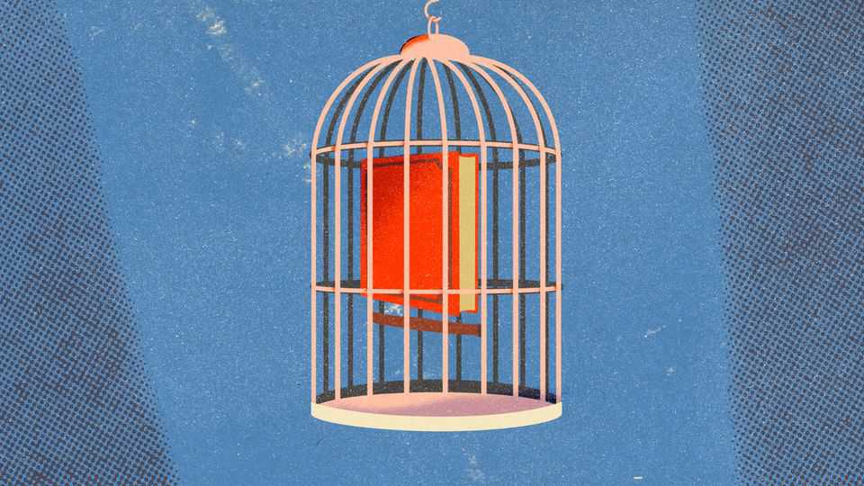

Culture | Censory deprivation
How publishers became scared of books
In “That Book is Dangerous!” Adam Szetela argues that the industry has  
become Orwellian

August 21st 2025
  

  
The rules of Oceania in George Orwell’s “1984” were clear: “Not even the  
smallest deviation of opinion on the most unimportant subject can be  
tolerated.” Any book that carried the wrong line “had to be rectified at  
lightning speed”. Only things that would not disturb the minds of the  
populace were allowed, since the “best books” are “those that tell you what  
you know already”. It is an idea that some readers took to heart: in 2022 a  
British university added a “trigger warning” to “1984”, alerting readers to  
the presence of racism, sexism and “political ideas”.

An engaging book by Adam Szetela, a journalist, also tells you what you  
already know: that something silly is happening in publishing. The world is
not Oceania, but it is not good: in American libraries in 2024, 2,452 titles  
were targeted for censorship. In 2020 employees of the New York Times  
demanded sensitivity readers. Journalists were told to snitch on each other: if  
an opinion piece gave them “the slightest pause” they should “call or text”  
the editor “immediately”. In Britain James Bond has been bowdlerised and  
filthsome bits excised from Roald Dahl. It is rotsome.

Quite why this has happened is complicated. Partly publishing had a genuine  
problem. The literary world was, for a long time, not very diverse: in  
America in 1985, just 18 of 2,500 books were by black authors or  
illustrators. When Zadie Smith, a British novelist, was growing up she  
searched books for “some form of cultural reflection” but found “only  
distorted mirrors [or] monstrous cliché”.

The “solution” has proved worse than the problem: it has meant conniptions,  
cancellations and the absurd strictures of sensitivity readers. (One rapped an  
author’s knuckles for having a black character visit a national park, for that  
“is not a thing we do, as a group”.) It has also resulted in bad books, such as  
“Was the Cat in the Hat Black? The Hidden Racism of Children’s  
Literature”. Sermons were a popular literary form in the 19th century.  
Sermonising is in fashion in the 21st.

The over-correction happened, in part, because the barriers to entry for the  
argument industry have tumbled. When Daniel Defoe wrote something  
people did not like, he had to be put in the pillory: that sort of insult took  
time, commitment and carrots. By the 20th century, the cost of insulting  
someone had dropped, but was still there: you’d write a rude letter, read it  
over then, as the author David Sedaris noted, think “Is this really worth a  
twenty-five-cent stamp?” Email allowed you to insult authors for nothing;  
social media mean you can now publicly insult them for the same. People  
vent their spleen on Instagram and X in an online version of Orwell’s “Two  
Minutes Hate” ritual.

The solution to all this is, says Mr Szetela, to speak out—or you are “guilty”  
too, like those who passively watch book-burnings in Ray Bradbury’s  
“Fahrenheit 451”. In this comprehensive (if at times too polemical) book he  
practises what he preaches. Expect it to cause conniptions online. ■
For more on the latest books, films, TV shows, albums and  
controversies, sign up to Plot Twist, our weekly subscriber-only newsletter

This article was downloaded by zlibrary from [https://www.economist.com//culture/2025/08/21/how-publishers-became-scared-of-books](https://www.economist.com//culture/2025/08/21/how-publishers-became-scared-of-books)