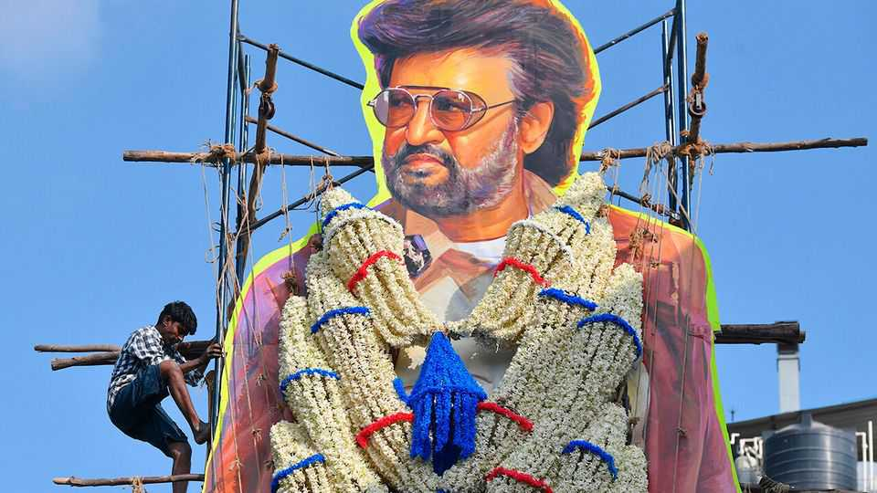
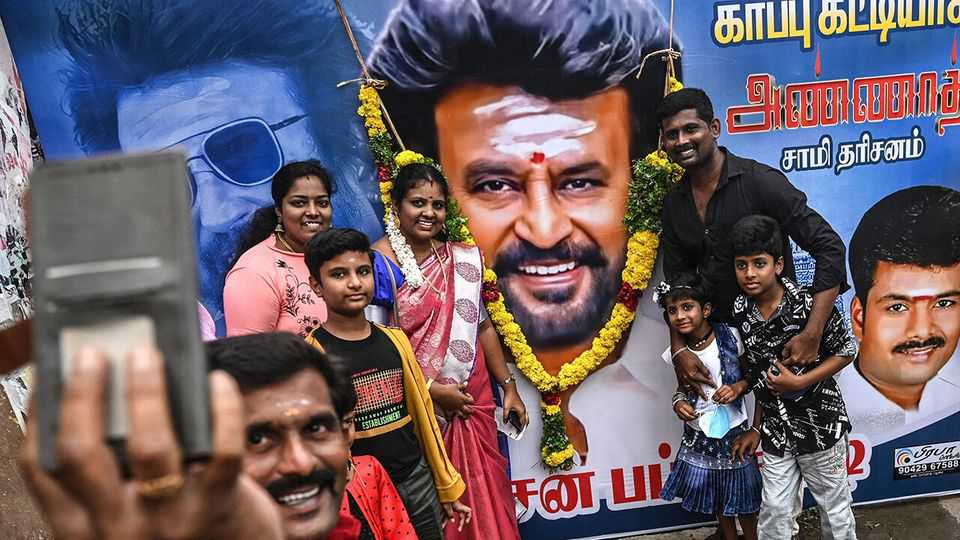

Culture | A man called “Superstar”
How Rajinikanth, a 74-year-old actor, drives fans into a frenzy
Indian crowds greet his new film with prayer, confetti and milk
August 21st 2025

FOR FANS of Rajinikanth, or Rajini, it is not enough to simply buy a ticket to one of his films and turn up at the right time and place. No; preparations begin days in advance. Ahead of his latest release, “Coolie”, on August 14th, some fans prostrated themselves in front of shrines, seeking a divine blessing for the Indian actor. Others bathed giant cardboard cutouts of him in milk, a sign of reverence usually reserved for Hindu gods. When a trailer for “Coolie” was released on August 2nd, it racked up 25m views in two weeks. (The term is derogatory in the West, but is not considered offensive in South Asia.) On the day of the film’s debut, cinemas

had a carnival feel, with drumming and confetti. A few devotees flew to India from countries as far as Australia for the occasion.

In a packed cinema in Mumbai, patrons whistled and hollered from the moment his sobriquet “Superstar” appeared on screen. (Projectionists sometimes pause the film after his grand entrance to let viewers offer prayers from their seats or to hurl coins and banknotes.) “This is nothing. You should go to Tamil Nadu or Karnataka,” says one fan. “You won’t be able to hear his dialogue.”

Rajinikanth—whose real name is Shivaji Rao Gaekwad—is one of the biggest movie stars in the world, inspiring the kind of devotion that most Hollywood actors can only dream of. “Coolie”, a Tamil gangster flick, marks his 50th year on screen. Rajini plays a dockyard worker and union leader who investigates the death of a friend, which draws him into a criminal underworld. Along the way, he wields swords, knives and guns. He shows what he can do with his fists and his wits.

The role hints at Rajinikanth’s humble beginnings. Born to a poor family in Bangalore, he discovered a love of acting at school and would perform folk tales for rapt classmates. As a young adult, he did manual jobs—hauling rice sacks for ten paise apiece (equivalent to 1.3 cents in 1970, and 0.12 cents today)—and worked as a bus conductor. Later he studied acting at the Madras Film Institute.

To begin with he got only bit parts and often played baddies. But in “Bairavi” (1978) he portrayed an honourable servant who avenges his sister’s murder. Thereafter, in blockbusters such as “Naan Mahaan Alla” (1984), “Baashha” (1995) and “Padayappa” (1999), he starred as the swashbuckling hero.

Rajini is not a method actor, nor a Bollywood beefcake. At 74, his lustrous hair has become a tonsured style flecked with grey. So what explains fans’ fervour?

One reason is his everyman appeal. He dresses plainly and shuns big-brand endorsements. He has a self-deprecating sense of humour. In a recent speech he joked about having warned his young choreographer not to overtax “a 1950s model” lest “parts start falling off”.

Another, somewhat paradoxical, reason is Rajini’s superhero-like qualities. He is known for his physics-defying antics: in one film, he catches a knife between his teeth. In “Coolie” he dials a phone with one hand while fending off a blade, then floors five goons with a single punch that sends them flying in all directions. The key to enjoying Rajinikanth’s work, one moviegoer says, is not overthinking it: “Leave your brain at home.”

Like all the biggest stars, Rajini has a certain magnetism. One punter says the actor’s “aura is unmatched”. For a time he hoped to use that charisma in the political arena. Rajini tried to launch a new party in 2020, but withdrew after a health scare he called a “warning given to me by the Lord”.

Most important, Rajinikanth’s work is suitable for all ages. Three generations filled the cinema in Mumbai. People across India and in the

diaspora have grown up watching him as he has made films in Tamil, Telugu, Hindi and Kannada.

For the most part, the Rajini fandom is harmless. On his birthdays admirers organise meal donations and charity collections. But sometimes affection tips over into frenzy. “We are really tense the night before any Rajinikanth film release,” admits one official in “For The Love of a Man”, a documentary of 2015. This year police in Chennai confiscated firecrackers from fans. His acolytes expect action, but will not tolerate evisceration. “Twice is okay, but if villains beat him a third time, the theatre might burn,” warns an admirer.

Most actors fear their powers diminishing with time: if anything, Rajinikanth’s are increasing, even after 170 films. “Coolie” took $17m at the global box office on its first day, setting a new record for Tamil cinema. Rajini still packs a punch. ■

For more on the latest books, films, TV shows, albums and controversies, sign up to Plot Twist, our weekly subscriber-only newsletter

This article was downloaded by zlibrary from https://www.economist.com//culture/2025/08/19/how-rajinikanth-a-74-year-old-actor- drives-fans-into-a-frenzy