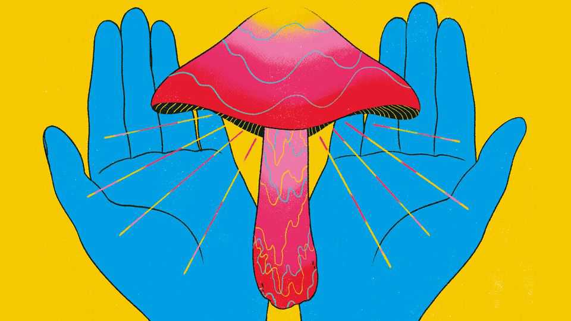

Culture | Drugs and religiosity
High priests: why scientists gave magic mushrooms to the clergy
An experiment looked at how religious folk responded to psychedelic drugs
August 21st 2025

SOME PEOPLE think of their hounds as heavenly, sporting T-shirts proclaiming that “‘Dog’ is ‘God’ spelled backwards.” For Jeff Vidt, God actually was a dog: the Lord came to him as a Great Dane. Meanwhile, Jaime Clark-Soles glimpsed the deity as a harp-playing woman. Sughra Ahmed felt the Almighty as a concept: love. These divine encounters occurred at Johns Hopkins University, Maryland, during an experimental study investigating how “the effects of psilocybin”— the active ingredient in magic mushrooms—“are experienced and interpreted by religious clergy”. The 29 participants came from Buddhism, Christianity, Islam and Judaism and were “psychedelic-naive”: ie, they had never dabbled

in these drugs before. They took psilocybin on two occasions; there was a waiting-list control group.

The sample size may be small, but the findings, recently published in the Journal of Psychedelic Medicine, are mighty clear: 96% of participants ranked a psilocybin trip in the top five most spiritually significant moments of their lives and 42% declared it the single most profound experience they had ever had.  (A recent study in Sweden also found that 58% of people found a psychedelic experience to be one of the most meaningful events of their lives.) Almost half described their trips as “psychologically challenging”, but none reported severely adverse effects.

Psychedelics change the way the default mode network (DMN) in the brain works. These linked parts of the brain are activated when people muse on the past, present or heavenly future. Psychedelics switch some of the DMN off at the same time as they activate other neural pathways, all of which allows for new ways of thinking. Scientists are exploring how psilocybin may help treat depression and post-traumatic stress disorder.

More than a year after the study, participants reported a deeper connection to their faith and improved prayer. Hunt Priest, an Episcopalian, felt an electric current in his spine; it stopped at his throat before exploding out of his head. The blockage was “connected to my preaching”: “I felt restricted in what I could say.” He has “never thought of the Holy Spirit the same again”. Roger Joslin, also an Episcopalian, says: “There’s my life before psychedelics and my life afterwards.”

Yet such spirituality is unlikely to please traditionalists, who argue that true faith is the product of discipline, not mind-bending drugs. Some may worry that these experiences threaten religious institutions: who would rather sit in a dusty pew than fly with the angels? As Mr Vidt, an Anglican priest, put it: “I don’t believe in God: I know God. I experienced God.”

Psilocybin also seems to promote the kind of universalism that religious authorities have spent centuries trying to contain. Mr Priest says he prayed as a Jew, then a Muslim; Julie Danan, a rabbi, chanted “Shalom” next to Hindus saying “Om”. “It’s hard to imagine having a psychedelic experience that made someone more narrow or exclusionary in their faith,” says Mr

Joslin. “It’s likely to broaden it.” This may bother religious authorities who must advance their own faith as superior to others.

Advocates argue that drugs are a conduit to the sorts of mystical things that are described in scripture, such as multi-headed beasts. “The whole Book of Revelation is a visionary journey,” says Ms Clark-Soles, a Baptist minister. “Christianity is fundamentally based on a mystical experience: the resurrection of a dead guy.”

Ms Clark-Soles is writing a book called “Psychedelics and Soul Care: What Christians Need to Know”. Several of the study’s participants have set up organisations aimed at exploring the benefits psilocybin can offer believers. Mr Priest established Ligare, a “Christian psychedelic society”; Zac Kamenetz, a rabbi, launched Shefa to support Jews; Ms Ahmed, an imam, created Ruhani for Muslims. Some feel the Religious Freedom Act should protect institutions in America offering drugs for spiritual purposes. Talk about a higher calling. ■

For more on the latest books, films, TV shows, albums and controversies, sign up to Plot Twist, our weekly subscriber-only newsletter

This article was downloaded by zlibrary from https://www.economist.com//culture/2025/08/21/high-priests-why-scientists-gave- magic-mushrooms-to-the-clergy