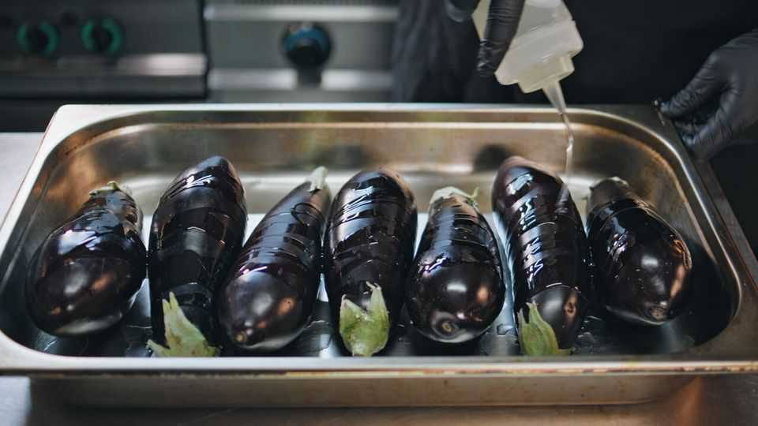

Culture | Steamy stuff
An anonymous chef serves up stories of food and flings
“Tart”, a new memoir, is a woman’s take on “Kitchen Confidential”
August 21st 2025

SLUTTY CHEFF, an anonymous female cook, has a confession: she is greedy. She doesn’t “want to eat” food so much as “devour” it. Her appetite is less that of an “average Western woman” and more akin to that of “a starved pig”. But, as her alias indicates, there is one thing she claims to desire even more than food: sex. “Tart”, her memoir, is a hedonistic tale of both. In the book Slutty (as her friends call her) recounts the first two years of her career as a chef, mostly in posh London restaurants. She peeks into the “socialite chef” world, which is “elitist, exclusive” and “more about who you know, not what you cook”. She discovers a lot about herself, for instance when she realises “I love cooking

—I need cooking.” She also discovers a lot about—quelle surprise—sex. Intercourse with a chef, she proclaims, is “more thrilling than being one”.

Fans are eating up her tales. She serves salacious morsels to her tens of thousands of followers on Instagram and to readers of her column in British Vogue. The film and television rights to “Tart” have already been gobbled up by Working Title, one of the production companies that made the “Bridget Jones” films. There are rumours that Lena Dunham, the creator of the hit show “Girls”, will help adapt the book for the screen.

“Tart” is dining out on the popularity of sexy chefs on screen and online. “The Bear”, a TV show which stars Jeremy Allen White as a moody chef who wants to turn a sandwich shop into a Michelin-starred restaurant, has helped professional cooks seem more sultry than sweaty. In “Emily in Paris”, a hit series, there is a love triangle involving a hunky chef. On social media so-called “hot chefs” sauté, sear and smoulder for the camera, often without their shirts on.

The memoir has been lauded as a feminine take on Anthony Bourdain’s “Kitchen Confidential” (2000). The American chef and author also stunned and delighted readers by sharing tantalising stories. (One memorable tale involved a blushing bride getting “an impromptu send-off” from a cook behind the kitchen bins.) Slutty Cheff has spoken of her lust for the rebellious culinarian. In “Tart” she says she imagines Bourdain—who took his own life in 2018, aged 61—joining her “for four hours of carnal feasting, seven bottles of wine, a couple of lines of crushed aspirin and then a great big fuck”.

In her acknowledgments, the author pays homage to Bourdain, as well as Jilly Cooper, the British queen of the bonkbuster novel. Ms Cooper’s influence is evident. Just consider Slutty Cheff’s contents page. Whereas Bourdain used the sleek, inscrutable subheadings of “Appetiser”, followed by “First Course” and so on, she prefers smutty titles such as “Michelin Star Pussy Juice” and “Ready Steady Cock”. She spends a great deal of time describing the “phallic form” of courgettes and the “great erection” of rhubarb.

“Kitchen Confidential” aimed to lift the lid on the restaurant industry. Bourdain wrote of how butter is reused and uneaten bread is often sent out to the next table. Seafood served on Mondays, he averred, is probably four or five days old; hollandaise sauce swims with bacteria. Readers finished the book feeling satisfied that they knew more about what (and what not) to order next time they went out to eat.

“Tart”, meanwhile, is mostly a romp. Slutty Cheff does not dish up such insights. The kitchens she works in seem clean and hygienic: the most nauseating it gets is the description of “the flashing grey of a mouse running past my feet”. She takes drugs and has sex outside the kitchen rather than in it.

The most revealing passages are not about sex, but sexual harassment. Slutty Cheff is often the only woman in the kitchen. She describes the challenges of working with a “pervy” man who touches her bottom and stands so close that she can “feel his breath”. She has to appear “strong and unaffected”, she feels, to earn the respect of her male peers. “Tart” offers a slice of life, but such experiences leave a bitter taste in the reader’s mouth. ■

For more on the latest books, films, TV shows, albums and controversies, sign up to Plot Twist, our weekly subscriber-only newsletter

This article was downloaded by zlibrary from https://www.economist.com//culture/2025/08/18/an-anonymous-chef-serves-up-stories- of-food-and-flings