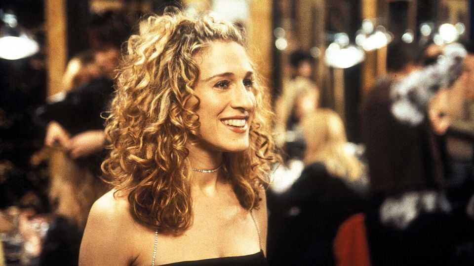
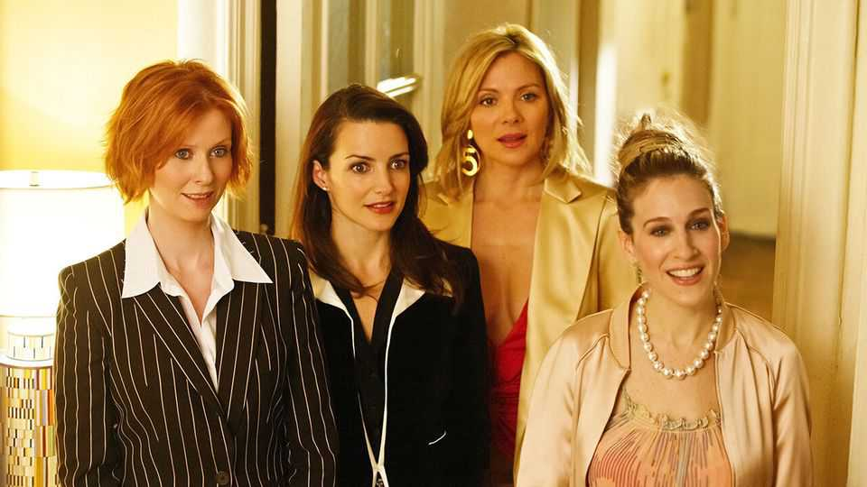

Culture | High-heeled shoes to fill
Farewell to Carrie Bradshaw, TV’s exasperating, enduring heroine
She made viewers cross. But “Sex and the City” was unlike anything that had come before
August 21st 2025

CARRIE BRADSHAW has skipped across Manhattan in Manolo Blahniks for the last time. On August 14th “And Just Like That…” (“AJLT”) broadcast its final episode and so bid farewell to Carrie, almost 30 years after she first appeared on television screens in “Sex and the City” (“satc”). In the debut episode, Carrie lamented the dearth of “great unmarried men” in New York; over the course of six seasons of “SATC”, two films and three seasons of “AJLT”, she received proposals (and called one  engagement off), got stood up at the altar, got married , was widowed and had umpteen flings and flirtations. All the while, Carrie was establishing her reputation as one of the most infuriating yet influential heroines ever to appear on screen.

She caused a stir from the beginning. Carrie and her coterie first appeared in 1994 in a racy, semi-autobiographical newspaper column written by Candace Bushnell for the New York Observer. It gained a following fast, though detractors dismissed Ms Bushnell as a low-rate gossip who made stuff up. “My characters exist,” she retorted. “Go to enough parties, and you’ll meet all of them.”

Those characters—four sparky, single women—arrived on screen in 1998. There was Miranda (Cynthia Nixon), the stressed-out lawyer, Charlotte (Kristin Davis), the hyper-polished WASP, and Samantha (Kim Cattrall), the sexually voracious publicist. But the show’s centre was Carrie (Sarah Jessica Parker), a journalist and bon vivant with a penchant for terrible puns. Together they broached topics that had not really been dealt with on TV before, including abortions, fetishes and fertility.

Much of “Satc” did not feel particularly plausible. All the women in the show looked impeccable all the time. Carrie lived alone in an apartment on the Upper East Side while turning out one column a week; she somehow had money left over for designer shoes and lavish dinners.

Viewers were happy to overlook that, but they often found Carrie vexing. She was spoiled: in one episode she ordered Charlotte to give her $30,000 as

a down-payment for her apartment. She was judgmental: she scorned Samantha for giving a blowjob to a delivery man. And she was blinkered: she had dire taste in partners. Her love for “Mr Big”—an emotionally unavailable financier with the prosaic name of John—led her to behave erratically.

Nonetheless, it was impossible not to be drawn in by the quartet’s dynamic. Miranda was acerbic. When Samantha was not bedding handsome men, she was turning out Wildean phrases. (“I’m a trisexual,” she declares: “I’ll try anything once.”) Charlotte was sentimental. “Maybe we could be each other’s soulmates?” she asks her friends as her marriage disintegrates. Most viewers secretly wished they were at the table, a Cosmopolitan in hand.

The show was a hit. It was nominated for 54 Emmys, winning seven. Various celebrities made cameos: Donald Trump appeared in an episode entitled “The Man, the Myth, the Viagra”. More than 10m people tuned in to watch Carrie fall into Big’s arms in the finale in 2004. The films, released in 2008 and 2010, together made over $1bn at the box office in today’s money.

“ajlt” tried to fix some of the shortcomings of “satc”. Its best-written characters were black, a refreshing change from the notably white original, and it attempted to grapple with modern debates about sexuality. There were some moving moments as Carrie, Miranda and Charlotte navigated midlife and its crises. (Samantha did not return, to the show’s detriment.) But it was a peculiar reboot which never recaptured the charm of the original. The writers seemed particularly unsure about what to do with Carrie after Big’s death.

All the same, Carrie Bradshaw struck a nerve in a generation of women. She has inspired fashion trends, internet memes and thinkpieces, from takedowns (Elle: “Carrie Bradshaw Is Still Full of Shit”) to fierce defences (the Atlantic: “No, Carrie Bradshaw Was Not ‘Such a Whore’”). Even when she was perplexing, there was something admirable about her determination to live her life on her own terms. Many fans won’t help but wonder: why is breaking up with a fictional character so hard? ■

For more on the latest books, films, TV shows, albums and controversies, sign up to Plot Twist, our weekly subscriber-only newsletter

This article was downloaded by zlibrary from https://www.economist.com//culture/2025/08/20/farewell-to-carrie-bradshaw-tvs- exasperating-enduring-heroine

Economic & financial indicators

Economic data, commodities and markets