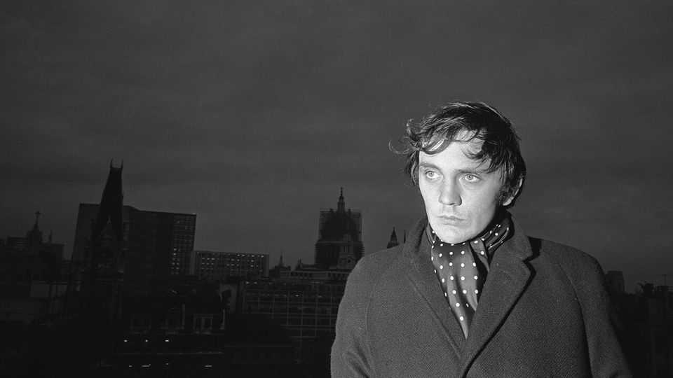
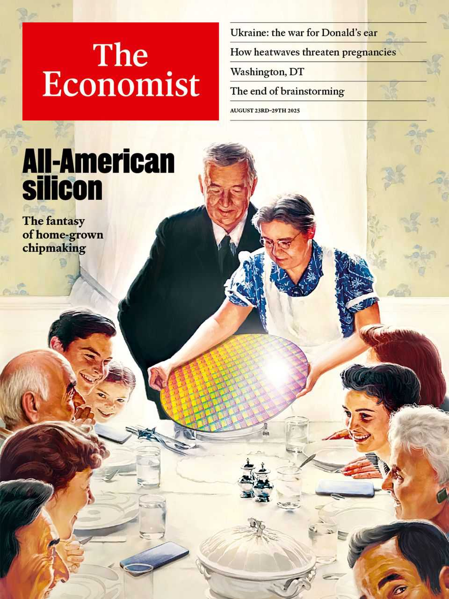

Obituary | The most beautiful man in the world
Terence Stamp preferred philosophy to celebrity
The film face of the 1960s died on August 17th, aged 87

August 21st 2025
  

  
As he stood on his mark, sunshine fell softly on his blond curls. Around him,  
beyond the deck of HMS Avenger, the waves sparkled. Beside him, in a  
slight breeze, the noose swayed. Sometimes it touched his face. Mutinous  
sailors thronged the lower deck, watching. He, Billy Budd, a saintly young  
crewman, was about to be unjustly hanged. And he was at peace, the script  
said.

How could he play a scene like that? He struggled to remember what  
Anthony Newley, another working-class actor like him, had told him. Empty  
head. Get rid of all the thoughts. He couldn’t do it; they kept coming. But  
then, suddenly, a song popped up from nowhere: “Little Dolly Daydream,  
pride of Idaho...” and he was full of another feeling. Lying on a rug in front
of a coal fire at his Granny Kate’s house in Barking Road, doing his  
homework, while out in the scullery she would be making him a marmalade  
sandwich and singing. This was a feeling beyond thinking, a strange  
otherness, and at the premiere of “Billy Budd” in 1962, it left not a dry eye  
in the house. He had nailed it in one take.

That film shot Terence Stamp to fame, winning him at 24 an Oscar  
nomination. After that it was a film a year: “The Collector” (a psychopathic  
butterfly collector pinning down Samantha Eggar), “Modesty Blaise” (a  
Cockney sidekick to a comic-book heroine), “Far From the Madding  
Crowd” (arch-cad Sergeant Troy ensnaring Bathsheba), “Poor Cow” (a bank  
robber with a tender side). He became one of the icons of the 1960s, all wide  
eyes and good cheekbones, and one of the voices too, confidently Cockney.  
His girlfriends were Jean Shrimpton and Julie Christie, both epitomes of  
class and style. David Bailey photographed him. He filmed in America,  
smoking peyote and a lot of Acapulco Gold. He worked with William Wyler  
and John Schlesinger. Best of all, in 1968 Federico Fellini chose him as his  
leading man.

It was all a bit surprising really. He didn’t actually think he looked that good.  
Clothes were fun, and he had always been mad about them, dragging his  
mum all over the market looking for the right jacket, dreaming of custom-  
made shoes. But his face? “The most beautiful man in the world” was  
mostly the creation of the lighting designer on “Billy Budd”, Robert  
Krasker, who had lit “The Third Man”. Film could do that. And this was  
something he had known ever since he was three, sitting with his mum in the  
one-and-ninepenny seats at the Old Grand and watching Gary Cooper play  
Beau Geste: cinema was magic.

People often thought there was something magical about him, too. Or, at  
least, intensely strange. Or mesmerising, like the terrifying sabre-whirling  
display he put on for Julie Christie in “Far From the Madding Crowd”. (All  
the scarier because he, a leftie, was made to do them right-handed.)  
Brooding silences were also his speciality. The thing was, he was fascinated  
by acting and how it was done well. In “Billy Budd” he had sent his feelings  
directly to the audience without needing words. Their minds had met in a  
sort of empty but conscious space. And what this had seemed to require  
from him was to be absolutely present in the moment. Not observing his
thoughts, not worrying about direction, but giving his purest self to the  
audience and bringing out the best in them.

As an acting method, though, it was hard to achieve. He began to consider it  
seriously when in 1968 he met Jiddu Krishnamurti in Rome and went for a  
walk with him. Krishnamurti would keep interrupting their chat to point out  
a tree, or a cloud. To an East End spiv like him, that seemed weird. Later he  
realised that if he had not noticed them too, it was because he was not yet  
fully in the moment. That was what he had to work on. His longest attempt  
so far, in Pier Paolo Pasolini’s “Teorema” (1968), was to play a divine  
stranger who seduced an entire family as pure consciousness and energy.  
Because he had no lines, he simply was.

In 1970 he went off to India, less to study than because, in a new decade,  
directors wanted a younger face than his. Over seven years in an ashram in  
Poona, in orange robes and on a macrobiotic diet, he took up yoga and  
meditation and picked up advice on breathing from Sufis he met. Yet a cable  
mentioning a role in Superman, and the chance of working with Marlon  
Brando, got him home and in the part in a trice, robes, beard and all. He  
needed no preparation. He was awake now, and thought, I’ll just go with  
that.

The Superman films epitomised it. They not only revived his career in a new  
age; they also gave him the chance to play an arch-villain, General Zod, not  
as cartoon evil but as all-enveloping presence. In “Superman II” (1980), as  
he commanded America’s president to “Kneel before Zod!” in the Oval  
Office, he was so purely aware that he felt he had a Magnum strapped to his  
leg. The same “cognisant emptiness” lay behind the desperate anger of a  
vengeful father in “The Limey” (1999) and the serenity of trans Bernadette  
in “The Adventures of Priscilla, Queen of the Desert” (1994), instructing a  
hostile bar-manager to blow her own box apart in the same level tone as she  
had ordered a lime daiquiri.

By that time, he was in full awareness automatically between “Action!” and  
“Cut!” This meant he was unafraid to tackle any role, including, in  
“Priscilla”, that of a woman in the wrong body (and dance it too, in crude  
lipstick and a lion’s mane of a wig). Outside filming it was back to his  
dapper Cockney self, still with the accent of Bow via Plaistow flavouring his
talk, still with the great bone structure, favouring black homburgs and pink  
linen suits and living in the Albany while worrying about his bus fare. He  
kept meditation, yoga and macrobiotics going. A macrobiotic diet made you  
stay beautiful for ever.

Celebrity hadn’t really marked him. He’d mostly enjoyed it. You could say  
his whole career had come from, and gone back to, that moment when he  
had stood on HMS Avenger with the sun playing on his peroxide curls, and  
realised there was nothing in his head but a tender little ditty last heard in  
Barking Road, E13. ■

This article was downloaded by zlibrary from [https://www.economist.com//obituary/2025/08/21/terence-stamp-preferred-philosophy-](https://www.economist.com//obituary/2025/08/21/terence-stamp-preferred-philosophy-)
to-celebrity

Table of Contents

The world this week  
Politics  
Business  
The weekly cartoon  
Leaders  
Donald Trump’s fantasy of home-grown chipmaking  
A new opposition could be a healthy sign for Syria  
Who will America’s president listen to next on Ukraine?  
Pregnant women need protecting from heatwaves  
Britain leads the world in a new global business—a criminal one  
Letters  
How significant is the rise of fraudulent scientific papers?  
By Invitation  
Margaret MacMillan on the promise—and perils—of wartime summits  
Briefing  
The world’s biggest chipmaker needs to move beyond Taiwan  
United States  
Does it make sense for America to keep subsidising a sinking city?  
Welcome to the YIMBYest neighbourhood in America  
The Democrats who find abundance liberalism threatening  
The young American female soldiers of TikTok  
Marjorie Taylor Greene wants to stop them from making it rain  
How Washington became Donald Trump’s chew toy  
The Americas  
Life after death for Canada’s crushed Conservatives  
Climate change threatens an Andean ski boom  
The new fears of Cubans in Florida  
After 20 years in power, Bolivia’s socialists crash out of it  
Why Mexicans love Japan and Korea  
Asia  
Japan storms back into the chip wars  
TSMC could revolutionise rural Japan  
How fair are India’s elections?  
Pakistan is critical in the fight against Islamic State terrorism
The world is learning to live with the Taliban  
China  
Hong Kong’s courtroom dramas  
China’s mid-year economic wobble  
Middle East & Africa  
A new twist in Syria: a political opposition  
What’s in a name in the Middle East?  
Gaza’s Gen-Z influencers  
Are east African governments colluding to stifle dissent?  
How Sierra Leone beat back mpox  
Europe  
Putin’s hunger to destroy Western unity rages on  
Security “guarantees” for Ukraine are dangerously hazy  
Friedrich Merz cuts a good figure abroad but is struggling at home  
Europe is ablaze  
Why Turkey’s football clubs can pay more cash for talent  
Trump wants a Nobel prize. Europe can exploit that to help Ukraine  
Britain  
The new geography of stolen goods  
How thieves could break into your car  
A court ruling threatens to disrupt Britain’s asylum policy  
England’s white working class falls further behind at exams  
The moral of “The Salt Path”, an embellished bestseller  
What it means when Britain talks about “Bosh”  
International  
A burning threat to pregnant women  
Was globalisation ever a meritocracy?  
Business  
To survive, Intel must break itself apart  
How AI-powered hackers are stealing billions  
China’s hottest new look: the facekini  
China is quietly upstaging America with its open models  
Big chocolate has a growing taste for lab-grown cocoa  
The last days of brainstorming  
American tech’s split personalities  
Finance & economics  
Can China cope with a deindustrialised future?
The green transition has a surprising new home  
Trump’s trade victims are shrugging off his attacks  
Where has the worst inflation problem?  
How America’s AI boom is squeezing the rest of the economy  
In praise of complicated investing strategies  
Economists disagree about everything. Don’t they?  
Science & technology  
RFK Jr’s attack on mRNA technology endangers the world  
AI-powered robots can take your phone apart  
Old fossil-fuel plants are becoming green-energy hubs  
Should you use a standing desk?  
Culture  
Covid-19 sent the world mad  
How publishers became scared of books  
How Rajinikanth, a 74-year-old actor, drives fans into a frenzy  
High priests: why scientists gave magic mushrooms to the clergy  
An anonymous chef serves up stories of food and flings  
Farewell to Carrie Bradshaw, TV’s exasperating, enduring heroine  
Economic & financial indicators  
Economic data, commodities and markets  
Obituary  
Terence Stamp preferred philosophy to celebrity