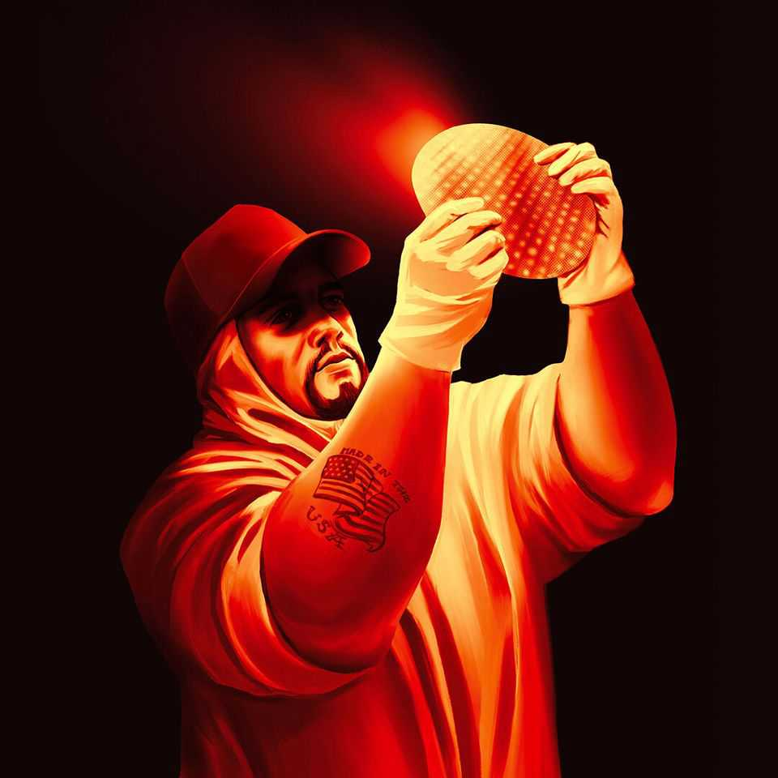

Leaders | All-American silicon
领导人专栏｜纯美式硅谷梦

Donald Trump’s fantasy of home-grown chipmaking
唐纳德·特朗普的“本土造芯”幻想

To remain the world’s foremost technological power, America needs its friends
要保持世界首屈一指的科技实力，美国离不开朋友与盟友

August 21st 2025
2025年8月21日

How low mighty Intel has fallen. Half a century ago the American chipmaker was a byword for the cutting edge; it went on to dominate the market for personal-computer chips and in 2000 briefly became the world’s second-most-valuable company. Yet these days Intel, with a market capitalisation of $100bn, is not even the 15th-most-valuable chip firm, and supplies practically none of the advanced chips used for artificial intelligence (AI). Once an icon of America’s technological and commercial prowess, it has lately been a target for subsidies and protection. As we published this, President Donald Trump was even mulling quasi- nationalisation.

英特尔，这位昔日巨擘，如今已跌落何等之低。半个世纪前，这家美国芯片制造商几乎就是“尖端”的代名词；它随后统治了个人电脑处理器市场，并在2000年一度成为全球市值第二的公司。然而眼下，市值一千亿美元的英特尔，已跌出芯片公司市值前十五名，几乎不再供应用于人工智能（AI）的先进芯片。它曾是美国科技与商业实力的象征，如今却频频成为补贴与保护主义的靶子。就在本文付梓之际，总统唐纳德·特朗普甚至在考虑对其进行“准国有化”。

> 备注：
> - <strong>byword</strong>：/[ˈbaɪwɜːd]/ 本义为"谚语、代名词"，引申为"某事物的象征"。此处将英特尔与"尖端"画上等号，凸显其昔日地位。
 >   · 源自"bye + word"，意为被反复传颂之语，后引申为某领域的典型代表。在本文中使"英特尔=尖端"的等式更具文化重量，暗示品牌符号性。
> - <strong>quasi-nationalisation</strong>：带有"准、类"的色彩，暗示并非全面公有化，而是以国家力量深度干预；在当前语境下强化了政策风险与不确定性。
>   · quasi 源自拉丁语，意为"类似于"。与 nationalisation 结合，表示介于市场与公有之间的混合状态，语用效果是"模糊边界、扩大政府之手"。
> - <strong>mighty</strong>：/[ˈmaɪti]/ "强大的、显赫的"；用于反衬"跌落"之深，形成强烈落差感。
>   · 古英语 meahte（力量）演变。与"fallen"搭配形成高处坠落的修辞，突出盛极而衰的戏剧性。
> - <strong>cutting edge</strong>：短语，"前沿、尖端"；比单词"advanced"更具锋芒感，传达技术领先的锋锐。
>   · 本义刀锋；由具象到抽象，表达"能切开旧物"的创新力。放在芯片叙事中，隐含制程代际"切换"的意象。
> - <strong>dominate</strong>：/[ˈdɒmɪneɪt]/ "主宰、统治"；语义比"lead"更强，体现市场支配力。
>   · 拉丁 domus（家、主权）同源；在商业文本里强调"议价权/生态控制力"。
> - <strong>market capitalisation</strong>：财务术语"市值"；文中与"世界第二"并置，强调当年高光时刻。
>   · capital 源于"头/本金"；在叙事中是"市场信心"的缩影，映照"由盛转衰"的情绪弧线。
> 
> - <strong>背景小史</strong>：英特尔在"奔腾(Pentium)"时代奠定PC芯片霸主地位，后因移动端与EUV转型迟缓被台积电/英伟达赶超。作者用"byword/cutting edge"对比其兴衰，制造戏剧张力。
> - <strong>语体选择</strong>：用"was a byword for the cutting edge"而非"was very advanced"，更具文采与评述感，体现《经济学人》写作风格。

More than ever, semiconductors hold the key to the 21st century. They are increasingly critical for defence; in the ai race between America and China, they could spell the difference between victory and defeat. Even free-traders acknowledge their strategic importance, and worry about the world’s reliance for cutting-edge chips on tsmc and its home of Taiwan, which faces the threat of Chinese invasion. Yet chips also pose a fiendish test for proponents of industrial policy. Their manufacture is a marvel of specialisation, complexity and globalisation. Under those conditions, intervening in markets is prone to fail—as Intel so vividly illustrates.

比以往任何时候都更清楚的是：半导体掌握着21世纪的钥匙。它们对国防的重要性与日俱增；在中美AI竞赛中，芯片可能成为胜负手。即便是自由贸易的支持者，也不得不承认芯片的战略地位，并担忧世界对台积电（TSMC）及其母土台湾的依赖——而台湾正面临中国入侵的威胁。与此同时，芯片也给产业政策的拥护者出了极其刁钻的一道难题。它的制造是分工、复杂性与全球化的奇迹。在这种条件下，市场干预往往以失败告终——英特尔就是活生生的注脚。

> 备注：
> - <strong>spell the difference</strong>：短语比喻"决定成败"。用于AI竞赛，强调关键性影响。
>   · spell 有"拼写/意味、招致"两义；此处为"意味着关键差异"，强调结果导向。
> - <strong>fiendish</strong>：/[ˈfiːndɪʃ]/ 原意"恶魔般的、极难对付的"，凸显政策设计与执行之难度。
>   · fiend（魔鬼）+ -ish；语气强，适合描写"系统性复杂度"带来的棘手性。
> - <strong>hold the key (to)</strong>：固定搭配，"掌握关键/决定因素"。较"be important"更具因果力度。
>   · key=钥匙，隐喻"开锁/通关"。在国家安全叙事里，象征"控制通道"。
> - <strong>defence</strong>：英式拼写（美式 defense）；点出国防维度下的芯片战略属性。
>   · 英式拼写常见于英媒，潜台词为"英国视角的全球议题"。
> - <strong>free-traders</strong>：支持自由贸易者；与产业政策拥护者形成对照，烘托争论面。
>   · 自由贸易/产业政策是经济学上的经典拉扯，芯片因安全外部性而成为争议焦点。
> - <strong>reliance (on)</strong>："对……的依赖"；比"depend on"更名词化、书面、客观。
>   · 名词化有"结构问题"之感，突显非个人、而是系统依赖。
> - <strong>proponents</strong>：/[prəˈpəʊnənts]/ "支持者、倡导者"；政策语境常用术语。
>   · pro-（向前）+ ponere（放置）→"把观点端上台面的人"。
> - <strong>marvel</strong>：名词，"奇迹"；与"specialisation/complexity/globalisation"并列，显体系化难度。
>   · 从审美词汇转作产业结构评述，制造"理性中的惊叹"。
> - <strong>intervene in markets</strong>：更书面的政策表述，较"interfere"少贬义，但强调"插手"。
>   · intervene 偏中性（干预/介入），interfere 偏负面（妨碍）。本文选择前者更克制。
> - <strong>be prone to fail</strong>：倾向于失败；表达统计/结构性失败概率而非个案偶然。
>   · 指政策与产业复杂性错配导致的"系统误差"。
> 
> - <strong>背景延伸</strong>：AI与军工的"算力—制造—供应链"被视作国家安全新支点。对TSMC/台湾的依赖牵涉地缘政治，文本以"reliance"呈现结构性脆弱点。
> - <strong>写作技巧</strong>：作者将技术复杂性(marvel of specialisation...)与政策失败倾向(prone to fail)对置，暗示行政干预与产业内在逻辑的张力。

To see how much can go wrong, consider its woes. Hubris caused the firm to miss both the smartphone and the ai waves, losing out to firms such as Arm, Nvidia and tsmc. Joe Biden’s CHIPS Act, which aimed to spur domestic chipmaking, promised Intel \$8bn in grants and up to \$12bn in loans. But the company is floundering. A fab in Ohio meant to open this year is now expected to begin operations in the early 2030s. Intel is heavily indebted and generates barely enough cash to keep itself afloat.

要理解事情可能走偏到何等地步，不妨看看英特尔的困局。自负使其错过了智能手机与AI两拨浪潮，输给了Arm、英伟达和台积电等公司。拜登的《芯片与科学法案》（CHIPS Act）旨在刺激本土造芯，向英特尔承诺了80亿美元的补助与最高120亿美元的贷款，但公司仍在泥潭中挣扎。俄亥俄州一座原定今年投产的晶圆厂，如今预计要到2030年代初才能开工。英特尔债务高企，现金流勉强维持生存。

> 备注：
> - <strong>hubris</strong>：/[ˈhjuːbrɪs]/ 源自希腊语，意为"过度自信、狂傲"。这里点明战略误判的心理根源。
>   · 古希腊悲剧中，hubris 常引发 nemesis（报应）。置于企业语境，隐喻"技术傲慢→迟滞革新"。
> - <strong>flounder</strong>：/[ˈflaʊndə(r)]/ "挣扎、蹒跚而行"，传达企业推进不力、步履维艰的画面感。
>   · 拟人化企业行路蹒跚，易产生共情与画面。
> - <strong>miss the waves</strong>：浪潮喻体；与"smartphone/AI waves"搭配，强调周期性机会窗口。
> - <strong>lose out to</strong>：短语，"输给/败给"；说明竞争位次被替代，不仅是落后。
> - <strong>spur domestic chipmaking</strong>：spur /[spɜː(r)]/ "刺激、推动"；政策文风常用动词。
> - <strong>grants/loans</strong>：财政转移与信贷支持并列，指向"补贴+融资"双工具。
> - <strong>fab</strong>：行业俗称，fabrication plant（晶圆厂）；专业读者常用缩写。
> - <strong>begin operations</strong>：书面表达"投产/开工"，比"start"更正式。
> - <strong>heavily indebted / afloat</strong>：债务沉重/勉力维持生存；金融语体，强调现金流紧绷。
>   · 从资本开支到良率爬坡，现金流吃紧是先进制程追赶者的常态风险。
> 
> - <strong>文化典故</strong>：hubris常见于希腊悲剧，如《俄狄浦斯王》，象征"自负招致覆灭"。套用至科技企业，暗示路径依赖与惯性思维的风险。
> - <strong>产业节奏</strong>：错过手机与AI"双浪"，对应制程、架构与生态三重错失，非单点失误。

The sums needed to rescue it keep growing. By one estimate Intel will need to invest more than $50bn in the next few years if it is to succeed at making leading-edge chips. Even if the government were to sink that much into the firm, it would have no guarantee of success. The company is said to be

拯救所需的资金在不断膨胀。有估计称，若要在先进制程上追赶成功，英特尔未来数年需要投入逾500亿美元。即便政府砸下这笔巨款，成功也毫无保证。据说公司目前还在——

（图片）

struggling with its latest manufacturing process. Its sales are falling and its plight risks becoming even more desperate.

——与其最新的制造工艺苦苦鏖战。销售在下滑，处境可能更加岌岌可危。

> 备注：
> - <strong>plight</strong>：/[plaɪt]/ "困境、险境"，语气强烈，凸显恶化的态势。
>   · 比 problem/grave situation 更凝练、书面，传递"危局感"。
> 
> - <strong>背景补充</strong>：制程推进卡点通常在EUV良率、光掩膜与材料堆叠复杂度，叠加资本开支压力，形成"技术+财务"双重困境。

The Biden administration failed with Intel, but Mr Trump could make things worse. He has threatened tariffs on chip imports, and may try to browbeat firms such as Nvidia into using Intel to make semiconductors for them. These measures might buy Intel time but they would be self-defeating for America. Chipmaking is not an end in itself but a critical input America’s tech sector requires to be world-beating. Forcing firms to settle for anything less than the best would blunt their edge.

拜登政府在英特尔问题上未能奏效，而特朗普或许会让情况更糟。他扬言对芯片进口加征关税，并可能试图恐吓英伟达等公司改由英特尔代工。这些做法也许能为英特尔赢得时间，却会让美国自食其果。造芯并非目的本身，而是美国科技业称雄所必需的关键投入。强迫企业接受“不是最优的选择”，只会钝化其优势锋芒。

> 备注：
> - <strong>browbeat</strong>：/[ˈbraʊbiːt]/ "恫吓、施压"。在政商互动语境中，传达行政胁迫之意。
>   · brow（眉）+ beat（击）；形容以"气势"压人。与产业政策搭配，显权力不当介入。
> - <strong>blunt their edge</strong>：用"变钝"形容竞争优势受损，富有形象感。
>   · edge（刀锋）贯穿全文"切割/锋利"的意象场，呼应 cutting edge。
> 
> - <strong>政策含义</strong>："用关税逼代工"可能短期保就业，却削弱下游选用最佳工艺的自由，长期损及生态竞争力。
> - <strong>文风观察</strong>：self-defeating（自我挫败）是《经济学人》常用评价，既简练又含批评力度。

What should America do? One lesson is not to pin the nation’s hopes on keeping Intel intact. It could sell its fab business to a deep-pocketed investor, such as SoftBank, which has reportedly expressed interest in buying it and this week announced a $2bn investment in Intel. Or it could sell its design arm and pour the proceeds into manufacturing. Intel may fail to catch up with TSMC even then. Either way, the federal government should not throw good money after bad. Taking a stake in Intel would only complicate matters.

美国该怎么做？其一，不要把国家的希望系在“保住英特尔的完整性”上。它可以把晶圆代工业务出售给财力雄厚的投资者，比如软银——据报道软银有收购意向，且本周宣布向英特尔投资20亿美元。或是出售其芯片设计部门，将所得全部投入制造端。即便如此，英特尔也未必追得上台积电。不论哪条路径，联邦政府都不应把好钱砸在坏钱上。入股英特尔只会让问题更加复杂。

> 备注：
> - <strong>throw good money after bad</strong>：惯用语，指"往失败项目里继续砸钱"，点出政策理性边界。
>   · 出自投资/财政语境的常见格言，用来劝阻非理性续投。
> 
> - <strong>背景连结</strong>：软银投资与潜在资产拆分（设计/制造）对应"轻重分离"的行业趋势，意在缓解资本与技术节奏错配。

That leads to a second lesson: to look beyond Intel and solve other chipmakers’ problems. tsmc is seeking to spread its wings. It is running out of land for giant fabs in Taiwan and its workforce is ageing. It has already pledged to invest $165bn to bring chipmaking to America. A first fab is producing four-nanometre (nm) chips and a second is scheduled to begin making more advanced chips by 2028. Samsung, a South Korean chipmaker that is having more success than Intel, is setting up a fab in Texas. But progress has been slow: Samsung and TSMC have both struggled with a lack of skilled workers and delays in receiving permits.

其二，要把目光投向英特尔之外，解决其他芯片厂商的堵点。台积电正“振翅”向外：台湾本土可建超大工厂的土地日渐稀缺，劳动力也在老化。它已承诺在美国投资1650亿美元：首座工厂量产4纳米芯片，第二座预计在2028年前后生产更先进制程。韩国的三星比英特尔更顺，正在得州建厂。但进度并不轻松：三星与台积电都受困于熟练工短缺与许可审批延误。

> 备注：
> - <strong>spread its wings</strong>：比喻"展开翅膀、向外拓展"。
>   · 由鸟类展翼而来，强调"能力成熟→地理扩张"。与"本土土地紧缺/劳动力老化"形成动因-行动链。
> 
> - <strong>地缘现实</strong>：TSMC美国建厂受制于成本、人力与审批；"分布式产能"是地缘冲击下的折中方案。
> - <strong>术语提示</strong>：nm节点（4nm/2nm）不仅是"线宽"，更涉及晶体管架构(N3/N2、GAA)与生态协同。
>   · GAA（环绕栅）相对 FinFET 是"立体—环绕"的演进，意在继续摩尔定律的等效延伸。

The last lesson is that, even if domestic chipmaking does make America more resilient, the country cannot shut itself off from the rest of the world. One reason is that the supply chain is highly specialised, with key inputs coming from across the globe, including extreme-ultraviolet lithography machines from the Netherlands and chipmaking tools from Japan. The other is that Taiwan and its security will remain critical. Even by the end of this decade, when tsmc’s third fab in America is due to begin producing 2nm chips, two-thirds of such semiconductors are likely to be made on the island.

其三，即便本土造芯的确能提升美国的韧性，这个国家也不可能与世界隔绝。其一，供应链高度专业化，关键投入遍布全球，例如荷兰的极紫外光刻机、日本的半导体制造设备；其二，台湾及其安全仍将至关重要。哪怕到本十年末，台积电在美第三座工厂开始生产2纳米芯片，全球此类芯片的三分之二仍很可能在台湾本岛完成。

TSMC’s model is based on innovating at home first, before spreading its advances around the world.

台积电的模式，是先在本土实现创新，再向全球扩散其技术进步。

To keep America’s chip supply chains resilient, Mr Trump needs a coherent, thought-through strategy—a tall order for a man who governs by impulse. No wonder he is going in the wrong direction. On Taiwan he has been cavalier, confident that China will not invade on his watch, while failing to offer the island consistent support. His tariffs on all manner of inputs will raise the costs of manufacturing in America; promised duties on chip imports will hurt American customers. He thrives on uncertainty, but chipmakers require stability.

要让美国的芯片供应链保持韧性，特朗普需要一套连贯、深思熟虑的战略——对一位凭直觉执政的人而言，这几乎是“强人所难”。他在台湾问题上轻率自信，坚称任内中国不会发动入侵，却又拿不出对台的一致支持。对各类投入品加征关税会抬高美国制造成本；承诺对芯片进口征税将伤害美国的客户群。他以不确定性为生，而芯片产业需要的是稳定。

> 备注：
> - <strong>cavalier</strong>：/[ˌkævəˈlɪə(r)]/ 原义"骑士"，引申为"轻慢、漫不经心"。用于描述外交安保态度，颇具讽刺意味。
>   · 与 cavalry（骑兵）同源。由高位自信到轻佻，语义转变体现阶层姿态的反噬。
> - <strong>a tall order</strong>：难以完成的要求，强调可行性不足。
>   · tall 非"身高"而是"过分的"，表达任务难度超组织能力边界。
> 
> - <strong>修辞观察</strong>：作者将"impulse（凭直觉）"与"coherent/thought-through（连贯/深思熟虑）"对比，形成逻辑落差。
> - <strong>产业共识</strong>：chipmakers require stability 指出半导体对"确定性"的依赖——长周期资本开支与供应链协同离不开政策连续性。

A sensible chip policy would make it attractive to build fabs in America by easing rules over permits and creating programmes to train engineers. Instead of using tariffs as leverage, the government should welcome the imports of machinery and people that support chipmaking. Given the bipartisan consensus on the importance of semiconductors, the administration should seek a policy that has Democratic support—with the promise of continuity from one president to the next.

一项明智的芯片政策，应通过放宽许可规则、设立工程师培训项目，使在美建厂更具吸引力。政府不该把关税当作筹码，而应欢迎支持造芯的设备与人才入境。鉴于两党已在半导体重要性上达成共识，当局应谋求一项获得民主党支持的方案——以确保从一任总统到下一任的政策延续性。

Economic nationalists should also see the progress of chipmakers in allied countries as a contribution to America’s security. Samsung is aiming to start producing 2nm chips in South Korea later this year. Rapidus, a well-funded chipmaking startup in Japan, is making impressive progress. Both countries have a tradition of manufacturing excellence, and may have a better shot at emulating Taiwan.

经济民族主义者也应把盟国芯片企业的进展视为对美国安全的贡献。三星计划在今年晚些时候在韩国量产2纳米芯片。日本的Rapidus这家资金雄厚的芯片新创，进步令人瞩目。两国皆有卓越制造的传统，或许更有希望追赶台湾。

The chipmaking industry took decades to evolve. It is built for an age of globalisation. When economic nationalists build their policies on autarky, they are setting themselves a needlessly hard task—if not an impossible one. ■

芯片产业的演化耗费了数十年，它天生属于全球化的时代。若把经济民族主义的政策建立在“自给自足”（autarky）之上，无异于自设不必要的难题——甚至是不可能完成的使命。■

> 备注：
> - <strong>autarky</strong>：/[ˈɔːtɑːki]/ 词源自希腊语，意为"经济自给自足"。在全球分工高度精细的产业里，这一理念格外不合时宜。
>   · auto（自身）+ arkein（足够）。在半导体语境中常与"去全球化"讨论相关，暗示效率与创新损耗。
> 
> - <strong>历史脉络</strong>：战间期与二战时期的自给自足政策常伴随效率损失与技术封闭；半导体高度碎片化的全球分工更放大其代价。
> - <strong>写作收束</strong>：以"■"收尾为本刊常见版式，形成观点的干净落点。

