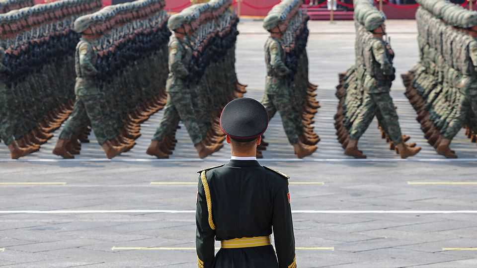
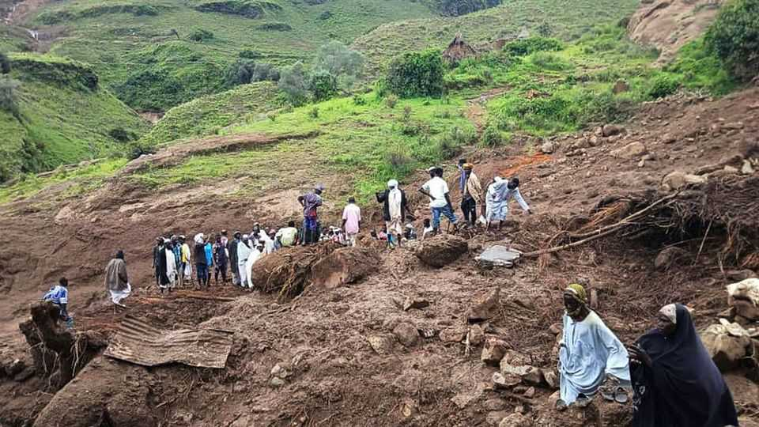

The world this week
Politics
September 4th 2025

China’s ruler, Xi Jinping, threw down his biggest challenge yet to the West’s global leadership by holding Beijing’s largest-ever military parade and a summit of 26 leaders from other countries. China showed off its new weapons, including laser gadgets, nuclear missiles and robot wolves at the parade, which was attended by Vladimir Putin, Kim Jong Un and leaders from Belarus, Iran, Pakistan and Zimbabwe. Mr Kim travelled with his teenage daughter, Kim Ju Ae, who may be the North Korean dictator’s eventual successor. Mr Xi held talks with Mr Putin on the eve of the parade and said they would work to create a “more just and equitable” global system. Russia announced that it had reached an agreement with China to build the Power of Siberia 2 gas pipeline, which is supposed to provide China with alternative supplies to the liquefied natural gas it imports from America, Qatar and Australia. There

was no detail about who would pay for the project, which is not due to be built until the 2030s. China offered no comment on the supposed deal.

Narendra Modi, India’s prime minister, made his first trip to China in seven years and also held talks with Mr Xi. Both men spoke warmly of their relationship. Mr Modi has been trying to balance India’s relations with China and America, but has been caught off guard by America’s imposition of tariffs.

In Thailand Paetongtarn Shinawatra was dismissed as prime minister by the Constitutional Court, which decided she had violated ethics rules when she held a phone call with Hun Sen, a still influential former Cambodian prime minister, to discuss a border skirmish between the two countries. The ruling Pheu Thai party wanted to name a new prime minister, but Anutin Charnvirakul, the leader of the Bhumjaithai Party, is favoured to get the job when parliament holds a vote on September 5th.

More than 1,200 people were detained in Jakarta, as the worst riots in decades beset Indonesia. The trouble began when students held demonstrations against the government’s plans to enhance benefits for politicians amid the country’s cost-of-living crisis. The protests turned violent when police ran over and killed a motorbike-taxi driver, and spread throughout Indonesia. Ten people have died overall.

Two earthquakes and associated aftershocks struck Afghanistan, killing at least 1,400 people. The quakes hit the provinces of Kunar and Nangarhar on the border with Pakistan the hardest. The death toll is expected to rise.

The worst floods in decades have devastated Pakistan’s Punjab province. Hundreds of people have died since late June when the deluge started. Thousands of villages have been hit hard, with their crops destroyed and fields under water. The resulting food shortage may fuel inflation. Meanwhile, 11 people were killed by a suicide-bomber in Quetta, the capital of Balochistan province, where militant separatists and Islamist extremists are active.

Israel pushed ahead with its offensive in Gaza city, launching heavy strikes and starting to send ground forces into the area. Thousands of Israeli

reservists have been called up. Israel has ordered civilians to leave but many remain. Meanwhile, Israeli air strikes on Sana’a, the Yemeni capital, killed a number of Houthi officials, including the Iranian-backed militia’s self- declared prime minister.

America denied visas to 80 Palestinian officials ahead of the United Nations General Assembly in New York, at which several countries, including Britain and France, have said they will recognise Palestinian statehood. American officials were reported to have also suspended visas for most Palestinians wanting to visit the United States.

Britain, France and Germany notified the UN Security Council that Iran was violating its obligations under the Joint Comprehensive Plan of Action, a multinational nuclear deal. Iran has 30 days to comply. If negotiations fail, UN sanctions that had been lifted by the JCPOA, including an arms embargo, will be reimposed.

Around 1,000 people are thought to have died in a landslide in Sudan's central Darfur region. It is the latest humanitarian catastrophe in the country, which has been mired in civil war for more than two years. Neither side in the conflict responded to calls for a temporary ceasefire in order to send help to the area.

Patrice Talon, the president of Benin, confirmed that he would step down after two terms in office. It is welcome news in west Africa, where leaders are increasingly trying to hold on to power for longer than promised. The country’s ruling coalition has nominated the finance minister to run in elections next year.

A 52-year-old man admitted to killing Andriy Parubiy, a former speaker of the Ukrainian parliament, in Lviv, Ukraine’s most westerly city. Mr Parubiy was a prominent figure in the Maidan protests that led to the downfall of Viktor Yanukovych as Ukraine’s pro-Russian president in 2014. Ukrainian officials suspect Russian involvement, but the assassin claims it was an act of “revenge” against the Ukrainian authorities and that he had no Russian help.

Ursula von der Leyen, the president of the European Commission, said that Europe had a “pretty precise” plan to send peacekeeping troops to Ukraine. That earned a rebuke from Boris Pistorius, Germany’s defence minister, who said it was “fundamentally wrong” to talk publicly about such things ahead of any potential peace negotiations.

At least 16 people were killed in Lisbon when the Elevador da Glória, one of the three funiculars that traverse the Portuguese capital’s steep hills, crashed. The 140-year-old rail car transported residents and tourists from the Baixa to Bairro Alto neighbourhoods in the heart of the city.

Britain’s deputy prime minister came under pressure to resign after admitting that she had underpaid tax on the purchase of a second home. In recent years Angela Rayner has been notably critical of politicians she says have avoided paying tax.

A federal judge in San Francisco ruled that Donald Trump’s deployment of National Guard troops to Los Angeles was illegal. The case was brought by Gavin Newsom, California’s Democratic governor, after the guard were sent to Los Angeles in June to help quell protests against the removal of illegal immigrants. The ruling is on hold while the government appeals against it. It didn’t seem to deter Mr Trump, who said he was sending the National Guard to Chicago.

The American military attacked a Venezuelan boat in the southern Caribbean that was allegedly transporting drugs to the United States, killing 11 people. Mr Trump said it was carrying “narco-terrorists”. Questions are being asked about the legality of the operation, which happened in international waters.

Guyana held presidential and parliamentary elections in which Irfaan Ali was likely to win a second term as president. The economy grew by 44% in 2024 thanks to an energy boom. Guyana accused Venezuela of firing shots at a boat carrying election officials and ballots in the oil-rich Essequibo region, which Venezuela claims as its own.

Two vocal opponents of the socialist government in Nicaragua were reported to have died in police custody. Daniel Ortega and his wife, Rosario Murillo, the country’s co-presidents, have overseen the detention of hundreds of opponents to their Sandinista regime.

This article was downloaded by zlibrary from [https://www.economist.com//the-world-this-week/2025/09/04/politics](https://www.economist.com//the-world-this-week/2025/09/04/politics)