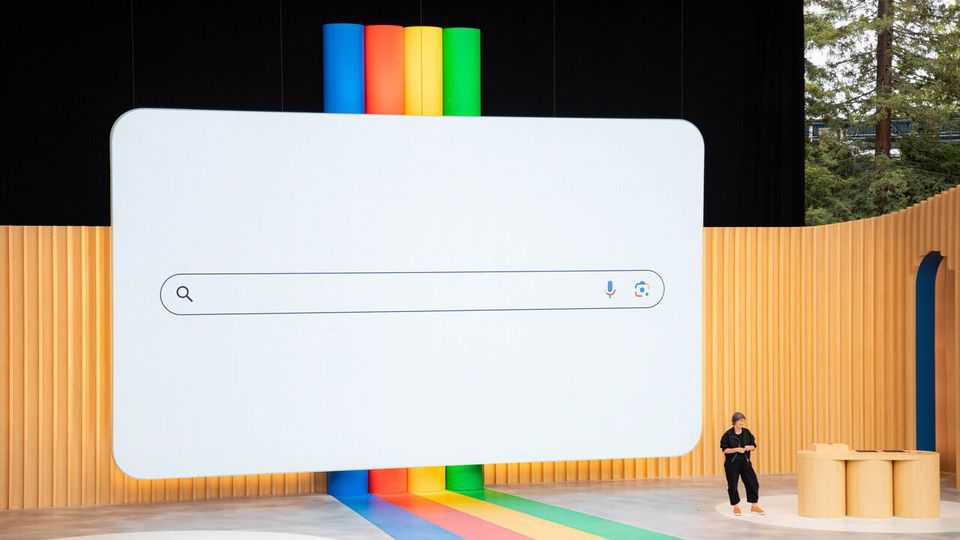
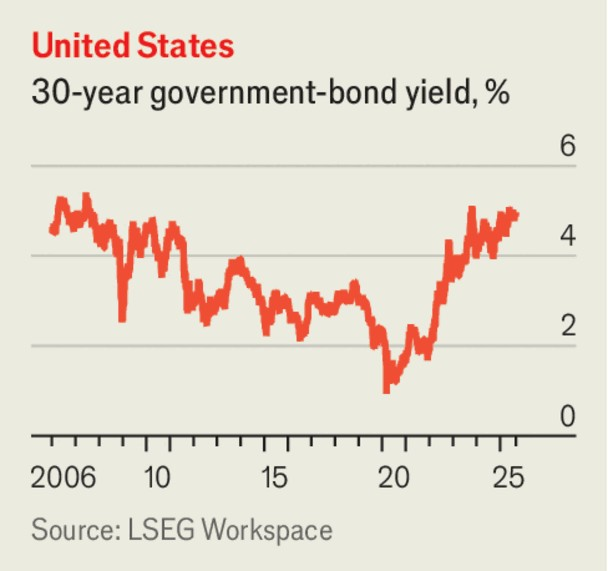

The world this week
Business
September 4th 2025

Google breathed a sigh of relief after the judge who last year ruled that the company was an illegal monopolist decided that it would not have to break itself up. Instead it must share search data with smaller companies. The Justice Department had called for much harsher remedies, such as for Google to sell its Chrome browser, in what was the biggest tech antitrust case since a trial involving Microsoft in the early 2000s. The decision may influence other efforts to rein in big tech. The judge suggested that new competition to internet search from the likes of ChatGPT had “changed the course” of the case.

Global bond markets came under more pressure amid a raft of investors’ concerns, from persistent inflation to unsustainable government debt. The yield on 30-year American Treasuries flirted with 5%, though yields on shorter-term bonds fell. Japan’s 30-year yield reached 3.29%, a record high. In Britain the yield on 30-year gilts hit its highest level since 1998, rising to 5.75%. Higher yields mean more expensive borrowing costs for governments.

The price of gold rose above $3,500 a troy ounce for the first time, reaching $3,560. Investors are piling into the conventional safe asset because the Federal Reserve is expected to cut interest rates later this month.

In a blow to Donald Trump’s trade policy, an appeals court ruled that most of his reciprocal tariffs are illegal, finding that the International Emergency Economic Powers Act does not grant a president “unlimited authority to impose” them (the decision does not affect Mr Trump’s duties on steel and aluminium). The tariffs will remain in place until October 14th to give the Trump administration time to take the case to the Supreme Court.

American Eagle’s share price soared after it confirmed that its ad campaign featuring Sydney Sweeney (and Travis Kelce) had been a roaring success. The clothing company said the jeans promoted by Ms Sweeney, an actress,

had sold out within a week, despite an online backlash about the ad mentioning her “genes”. Quarterly revenue far exceeded analysts’ expectations.

Anthropic, an artificial-intelligence startup best known for its Claude large language models, was valued at $183bn following a round of fundraising. That is up from $61.5bn after a previous round of capital-raising in March.

Klarna launched its initial public offering on the New York Stock Exchange, five months after postponing it amid the turmoil in markets caused by Mr Trump’s tariffs. The Swedish fintech firm could be valued at up to $14bn, according to reports, well below the $46bn it was thought to be worth in 2021 after a capital-raising exercise.

A decade after merging in a transaction arranged by Warren Buffett, Kraft Heinz announced that it would split into two separately traded companies. One of them will focus on condiments and spreads and house the Heinz, Philadelphia and Kraft Mac & Cheese brands, and the other will contain the slower-growing Oscar Mayer, Kraft Singles and Lunchables assets. Mr Buffett, who is stepping down as chief executive of Berkshire Hathaway, admitted in 2019 that he was “wrong in a couple of ways on Kraft Heinz”. Berkshire is still the company’s biggest shareholder, with a 27.5% stake.

A potential corporate battle loomed into view when Elliott Management, an activist hedge fund, revealed that it had bought a $4bn stake in PepsiCo with a view to pushing an “appropriately ambitious turnaround plan” to revive the company’s stock price. Elliott has a long track record of trying to shake up the companies it invests in, which most recently include BP and Southwest Airlines. PepsiCo said it welcomed “constructive input on delivering long- term shareholder value”.

In what turned out to be a week of upheaval in the consumer food and drinks industry, Nestlé sacked Laurent Freixe as its chief executive for not disclosing a romantic affair with an employee. He had been in the job for just a year. Philipp Navratil takes the reins at the world’s largest food company, which faces a challenge from cheaper rival brands.

And in Japan Niinami Takeshi resigned as chief executive of Suntory, which owns the Jim Beam and Maker’s Mark whiskey brands as well as the Lucozade, Orangina and Ribena soft-drink assets, amid allegations that he possessed supplements containing possibly illegal cannabis-derived substances. Mr Niinami is one of Japan’s best-known businessmen, and has been an economic adviser to several prime ministers. He says he was unaware that the supplements were illegal.

This article was downloaded by zlibrary from [https://www.economist.com//the-world-this-week/2025/09/04/business](https://www.economist.com//the-world-this-week/2025/09/04/business)