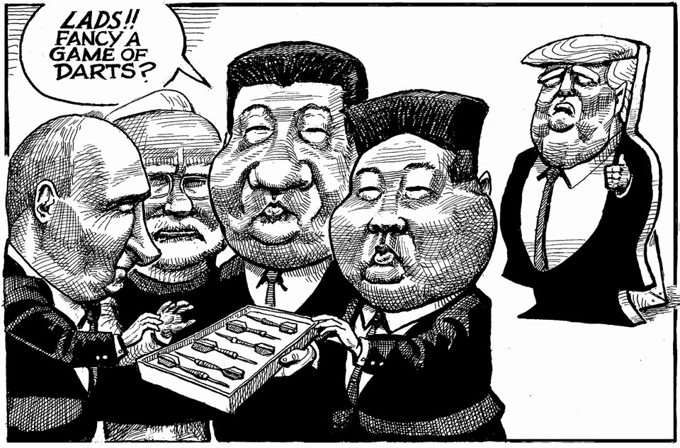

The world this week
The weekly cartoon
September 4th 2025

Dig deeper into the subject of this week’s cartoon: Xi Jinping’s anti-American party On parade in China China has Russia over a barrel The editorial cartoon appears weekly in The Economist. You can see last week’s here. This article was downloaded by zlibrary from https://www.economist.com//the-world-this-week/2025/09/04/the-weekly-cartoon

Leaders

Donald Trump is unpopular. Why is it so hard to stand up to him? How Europe’s hard right threatens the economy Xi Jinping’s anti-American party Indonesia could be on the brink of something nasty Schools should banish smartphones from the classroom