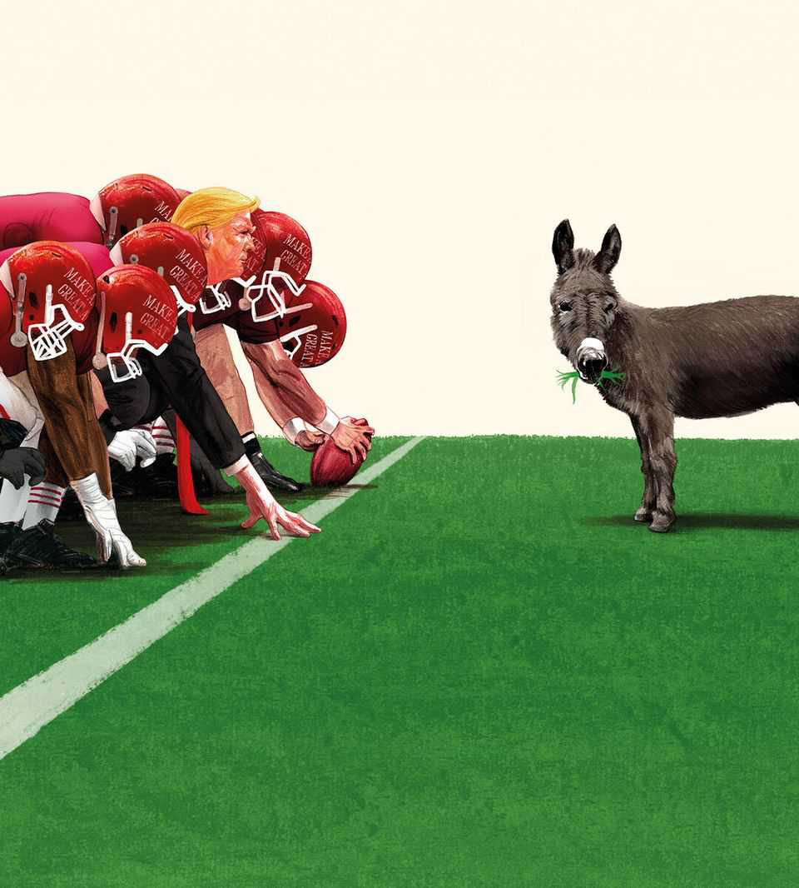

Leaders | America’s missing opposition
Donald Trump is unpopular. Why is it so hard to stand up to him?
Republicans are servile. Courts are slow. Can the Democrats rouse themselves?
September 4th 2025

IF A SINGLE political idea has tied Americans together over their first quarter of a millennium, it is that one-person rule is a mistake. Most Americans also agree that the federal government is slow and incompetent. Together, these things ought to make it impossible for one man to govern by diktat from the White House. And yet that is what this president is doing: sending in the troops, slapping on tariffs, asserting control over the central bank, taking stakes in companies, scaring citizens into submission. The effect is overwhelming, but not popular. President Donald Trump’s net approval rating is minus 14 percentage points. That is little better than Joe Biden’s after his dire debate last year, and no one fretted that he was over-

mighty. This is a puzzle. Most Americans disapprove of Mr Trump. Yet everywhere he seems to be getting his way. Why?

One answer is that he moves much faster than the lumbering forces that constrain him. He is like the TikTok algorithm, grabbing attention and moving on to the next thing before his opponents have worked out what just happened. The Supreme Court has yet even to consider whether deploying troops to Los Angeles in June was lawful. While the justices take their time, the president may soon use the same routine in Chicago. The court may not rule on the legality of his tariffs for months. So far the president has obeyed Supreme Court rulings, but if one legal avenue is closed he will try another and the clock resets.

Another answer is that the Republican Party always lets him have his way. It is not just that he dominates it, with an approval rating among Republicans of almost 90%. It is that the party’s organising idea is that Mr Trump is always right, even when he contradicts himself. Policy debates have turned into theological disputation in which sides fight over the real meaning of his words.

Independent institutions—companies, universities or news organisations— might oppose him. But they suffer from a co-ordination problem. This is much easier to point out than to fix, because organisations that compete with each other would have to collaborate. What is bad for Harvard may not be bad for its rivals. If a single law firm can be picked off, its business may go to a competitor.

Behind all these lurks the ugly reality of Mr Trump’s vindictiveness and intimidation. Previous presidents were influenced by independent-minded experts and the cabinet. The new definition of an expert in the Oval Office is someone who agrees with the boss. Bearers of bad news are sacked; awkward Republicans primaried; business leaders punished; opponents investigated. For each, the rational response is to apologise, settle and hope that someone else will do the right thing. Having seen what that entails, someone else may prefer a quiet life.

Politically, therefore, the main task of opposition falls to the Democrats. They are, to put it kindly, confused. Should they fight Mr Trump with ALL

CAPS posts, as Gavin Newsom is doing? Is it all about mastering curated authenticity, like Zohran Mamdani? Do they move left? Do they occupy the centre? Is the problem merely one of messaging that can be fixed if only activists would stop calling women “birthing people”?

The fact that Democrats can neither constrain Mr Trump nor even communicate clearly leaves their base angry. Mr Trump’s ratings are low, but he is more popular than the Democratic Party—not because Republicans and independents disapprove of it (though they do), but because Democrats disapprove of themselves.

In the short run the self-loathing may be overdone. The midterms are a year away. In ten of the 12 elections for the House of Representatives this century, voters have turned against the party that holds the presidency. Gerrymandering, which will reduce the number of competitive seats in the House from few to almost none, means that even a president this unpopular is unlikely to suffer a landslide defeat in 2026. But a Democratic House with subpoena power would provide a crucial check on presidential corruption and incompetence.

In the long run, though, that looks like false comfort. The Democratic brand is damaged. Democrats are more trusted by the electorate on health care, the environment and democracy. But on many issues voters care about, including crime and immigration, they prefer Republicans. In the 2024 election Kamala Harris was seen as more extreme than Mr Trump. Saying the voters are wrong or sexist to think this way is not helpful.

Demography is no longer the Democrats’ friend. Under Mr Trump, Republicans have made progress with non-white and young voters. The Democrats have lost the white working class. Although the most educated voters like them, only 40% of Americans aged 25 or over have a college degree. These changes mean the story Democrats have long told themselves —that they represented the real majority in America, but Republican machinations kept them out of power—is no longer true, if it ever was. Now they benefit from a lower turnout.

Ten years into the Trump era, Democrats are still underestimating him. His skill in setting traps for them is extraordinary. Take the looming vote in

Congress on raising the federal debt ceiling: Democrats will have to choose between more cuts to foreign aid and shutting the government. Or take sending troops into cities, supposedly to fight crime. Democrats decry executive overreach; Mr Trump places them on the side of criminals and danger. Or take drone strikes on alleged drug-smugglers. It is hard to oppose the lack of any due process without sounding like a defender of violent gangs.

Democrats have choices about whether to walk into those traps. Lots of them think, rightly, that Mr Trump poses a danger to the country’s democratic values and conclude that this alone should make him toxic to most voters. Alas, it does not. Instead, the question Democrats need to keep asking themselves is this: why do voters think they are the extremists, rather than the guy trying to establish one-man rule? ■

For subscribers only: to see how we design each week’s cover, sign up to our weekly Cover Story newsletter.

This article was downloaded by zlibrary from https://www.economist.com//leaders/2025/09/04/donald-trump-is-unpopular-why-is-it- so-hard-to-stand-up-to-him