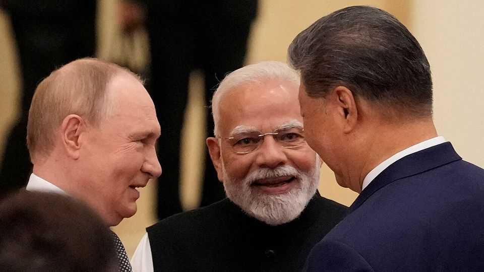

Leaders | The summit in Tianjin and Beijing
Xi Jinping’s anti-American party
To see the cost of Trump’s bullying, tally the world leaders flocking to China
September 4th 2025

YOU MAY think the place where national leaders gather to talk about the state of the world is Washington, or perhaps the UN Headquarters in New York. In fact, as President Xi Jinping showed when he hosted over 20 presidents and prime ministers in China this week, a new reality is taking hold. Mr Xi used a summit of the Shanghai Co-operation Organisation (SCO) in Tianjin to advertise China as a source of stability and prosperity. He used a military parade in Beijing, marking the 80th anniversary of the end of the second world war, to remind everyone that China has become a mighty power. The source of trouble today, he suggests, is America.

Mr Xi’s claim to lead a global coalition of America-sceptic powers is not as fantastical as you might think. He received autocrats like Vladimir Putin of Russia and Kim Jong Un of North Korea, who travelled by armoured train. But he also welcomed leaders of countries that have leant towards the West, including Turkey, Egypt and India—which is furious after Donald Trump singled it out for punitive tariffs and embraced its enemy, Pakistan, after a conflict in May.

China’s boast to be an anchor of stability has weight, at least in some respects. The country is already the largest goods-trading partner of most of this week’s visitors, along with another 40-odd states around the world. As the Trump administration pursues a rolling campaign of economic warfare against its trading partners, China’s sins of mercantilism and state capitalism look minor by comparison.

There is also a new-found unity opposing sanctions, including the extraterritorial threat America uses to sever individuals, firms and countries from the dollar-based financial system and tech platforms. More and more countries are interested in finding alternatives to the dollar. And fewer will be interested in enforcing America’s sanctions on its behalf.

China’s guests still have plenty to disagree about. India opposes its military build-up after skirmishes on the Himalayan border. China’s neighbours must have watched its new missiles trundle through Tiananmen Square with mixed feelings. Yet among the autocrats, co-operation is deepening. Russia and North Korea are working on space and satellite systems. In return for China’s support over Ukraine, Russia is thought to be offering it more of its most sensitive military technology, including submarine-propulsion and missile-defence systems.

The weakest part of Mr Xi’s campaign is over international institutions and rules. He has just declared that “global governance has reached a new crossroads.” State media propose that China should work with like-minded countries to uphold the UN Charter and “build a more just and equitable global governance system”. Despite being cloaked in the language of multilateralism, these are code words for a China-friendly world order in which big powers dominate spheres of influence and enjoy more rights than small ones. Few countries want Asia to be run by China.

Not everyone at Mr Xi’s big bash agrees with each other on everything. The SCO is a far cry from a NATO-style alliance. Other than the unifying factor of disenchantment with Mr Trump’s America, these countries often have little in common. European leaders were notably absent from the celebrations. Yet convening disparate parties with different interests is not a sign of weakness. It is what superpowers are uniquely able to do. To have China shepherd so many leaders through Tianjin and Beijing was a display of its growing power. China does not yet command a new world order. But it does show how much damage Mr Trump is doing to American interests. ■

Subscribers to The Economist can sign up to our Opinion newsletter, which brings together the best of our leaders, columns, guest essays and reader correspondence.

This article was downloaded by zlibrary from [https://www.economist.com//leaders/2025/09/02/xi-jinpings-anti-american-party](https://www.economist.com//leaders/2025/09/02/xi-jinpings-anti-american-party)