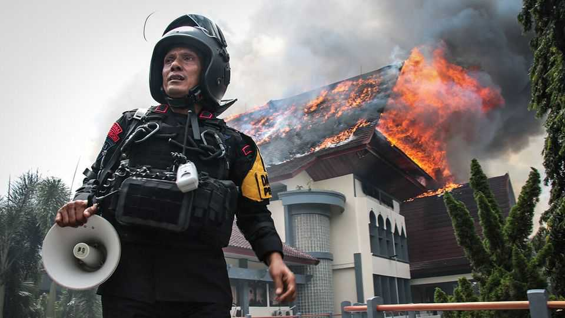

Leaders | Prabowo’s choice
Indonesia could be on the brink of something nasty
The president should heed protesters rather than crushing them
September 4th 2025

The spark was a young man’s death. A motorbike delivery driver was passing a protest outside Indonesia’s parliament on August 28th, just as a police vehicle surged forward. It crushed him. The video went viral, and mostly peaceful demonstrations turned into nationwide riots. Looters sacked the homes of five officials, including the finance minister. The original protest was about a lavish housing allowance that Indonesian lawmakers have awarded themselves, worth nearly ten times the minimum wage in Jakarta, the capital. Now Indonesians are furious about many things, from heavy-handed policing to the grubby misrule of Prabowo Subianto, the former general who was elected president last year. The country could be on

the brink of serious unrest—and Mr Prabowo’s governing style is largely to blame.

He dislikes having to deal with opposition, and so has pursued a strategy of co-opting all the other political parties by welcoming them into a ridiculously broad coalition. Fully seven of the eight parties in the lower house have joined it; Mr Prabowo is trying to persuade the last one to come on board, too. His bloated cabinet has over 100 members, up from around 50 under the previous administration.

Mr Prabowo claims that this set-up suits the country’s culture. (Javanese people are polite, he insists, and dislike open disputation.) He has suggested that his mega-coalition should become permanent. That is a dismal idea. It would be an open door to corruption. To keep the factions happy, Mr Prabowo has already doled out bungs, such as that housing allowance. With no opposition in parliament, disgruntled Indonesians would have no way to complain, save taking to the streets. And it would reduce pressure on Mr Prabowo to govern better.

Such pressure is urgently needed. Mr Prabowo is mismanaging the economy. Annual growth was a tolerable 5.1% in the second quarter of this year, but problems are bubbling under the bonnet. Indonesia has prematurely deindustrialised. The share of GDP from manufacturing has fallen by half in two decades. The country has failed to use its resources well. Despite huge oil and gas reserves, it has spent 20 years as a net oil importer. Its solar and wind potential has barely been exploited.

Life for many is hard. The cost of staples has jumped: a kilo of rice is 34% pricier than three years ago. Lay-offs are increasingly common; university graduates are more and more likely to be unemployed. Families struggle with debt. The share of bank loans to households that are non-performing has surged to its highest on record.

Grappling with these ills requires wise structural reforms. Instead, Mr Prabowo has ordered a 9% cut to the government’s budget to pay for a free school-lunch programme and a new sovereign-wealth fund. The fund has taken over state-owned enterprises and now receives their dividends, leading

to a sharp drop in government revenues—which are already squeezed by low prices for commodities such as nickel.

The free-lunch scheme is supposed to reduce stunting, but the way to do that is to help children in the womb and before the age of two, not at school. The sovereign-wealth fund is accountable only to Mr Prabowo: a mightier tool to promote cronyism is hard to imagine.

Sensibly, the president has agreed to cancel MPs’ new housing allowances. But the big risk is that he will use violent protests as an excuse to crack down even more heavily. Indonesia is nothing like the police state it was under Suharto, a dictator who was ousted by protests in 1998. But Mr Prabowo, who married Suharto’s daughter, is clearly nostalgic for the old authoritarian habits. That is no way to hold together a multi-ethnic archipelago of 17,000 islands, let alone to govern it well. ■

Subscribers to The Economist can sign up to our Opinion newsletter, which brings together the best of our leaders, columns, guest essays and reader correspondence.

This article was downloaded by zlibrary from https://www.economist.com//leaders/2025/09/04/indonesia-could-be-on-the-brink-of- something-nasty