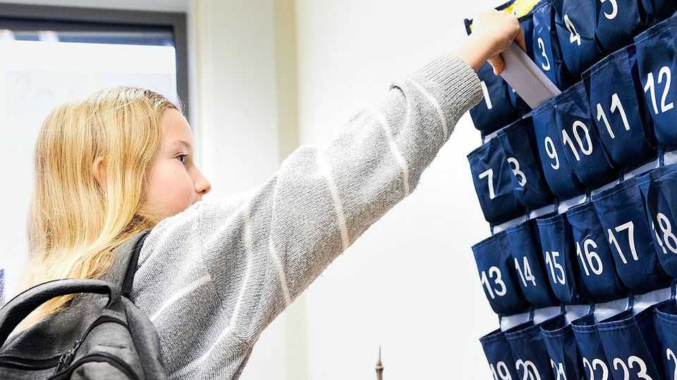

Leaders | Education and technology
Schools should banish smartphones from the classroom
Grades will rise—and pupils will be happier
September 4th 2025

Back in the 20th century, bored scholars had to make do with flicking rubber bands at their classmates, doodling in their textbooks or staring out of the window. Modern technology has revolutionised slacking. Most teenagers in the rich world own smartphones. Many are allowed to bring them into classrooms, where each provides a bottomless source of apps designed to be as compelling—and distracting—as possible. A backlash is under way, as parents and teachers worry about the effects on classroom performance. On August 27th South Korea passed a ban on smartphones in classrooms. Governments from China to Finland, as well as dozens of American states, have introduced bans and restrictions of varying

severity. The Economist is queasy about micromanaging the job of head teachers to such a degree—but schools that still welcome smartphones would be wise to think again.

This may seem fusty and technophobic. It is not. Even diehard libertarians agree that children do not always know what is in their own interests. Nor does banishing phones from maths lessons mean depriving children of experience with modern technology. They get plenty of that outside school; gaps can be patched up in dedicated lessons.

Technophiles like to point to a long history of misplaced scepticism about technology and its impact on education. A favourite example is Plato, who complained about the baleful effects of writing on the grounds that storing facts and arguments on scrolls would erode pupils’ ability to remember them. But just because Plato was wrong two thousand years ago does not mean that today’s worries are misguided.

Plato never put his claims to the test—whereas a growing body of research suggests that phones are indeed bad for schoolchildren. A recent study, run by an international team of academics and conducted in India, was a randomised controlled trial, the gold standard. As we report this week, it followed 17,000 higher-education students for three years. It concluded that requiring phones to be left outside classrooms led to a small but measurable improvement in grades. The weakest students benefited most of all.

Admittedly, the evidence is not yet overwhelming. The Indian study found only small gains. Its results contain quirks (they suggest, for instance, that bans lift performance in the first and third years of a degree but not in the second, which is odd). Although its conclusions match those of studies in England and Spain, one in Sweden found that bans had no effect.

Yet most educational interventions have only a small effect on grades. Scientists and researchers can afford to wait for the evidence to improve before issuing a final verdict, but teachers cannot. They must do the best they can for children in their classrooms with whatever evidence is available today.

And the benefits of restricting smartphone use may go beyond better exam results. One of the more striking findings in the Indian study was that, after a while, the bans became popular with students. That fits with anecdotes from young people, which suggest the problem is in part one of collective action. If most pupils are socialising on phones, then anyone who tries to focus on lessons instead is missing out. If schools impose a blanket ban, there is nothing to miss out on.

Smartphones are far from the only problem schools face. But they are one that is easy to solve. At a time when educational progress seems to be in reverse around the world, any school that has not restricted them should consider doing so. In the long run, their pupils might even thank them for it. ■

Subscribers to The Economist can sign up to our Opinion newsletter, which brings together the best of our leaders, columns, guest essays and reader correspondence.

This article was downloaded by zlibrary from https://www.economist.com//leaders/2025/09/03/schools-should-banish-smartphones- from-the-classroom

Letters

Is the Arctic NATO’s soft underbelly?