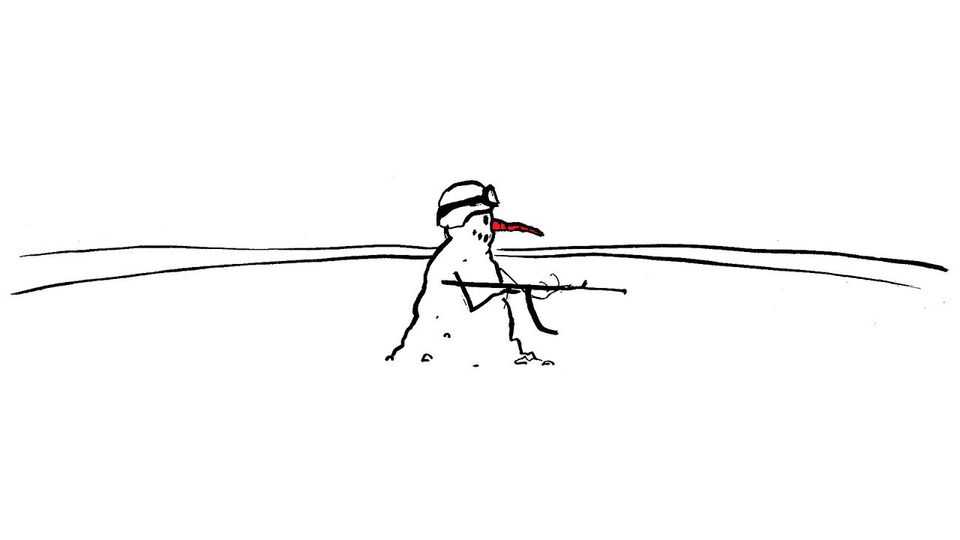
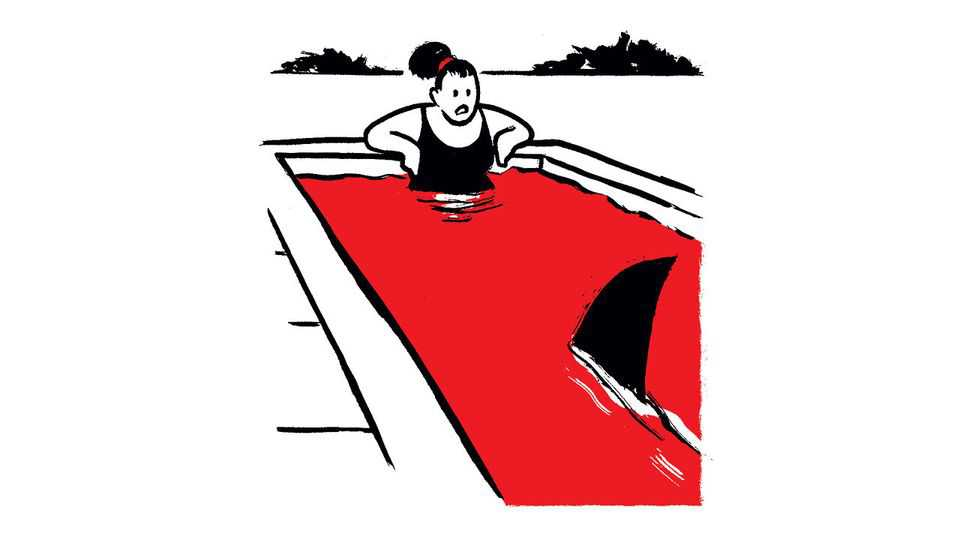

Letters | A selection of correspondence
Is the Arctic NATO’s soft underbelly?
Also this week, wildfires, electricity prices, swimming pools, New Orleans, fantasy football
September 4th 2025

Letters are welcome via email to letters@economist.comFind out more about how we process your letter John Bolton suggests that the Arctic is NATO’s soft underbelly (By Invitation, August 16th). He describes Canada as the “hole in the doughnut” of Arctic defence. That hole is in fact filled by the North American Aerospace Defence Command, the binational organisation between the United States and Canada that has been the first line of Arctic and North American defence since 1958. Russia gets barely a mention in Mr Bolton’s analysis, but it is still the proximate, persistent threat because the Arctic Ocean is its fastest avenue of attack and Russia has enough warheads to hold

North America to ransom. It is the United States’ plans that are opaque. For instance, it is true that Greenland is essential to the defence of North America, but the US is highly dependent on Nuuk, Greenland’s main port, for refuelling military vessels because it is dithering over the construction of a deep-water port in Alaska.

NATO has hosted its largest exercises in the Arctic since the cold war. The point that the alliance must do more is well taken, but not all NATO states can operate in the region. NATO only mentioned the Arctic in a summit communiqué mostly because Canada and the United States saw NATO as essential in Europe’s Arctic, not North America’s. However, the Arctic Security Forces Roundtable, which includes all seven NATO Arctic states and several other countries, needs a jolt; there should be more co-ordination of regional operations; and NATO’s Integrated Air and Missile Defence planning must go beyond the committee stage.

But the United States’ allies have always been there in the Arctic. When it comes to Arctic know-how and capabilities, it is as Mr Bolton states, the “wholly inadequate” American military resources that are often the concern.

Prof. Andrea CharronDirectorCentre for Defence and Security StudiesUniversity of ManitobaWinnipeg, Canada

The one recommendation you left out of your article on wildfires in Europe is the need for good land management (“A continent ablaze”, August 23rd). There used to be established routines for burning off scrub and moorland to prevent the build up of combustible old growth, but recent, well-meaning legislation has disrupted the process and fires now have plenty of fuel. Generally, land owners and their estate staff know what works, but the metropolitan establishment is reluctant to listen to them.

Neil WoodAylesford, Kent

You noted that the average electricity bill in America has risen by 7% so far in 2025 and blame rising demand from data centres (“Everything’s computer”, August 23rd). Prices have risen, but not because of artificial intelligence. At least for now. The real culprit is the escalating cost of transmission. For example, over the past ten years transmission costs in the

PJM Interconnection, America’s largest regional transmission organisation, have risen from 6.8% to 32.4% of the wholesale price of electricity.

The solution to higher transmission costs is competitive bidding on new transmission projects. Only about 5% of all transmission projects face competition. The Federal Energy Regulatory Commission is at fault. It has failed to enforce Order 1,000, a regulation that requires monopoly transmission utilities to compete when building new transmission lines. Without competition, there is no reason for a monopoly to reduce costs. Hundreds of billions of dollars in higher costs have been incurred and billions more are on the way. Consumers will foot the bill for FERC’s failure.

Paul CicioChairElectricity Transmission Competition Coalition Washington, DC

Back Story in the August 9th issue discussed fictional swimming pools as “cauldrons of envy, danger and lust”. It did not mention Jacques Deray’s seminal film from 1969, “La Piscine” (The Swimming Pool). The film’s entire plot revolves around the envy, danger and lust surrounding the titular pool. Omitting it is like running an article on British naval victories without Trafalgar.

JOSEPH BENJAMIN BOBER BAERNew York

There is something deep in our psyche about pools. My mom wouldn’t spend money on pool membership, the social scene of junior high school; she would hand me my bag through the fence. An invitation to the pool next to my friend’s house was a joyful time. As an adult I have a recurring dream about owning a pool. I’m still waiting for my husband to build it.

COURTNEY BROOKSPort Orchard, Washington

Does it make sense for America to keep subsidising a sinking city, you ask (“Muskrat ramble”, August 23rd)? Using taxpayers’ money to protect New Orleans is a question of priorities. Elon Musk’s SpaceX and Tesla have received by some estimates $38bn in public support, such as government contracts, subsidies and tax credits. That is twice as much that was spent on strengthening the levees in New Orleans after Hurricane Katrina. Greater New Orleans is home to 1.4m people and contributes over $100bn to America’s economy (yes, including from people who actually have to pay taxes). Its culture has helped shape American culture from jazz to Cajun and Creole cuisine. I think it’s safe to say the city is worth the investment. You don’t have to travel to Mars to figure that out.

Scott TiltonNew Orleans

Bartleby asked, “Should you trust that five-star rating on Airbnb?” (August 16th). Notably absent from the column was any mention of the role incentives play in shaping behaviour when drafting a review.

Among various online platforms I’ve used, Airbnb’s system is the more rigorous. Reviews are blind (you can’t see the other party’s review until both are submitted) and performance ratings for hosts are tied to coveted Superhost and Guest Favourite badges. These incentives strongly encourage hosts to deliver high-quality stays and provide guests with useful decision- making tools.

And rather than raising alarm about the risks of artificial intelligence, I see real potential in applying the technology to improving these mechanisms. So the real questions are, which platforms enforce quality control? Which let

standards slip? And how might AI sharpen, not undermine, the credibility of reviews?

Jock BakerRolle, Switzerland

I was reading Bartleby on whether online reviews could be trusted when suddenly I was interrupted by The Economist to ask if I was happy with the app. I of course said yes. And then I was asked would I like to leave a review. I wonder what would have happened if I said no?

Eoin DugganCork, Ireland

“In a league of their own” (August 16th) analysed football’s Fantasy Premier League by focusing on expected goals, a derivative of an individual player’s performance. This neglects decades of statistical analysis covering team performance. Clearly, individuals can stand out statistically and on the pitch. However, over the course of a season it is teams that win leagues and championships.

The style of play is critical in providing those goal-scoring players with the chances to shoot. That has been the basis of much football analysis and is what makes the beautiful game such a joy to follow. My journey on the football-statistics path was influenced by the late Charles Reep, a football- data analyst, at Plymouth Argyle, my hometown club. His philosophy was clear. Implement a structure to improve your chances of scoring. After all, to win you must score more than the opposition. Sounds simple, but not so easy to achieve.

Nick LittleBloomingdale, Michigan

You described Brighton and Brentford as “yo-yo” clubs, meaning they are regularly relegated and promoted between leagues. Brighton has been in the Premier League for eight years. Brentford has a similar tale. Neither has yet to be relegated, or re-promoted.

Or as a fellow Seagulls supporter put it, we’ve yet to yo, let alone yo-yo.

Hannah KowszunLondon

This article was downloaded by zlibrary from [https://www.economist.com//letters/2025/09/04/is-the-arctic-natos-soft-underbelly](https://www.economist.com//letters/2025/09/04/is-the-arctic-natos-soft-underbelly)

By Invitation

Gaurav Kapadia on how to make the Democrats relevant again America needs smarter AI policies. The Democrats can provide them, reckons Gina Raimondo China should not fuel an arms race, says a close watcher of its nuclear policy