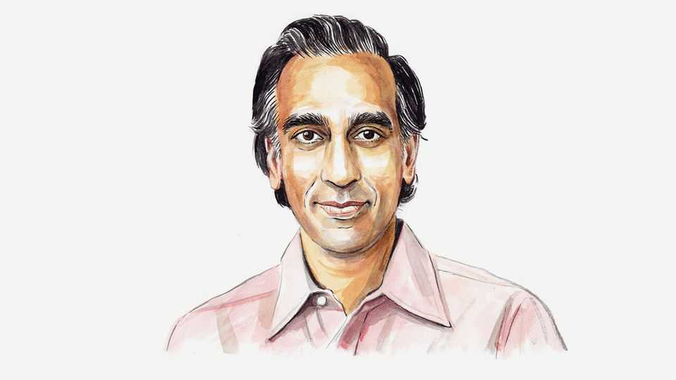

By Invitation | America’s missing opposition
Gaurav Kapadia on how to make the Democrats relevant again
What’s the point of being principled if you can’t be practical?
September 4th 2025

WE’VE ALL been at a party with a well-meaning but exhausting guest; let’s call him Jerry. Jerry’s stories meander without a clear point. He equivocates, laments past failures, complains about the status quo and offers no solutions for the future. He talks without listening. Everyone feels for Jerry, but no one wants to be around him. The vibes give everyone the ick. Jerry’s predicament is exactly the bind Democrats find themselves in. They have lost the thread, and it is showing; of the 30 states that track voter registrations by party, the Democrats have lost ground in every single one of them over the past four years, with a negative voter-registration swing of 4.5m.

The party that once embodied American optimism now sounds perpetually pessimistic. Where Democrats once championed growth and possibility, they now focus on managing decline and redistributing scarcity. They have become the party that explains why things can’t be done rather than the party that gets things done. Worse, they’ve become hopelessly reactive, always responding to whatever Republicans do instead of charting their own course.

To get their aura back, the Democrats need to listen to a fresh crop of leaders. It isn’t that hard; at cocktail parties and in politics people gravitate towards authenticity, optimism and those who listen and show respect for others. People lean away from those who make excuses, complain and patronise them. If the Democrats can harness their dynamic young talent and offer common-sense solutions that help Americans get on top of their most important issues, the vibes will be immaculate.

Conversations with Democratic senators, congressmen, governors and mayors reveal a contradiction. In private, I have found each of them authentic and filled with practical solutions. But when they move to a group setting they become cautious and insecure. This stems from fear—they are terrified of the left branding them sell-outs, the right calling them radicals and special interests vilifying them. This paralysis prevents them from conveying their authenticity and championing bold changes. They’ve become the party of perpetual worry rather than purposeful action.

Voters wake up worried about affording rent, frustrated by friction the government creates and anxious that their kids may not have better opportunities than they did. When Democrats respond to these concerns with vague, grandiose statements with no plan, they lose their audience.

Americans want a party that believes the pie can grow bigger, not one that just argues about how to slice it smaller. This means getting stuff done: more homes built faster, more good jobs created, more paths to prosperity opened. Take housing. Young teachers can’t afford to live in the districts where they work. Nurses commute for two hours because homes near hospitals cost a fortune. Small-business owners can’t find workers because their employees can’t find places to live. Accepting the weaponisation of regulation by special interests in building housing and letting constituents fend for themselves has alienated voters. Democrats have let themselves get captured

by every constituency except the most important one: people who need somewhere to live.

The same pattern crushes entrepreneurship. Lower-income workers and budding business-owners are being hobbled by conflicting and unreasonable rules and red tape. Hair-braiders in some states need 500 hours of training. New York City’s decade-long waiting lists for food-truck permits have created an illegal secondary market where aspiring vendors pay exorbitant rates to lease permits from existing holders. Democrats claim to champion the American Dream while making it harder to fulfil. When even democratic-socialist mayoral candidates call for slashing small-business regulations, maybe it’s time for the party to listen.

The required getting-things-done mindset extends beyond housing to every challenge Democrats claim to care about. Climate change? Stop blocking nuclear plants and transmission lines. Economic mobility? Cut the licensing requirements that keep people from starting businesses. Infrastructure? Build the roads and bridges instead of spending five years on environmental reviews for projects everyone agrees are needed.

Democrats need to embrace logical policies regardless of their source. If Republicans propose something that works, steal it and make it better. Immigration is a prime example. America’s asylum process is indeed broken; working across the aisle to fix it should be a priority. If business leaders identify regulatory barriers to job creation, fix them. If local mayors figure out how to cut permit times in half, scale their innovations nationally.

There are reasons for optimism. In Ohio, Democrat-led Cincinnati has pushed zoning reforms and set up a trust fund to make it easier for families to find affordable homes. In Maryland, a “Feds to Eds” programme helps ease teacher shortages by fast-tracking teaching licences for laid-off federal workers. Across the country, younger Democratic leaders are showing that efficiency, pragmatism and partnership with business can produce results.

Democrats have a choice: embrace the vanguard of leaders who make things work, or remain the party that excuses away why they don’t. Americans are exhausted by broken systems and frustrated by leaders who seem to ignore

or misunderstand their complaints. They want less process and more progress.

The party that figures out how to be both principled and practical, both compassionate and competent, will own the next generation of American politics. The party that doesn’t will find itself exactly where Jerry always ends up: talking to an empty room while everyone else has moved on to better conversations.■

Gaurav Kapadia is a New York-based investor and entrepreneur.

This article was downloaded by zlibrary from https://www.economist.com//by-invitation/2025/09/02/gaurav-kapadia-on-how-to-make- the-democrats-relevant-again