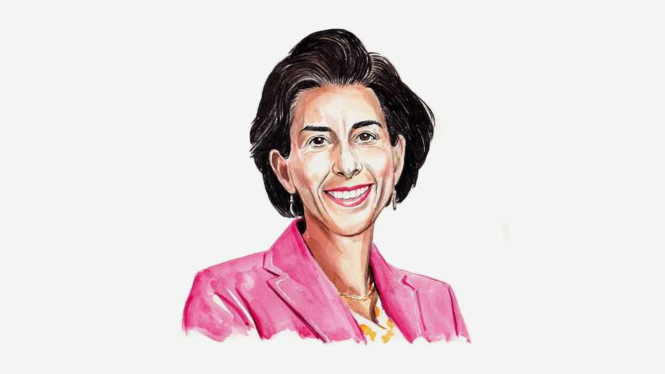

By Invitation | America’s missing opposition
America needs smarter AI policies. The Democrats can provide them, reckons Gina Raimondo
The former commerce secretary on why it’s her party’s turn to benefit from tackling economic insecurity
September 4th 2025

A BIG REASON Donald Trump won in 2024 was his focus on voters’ top issue. People were angry and anxious about the economy, with good reason. Mr Trump promised radical change and voters trusted him more to deliver it. But Democrats have an opening. In just six months, Mr Trump has passed economic policies that will be disastrous for most Americans, not least his fiscally reckless “Big Beautiful Bill”. Now Democrats have to be the ones who are clear-eyed about people’s economic insecurity. The candidates who win in 2026 and 2028 will be those who people trust to do whatever is necessary to protect their economic interests.

Right now, economic anxiety is focused on the cost of living. But over the next few years it could be supplanted by fears over artificial intelligence. AI is set to disrupt nearly every workplace. We could see a tsunami of unemployment, and we need to start preparing.

If Democrats want to win in the 2026 midterms and beyond, we need to position ourselves as the party that understands the AI revolution and will help voters stay secure. We shouldn’t approach it as a tech issue, but as a core economic one on a par with, or even surpassing, housing, health care and the cost of living.

AI’s looming impact on jobs may feel like other disruptions that have caused economic pain for many and brought benefits to a few. But it could sweep through the economy much more quickly and disruptively than the “China Shock” or other technological tempests. Politicians need to resist the temptation to wield vague promises about AI creating lots of new jobs as well as taking many away. The revolution will doubtless boost productivity in some parts of the economy, and create new jobs, but the net impact on the workforce is highly uncertain—and potentially much more severe than that of any past disruption. Americans deserve honesty.

That doesn’t mean giving up on the promise of AI. It’s not in America’s interest to hit the brakes on innovation. AI has the potential to cure diseases, democratise access to education, and much more besides. Keeping up is also a national-security imperative: if we slow down while China races ahead, we will become less safe. But workers can’t get left behind. This moment demands a bold, realistic response.

It starts with changing learning—with an overhaul of how Americans are educated and trained for the AI age. The higher-education system is not delivering for enough people. Nearly every good job created since the global financial crisis of 2007-09 requires some education beyond high school, yet 40% of college students never graduate, mostly because it is too expensive. We need affordable, job-focused training that actually leads to high-paying work. And we need to realign education and workforce programmes around the industries that will define our future: AI, semiconductors, quantum computing, drones, and so on.

These educational opportunities need to be available to everyone, not just the young. The American system does a generally terrible job of supporting people in mid-career transitions. This is an area in which Democrats can make the running—and if we get it right, middle-aged voters will notice.

Second, government needs to work with the AI industry to pass legislation with teeth to steer the technology in a direction that benefits ordinary people while allowing America to maintain its technological edge. We need to forge a path between the extremes of halting AI progress and steaming ahead without guardrails. Shocking as it may seem in these absolutist times, there is a middle ground. With the right sort of public-private collaboration, Democrats can stake it out.

The third challenge will be to get businesses to take more responsibility for the disruption AI will cause. This starts with helping to retrain displaced workers, with government support. Other countries are already doing this. In Singapore, every citizen gets a lifelong training credit. In Britain, large employers contribute a share of payroll to a national reskilling fund, topped up by the government. America needs to find its own approach, quickly.

We must also, however, acknowledge that AI doesn’t have borders. It is crucial to work with allies on the cross-border issues it throws up. America must also reopen, once again welcoming foreign AI researchers and other highly skilled immigrants.

These steps would help make the coming transition easier for working Americans and show them that Democrats are fighting for them. We cannot simply accept the idea that mass layoffs are the price to be paid for staying competitive. That’s what companies said when they moved supply chains to Asia—and America lost a generation of manufacturing talent and became less competitive in crucial products like semiconductors. We chased short- term efficiency and profit without counting the longer-term costs to the economy and society.

We cannot afford to make that mistake again. We must commit to doing better this time and not just accepting traditional assumptions or economic theories. Over the coming decade AI, more than any other issue, will shape

the American economy and determine the fate of the American worker. This is an era-defining moment that is crying out for Democratic leadership. ■

Gina Raimondo was America’s commerce secretary from 2021 to 2025.

This article was downloaded by zlibrary from https://www.economist.com//by-invitation/2025/09/04/america-needs-smarter-ai- policies-the-democrats-can-provide-them-reckons-gina-raimondo