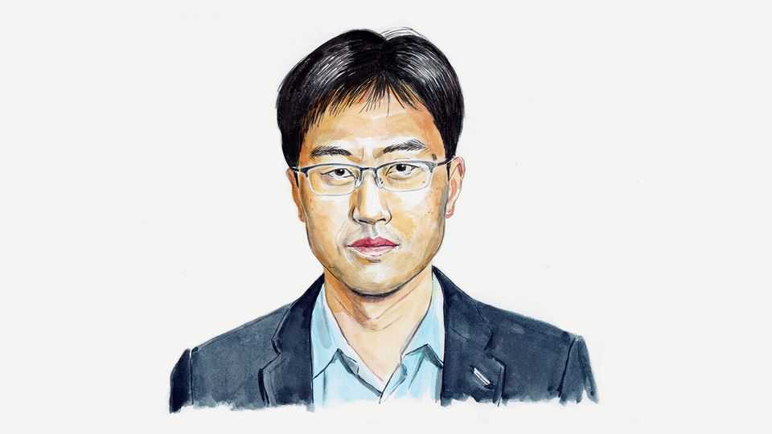

By Invitation | Nuclear proliferation
China should not fuel an arms race, says a close watcher of its nuclear policy
Its interests would be better served if it led on crafting nuclear rules, argues Tong Zhao
September 4th 2025

THE HIGH-PROFILE display of nuclear might that China staged at its latest military parade on September 3rd showcased a full spectrum of land-, sea- and air-based systems. Remarkably, for land-based intercontinental ballistic missiles alone, it unveiled three new systems simultaneously, including a silo-based missile probably intended for large-scale deployment in the open terrain of north-west China. The country’s growing willingness to exhibit its nuclear strength signals its waning faith in diplomacy to bridge divides with America and other Western rivals over clashes of strategic interests and ideological values. Instead, it is betting that raw power will secure domestic

legitimacy, protect sovereignty and enforce its vision of regional peace and international order.

Chinese strategists argue that time will bend the world to a more powerful, confident China—and stability will follow. Yet the rapid growth of its arsenal from around 200 warheads several years ago to some 600 today, potentially reaching 1,000 by 2030, isn’t coercing deference. Worse, it is spawning instability China didn’t foresee. Rather than bemoan an increasingly lawless world and lean harder into self-help, China could pivot —to champion a rules-based nuclear order.

America, rattled by the unprecedented challenge of simultaneously confronting two nuclear near-peers—Russia and China—appears likely to boost its nuclear capabilities. American concerns about China’s build-up, more than Russia’s nuclear threats, are driving doubts over the last remaining US-Russia arms-control treaty and hastening the collapse of the global arms-control regime.

China’s silence about the ultimate size and purposes of its nuclear forces feeds fears of a doctrinal shift from pure deterrence towards a willingness to consider the first use of nuclear weapons. American strategists feel compelled to map detailed nuclear-war scenarios between the two countries —ranging from limited regional exchanges to all-out homeland strikes.

This, in turn, is likely to push China towards more advanced nuclear- warfighting preparations. Even if deterrence never fails and luck never runs out, the process ensures an unwinnable arms race. Haunted by the Soviet collapse, China has vowed repeatedly to avoid such races. The challenge lies in recognising—and stepping back from—the slippery slope.

Regionally, China’s nuclear build-up provides political cover for North Korea’s own nuclear expansion, fuelling pressure in Japan and especially South Korea to develop their own nuclear weapons. On China’s western flank, any Indian response to China’s nuclear expansion will increase the nuclear threat facing China and probably trigger Pakistani countermeasures —a nuclear chain reaction with global ripple effects.

Paradoxically, China has escalated verbal attacks on America’s policy of extended nuclear deterrence—the nuclear umbrella that reassures allies and, crucially, discourages them from building their own bombs. While China sees it as a projection of American military influence, this arrangement has also long served China’s interests by keeping America’s allies non-nuclear. Undermining it now is self-defeating, especially when the worsening security environment is already tempting American allies to reconsider their nuclear abstinence.

China’s nuclear diplomacy today resembles that of a permanent opposition party: better at criticising the system than shaping it. Given China’s declared aspiration of an orderly system grounded in shared rules, it could instead show real leadership by proposing concrete solutions to specific security challenges and opening them to international scrutiny and debate. Its slogan of “a community with a shared future for mankind” will ring hollow unless backed by shared, actionable security rules.

Take its advocacy of “indivisible security”—the idea that no country should gain security at others’ expense. It is meaningless unless applied to real- world problems such as the escalating arms race across the Asia-Pacific to build “theatre-range” missiles (those designed to hit targets in a specific region).

Over decades, China has built the world’s largest arsenal of land-based theatre-range missiles, including nuclear-capable systems. In response, America and its allies have only recently begun developing conventional land-based missiles. Instead of decrying those efforts as destabilising, China could lead by proposing universal rules for how such capabilities should be developed and deployed without resorting to threats. Confidence-building measures such as transparency on development plans—or more ambitious steps like numerical caps on key land-, sea- and air-based theatre systems— could lay the foundation for a regional missile arms-control regime.

On its overall nuclear capabilities, China dodges talks with America (whether or not Russia is also involved), wary of cold-war optics and its smaller arsenal. But these concerns need not stop China from engaging with Britain and France. All three possess only a few hundred nuclear weapons and profess “minimum deterrent” strategies—that is, maintaining just

enough of an arsenal to deter nuclear-armed adversaries. Such a trilateral dialogue could clarify what minimum deterrence means in practice, give China a more politically acceptable forum to explain how its growing arsenal aligns with its professed minimalist strategy, and explore how smaller nuclear powers can support, rather than obstruct, US-Russia arms control. Even without direct talks with America, the Chinese could be more open about their nuclear thinking in such settings, providing much-needed reassurance to the international community.

In Asia, if China insists on rejecting American extended deterrence, it should articulate what alternative security arrangements it is willing to offer to address Japan’s and South Korea’s concerns about both North Korea’s nuclear expansion and China’s own military build-up. So far, China has refused even to acknowledge these concerns. Reaching out to listen and respond to regional threat perceptions could be a starting point.

To believe that raw power will silence rivals and secure long-term peace is not strategy but illusion. Having risen to unprecedented international strength, China must decide whether to be feared for fuelling humanity’s most destructive arms race or respected for helping build shared rules that ensure China’s own past humiliations cannot be repeated. ■

Tong Zhao is a Senior Fellow at the Nuclear Policy Programme and the China Centre of the Carnegie Endowment for International Peace.

This article was downloaded by zlibrary from https://www.economist.com//by-invitation/2025/09/03/china-should-not-fuel-an-arms- race-says-a-close-watcher-of-its-nuclear-policy

Briefing

How America’s Democrats might win back power