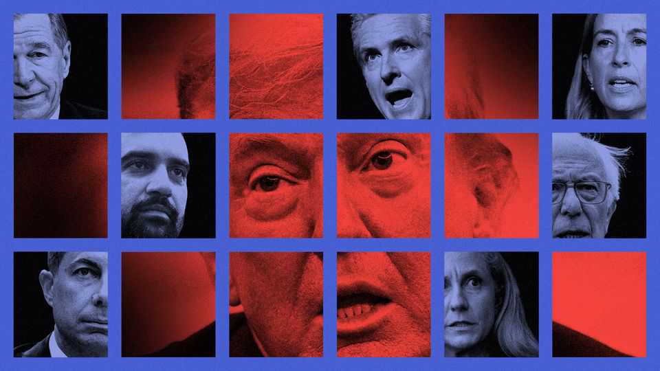
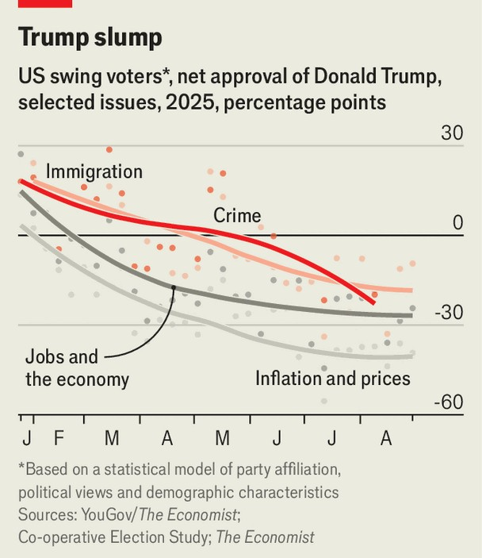
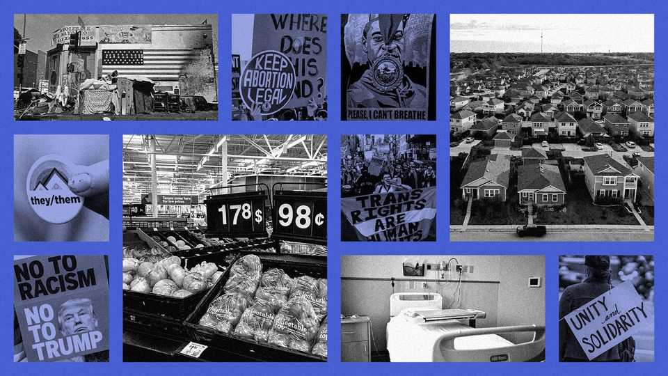

Briefing | Big mess v big man
How America’s Democrats might win back power
The party is trying to talk less about pronouns, more about prices
September 4th 2025

If you want to hear someone badmouth America’s Democratic Party, ask a Democrat. “They’re lost.” “They need to get their act together.” They’re “dinosaurs”. These were some of the views The Economist heard from Democratic voters in Iowa, New York and North Carolina in August. Practically none gave their party a passing grade. Democratic bigwigs are equally vexed. Elizabeth Wilkins, the boss of Roosevelt Forward, an advocacy outfit, describes the party’s mood as: “Oh, my God. We lost to this guy again. [Voters] knew who he was, and they voted for him anyway. We must be doing something really, really, really wrong.” The only notable elections this year are for governor in New Jersey and Virginia and for mayor in New York. The Democrats’ next chance to win

back some power nationally will come at the mid-term elections in November 2026. If the party retakes the House of Representatives or (a longer shot) the Senate, it will be in a better position to curb Donald Trump’s excesses. It will have a say on the federal budget and power to investigate wrongdoing in high places. But given the party’s disarray, will it make much headway?

Voters usually treat mid-term elections as a referendum on the president, so the Democrats ought to be strolling to victory. Mr Trump is unpopular, with a net approval rating of minus 14, according to The Economist’s tracker. However, the Democratic Party appears to be even less popular, with a 28- point gap between the share of registered voters who view it favourably and the share who view it unfavourably. This is 12 points worse than the Republican Party’s net favourability. Yet that may be a poor guide to voting intentions. Many Democrats view their own party with disfavour for letting Mr Trump win, notes Larry Sabato of the University of Virginia. They will probably still vote for it.

The Democrats are painfully divided over how to fight back. Should the party lurch to the left to boost turnout among true believers, or cleave to the centre? Should it focus on denouncing Mr Trump, or promote a platform of its own? Should it fight back hard and dirty, or follow Michelle Obama’s advice from 2016: “When they go low, we go high”?

When the party was locked out of the White House for 12 years in the 1980s and early 90s, Bill Clinton revived its brand by forcefully occupying the centre. He embraced fiscal sobriety, market-friendly economics and a tough approach to crime. He also distanced himself from activists who repelled middle America. In 1992 Sister Souljah, a rapper, said of the LA riots, “If black people kill black people every day, why not have a week and kill white people?” Mr Clinton denounced her furiously and won the presidency soon after.

To win over swing voters today, many Democrats think their party needs a “Sister Souljah moment”. Eric, a medical student in Iowa City, hates the way Republicans play down climate change and thinks Mr Trump’s military parade in Washington was “a throwback to what Hitler would do”. He

examined the spreadsheets of Mr Trump’s “big, beautiful” budget bill, and was dismayed by how much it cut Medicaid (health care for the hard-up).

Yet he is a Republican, he says, because left-wing views are constantly rammed down his throat on campus. Like most Americans, he favours secure borders and colour-blind college admissions—views deemed racist by cancel-culture commissars. He didn’t want his real name used, for fear of ostracism, amplified by social media—a threat less grave than authoritarianism in Washington, perhaps, but far more immediate. A nearby mural declaims, “WEAPONISE YOUR PRIVILEGE TO SAVE BLACK BODIES”. So “if I don’t do something, black people are gonna die?” sighs Eric. “That’s a bit extreme.”

Most Democratic officeholders do not govern on “wildly out-of-touch social positions”, argues Third Way, a centrist group. But “Democrats and their allies use an awful lot of words and phrases no ordinary person would ever dream of saying. [The intent]…is to include [but] the effect…is to sound like the…obfuscatory enforcers of wokeness.” Pressure groups give candidates questionnaires and want them to tick every box. Kamala Harris gave Donald Trump his best attack line in 2024 by telling one such group that she favoured paying for “gender-affirming” surgery for prisoners. Hence “Kamala is for they/them. President Trump is for you.”

Several senior Democrats are now snubbing the activists. Rahm Emanuel, a former mayor of Chicago and White House chief of staff, has said that a man cannot become a woman. Gavin Newsom, the governor of California and a probable presidential candidate in 2028, says it is “deeply unfair” for biological males to compete in women’s sports. Such views are popular everywhere except in progressive circles. A party grandee predicts that Democrats will keep insisting that “you shouldn’t bully trans people for who they are”, but drop policies such as paying for trans medicine for children.

In places that Democrats hope to flip, candidates are downplaying culture and emphasising the cost of living. The candidates for governor in New Jersey and Virginia, a former Navy pilot and an ex-CIA officer, both fit this description. So do several contenders for Congress next year.

People “are seeing the price of utilities, groceries and rent go up and up, and there’s too much month at the end of the money,” says Roy Cooper, a former governor of North Carolina, who is hoping to bag a crucial open Senate seat next year. Mr Cooper is no one’s idea of an extremist. As governor, he worked with Republicans to balance the state’s budget and expand public health insurance. In person, he is soft-spoken and warm. Visiting Chimney Rock, a village that was flooded last year, he praises locals’ “courage, resilience and hard work” rebuilding. One points to floorboards that were nailed in place by another politician; Mr Cooper jokes that he’d better be “careful” stepping on them.

Behind the aw-shucks charm is a ruthless focus on issues that should help Democrats with swing voters. Economist/YouGov polls show that the 20% of voters who are at the ideological centre supported Mr Trump over Ms Harris by 52% to 44% in 2024. Yet now they give him a net approval rating of minus 27 points. At the start of his term they liked his handling of crime, immigration, the economy and inflation. Now they disapprove on all four counts, with a whopping minus 40 for prices and inflation, the problem they care about most (see chart).

Mr Trump’s “erratic tariffs” will make things worse, warns Mr Cooper: “You know it’s a tax on everyday families.” Adding to the strain, Mr Trump

is slashing health care. Medicaid cuts will not be felt until after the mid- terms, but subsidies for Obamacare are due to end in December. Unless they are extended, 20m Americans will see their out-of-pocket costs soar by 75%, by one estimate. “That’s going to be a shock,” says Mr Cooper.

Though Democrats all want to ease economic pain, they differ as to how. The left favours old-fashioned public spending, paid for by squeezing the rich. Moderates are warming to “abundance”, a reference to a fashionable book by Ezra Klein and Derek Thompson, two journalists who call for loosening regulations to make it easier to build new homes and energy projects.

Among the party’s footsoldiers, the left stirs more passion. Bernie Sanders, an 83-year-old senator from Vermont, is criss-crossing the country on a “Fighting Oligarchy” tour. On a recent evening in Davenport, Iowa, he raised thunderous applause for promises of free health care, free college tuition and larger pensions, and thunderous boos at every mention of plutocrats. (Humdingers like “government of the billionaire class, by the billionaire class, for the billionaire class” gave him ample time to catch his breath.) The crowd loved it. But his promises are implausible. By one estimate, his spending plans in 2020, when he last ran for president, would have doubled federal spending.

In the same vein Zohran Mamdani, a 33-year-old “Democratic Socialist”, has made himself front-runner in New York’s mayoral race with a mix of social-media razzle-dazzle and lavish promises: free buses, free child care and cheap government-run grocery stores. He would freeze the rent of New York’s rent-stabilised apartments (nearly half of the total) and crack down on bad landlords, even seizing the property of the worst. He vows to pay for it all with extra taxes on the rich. Businesses fear him. The party is wary of him. Mr Trump calls him a “100% communist lunatic”.

When Democrats are in power, moderates tend to have more influence over economic policy than the far left. But given the foul mood of voters, some populist policies would be likely under a future Democratic administration. Raising taxes on companies and high earners is popular; so is the idea of forcing drug firms to reduce prices. Government-run grocery stores get a thumbs-down in polls, but two-thirds of Americans like the sound of rent

controls, despite decades of evidence that they reduce the supply of new housing.

The abundance agenda is more likely to deliver results. Draconian land-use rules make housing unaffordable in the cities where the best jobs are. Easing them could raise output per worker by 8%, by one estimate. Demand for energy is soaring owing to AI, yet Mr Trump is throttling the expansion of the cheapest sort, renewables. Abundance Democrats vow to dynamite such roadblocks to prosperity. Mr Cooper talks of streamlining permitting so “we can make it easier to build affordable housing and still protect our air and water”. Mr Newsom has signed a reform exempting urban homebuilding from California’s anyone-can-sue-to-block-anything environmental law. Josh Shapiro, the governor of Pennsylvania, cut through red tape to repair a collapsed highway in days. Elissa Slotkin, a Michigan senator, offers an “all- of-the-above” energy plan, including renewables, fossil fuels and “new stuff that’s still in development”.

The left is not wholly allergic to supply-side reforms. It is happy, for instance, to smash corporate monopolies to help consumers. Even Mr Mamdani sometimes complains about red tape. In a slick video called “halalflation”, he noted that a crazy permit system for food trucks in New York raises the price of kebabs.

It is unclear which of Mr Trump’s tariffs Democrats would keep, were they in power, though many say they would be tougher on China and less cavalier about alienating allies. All agree that having one fickle man setting policy is a bad idea. “Businesses value predictability,” notes Mr Cooper. He adds that Republicans have “completely” surrendered Congress’s proper constitutional role setting tariffs.

On AI, the Democrats sound muddled. Many are scared that the technology will destroy jobs. The left argues that if AI raises productivity, people should get a shorter working week and perhaps a universal basic income. Moderates such as Gina Raimondo, a former commerce secretary, want to prepare workers for the coming disruption while welcoming foreign AI engineers. Zoe Lofgren, a representative from California, says politicians should beware of writing laws that may quickly end up out of date.

On immigration, Mr Trump’s approval rating has plunged among swing voters since he took office, from plus 18 to minus 18. Many are glad that the border is secure, but appalled by enforcement agents shoving grandmas into vans. Democrats see an opening. On August 25th 115 House Democrats unveiled a plan to enhance border controls while restoring due process.

On law and order, the Democrats have a problem. Mr Trump is trying to goad them into siding with criminals. When he sent the national guard to Washington, DC, to crack down on crime, progressives howled that a would- be despot was preparing to use soldiers against his political opponents. So far, however, the troops in DC have done little besides pose for pictures. Stephen Miller, Mr Trump’s deputy chief of staff, says Democratic objections show that the party is “devoted exclusively to the defence of hardened criminals, gangbangers, and illegal alien killers and terrorists”.

That is absurd. But Democrats are less gung-ho about policing than swing voters are, and some on the left are well outside the mainstream. Mr Mamdani has disavowed past calls to “defund the police”, but the Democratic Socialists of America, a group to which he belongs, still wants to abolish “the carceral state”. Volunteers for Mr Mamdani are given a script for voters who ask about crime. “Listen and affirm their feelings,” it says, then talk up his plan for a “Department of Community Safety”.

Moderate Democrats want to make it clear that they oppose lawlessness on the street as well as in the Oval Office. Party wonks promote anti-crime policies such as hot-spot policing, bullet-case tracing and, of course, gun control.

Many big cities have been Democrat-run for decades. This makes it easy for Republicans to blame them for every urban problem, from homelessness to disorder. The Black Lives Matter riots of 2020 did not help: Republicans are still talking about the no-police zone in Seattle, which was welcomed by the Democratic mayor but swiftly turned anarchic. When it comes to governance, however, MAGA has vulnerabilities of its own. Democrats slam Mr Trump’s family for its grotesque conflicts of interest, and point to an erosion of norms at every level of government.

In Iowa, for example, the Democratic state auditor, Rob Sand, accused the Republican governor of misappropriating covid recovery funds. She later signed a bill making it almost impossible for him to investigate her administration without her say-so. Mr Sand called this “the greatest pro- corruption bill in state history”. Now he is running for governor; and as a Bible-quoting hunter, he could win a state that Mr Trump carried by 13 points in 2024.

The force that most animates all Democrats is fear and loathing of Mr Trump. “If it walks like a duck and quacks like a duck, it’s probably a Nazi,” says Mikey Goodmark, a theatrical costume manager in New York. But allusions to the Third Reich persuade few swing voters. Democrats “have to have a way of talking about it that relates to how everyday life is different”, said Pete Buttigieg, another likely presidential candidate, on National Public Radio. “It’s not just autocracy is bad …it’s that when you have an autocrat in power, he can get away with appointing incompetent people. …We have the person in charge of American public health who is a quack who doesn’t believe in medicine, and now measles is on the rise in America.”

Passionate young left-wingers think the best people to take on Mr Trump are passionate young left-wingers, such as Mr Mamdani. But moderates fight, too. Mr Newsom has started trolling Mr Trump on X, juxtaposing North Korean propaganda posters with images of the president. He has also scrapped the California Democrats’ high-minded commitment to drawing

electoral boundaries in a non-partisan way; he wants to gerrymander as hard as Republicans do in Texas. Patrick Ruffini, an analyst, says such tactics are here to stay, and will make it hard for either party to win a large majority in the House.

In 2016 and 2024 the Democrats had one job—to offer a persuasive alternative to Donald Trump—and they flubbed it. Next year they have a chance to limit the damage, and act as a check on a president without self- restraint. Betting markets give them a 68% chance of winning the House. Yet given the party’s omnishambles, that is less reassuring than it should be. ■

This article was downloaded by zlibrary from https://www.economist.com//briefing/2025/09/04/how-americas-democrats-might-win- back-power

United States

Donald Trump comes for America’s public universities Trump’s tariffs suffer a legal setback Banning smartphones in classrooms helps students The dubious legality of killing drug suspects at sea Five Republican factions jostle for the president’s favour The rules for defending democracy under Donald Trump