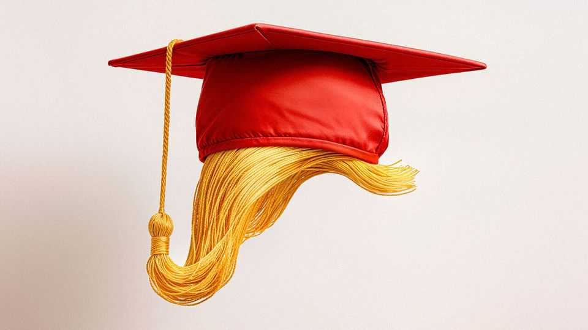
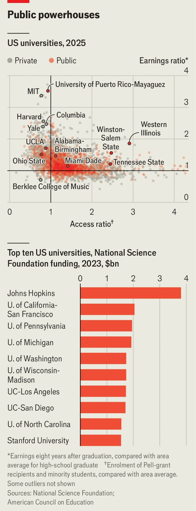

United States | Struggle sessions
Donald Trump comes for America’s public universities
But, so far, only those in enemy territory
September 4th 2025

ON THE EVE of a new academic year, the campus of the University of California, Los Angeles (UCLA) is tranquil. A few students wander around wearing backpacks. Banners declaring UCLA the country’s “#1 public university” are inescapable (a claim that rankles with the University of California, Berkeley, a state rival). A year ago, tents housing students who were protesting the war in Gaza filled a lawn where a young woman now sunbathes. But the calm masks deep anxieties. In July the Department of Justice (DoJ) alleged that UCLA was “deliberately indifferent” to the antisemitic harassment of Jewish and Israeli students perpetrated by protesters in the

tent encampment. In response, the Trump administration froze $584m in research grants from the National Science Foundation (NSF) and the National Institutes of Health (NIH), hindering studies on everything from Alzheimer’s to opioids. To release the funding, President Donald Trump is asking for $1bn, or roughly 9% of UCLA’s annual budget, a ban on overnight protests and a host of other changes. The DoJ gave the university until September 2nd to negotiate a deal or face a lawsuit. “It’s extortion, it’s the only way to look at it,” says Donald Heller, a former provost of the University of San Francisco.

In some respects UCLA’s predicament is an extension of the administration’s attacks on elite private institutions. As was true of Mr Trump’s fight with the Ivy League, California is one of the president’s favourite foils. Attacking the Golden State is, at this point, a treasured pastime for this White House. But this also marks a new stage in Mr Trump’s shakedown of universities. If the administration succeeds in damaging the public universities that annoy him (ie, the ones in Democrat-run states) the strain will have a broader impact than his attack on wealthy, private schools.

The Ivies educate less than 2% of America’s college students. The vast majority—just shy of three-quarters of students—attend public universities like UCLA that are more extensively funded by taxpayers. Some of these

schools do the most to foster upward mobility, yet they rarely make the news. An analysis by the Carnegie Foundation, a non-profit, and the American Council on Education (ACE), a trade association, identified 478 “opportunity colleges”, places where a smart local student has a shot at admission and where earnings after graduation are high. None of the Ivies made the list. Elite private universities excel at research but public ones produce lots of it too. Of the ten universities that receive the most grant funding from the NSF, seven are public and three are in the University of California (UC) system. UCLA ranks 7th, Harvard 15th and Columbia 19th (see chart).

Recognising the high stakes, the University of California’s Board of Regents, which oversees the entire ten-campus system, has been tight-lipped about their negotiations with the administration. Gavin Newsom, the state’s Democratic governor, who sits on the board, has characteristically made his opinion known, however. “We’ll sue,” he has said. Whether UCLA pursues a lengthy legal battle or settles for a large sum, it will be hard-pressed for funding. (A federal judge has already told the administration to restore some of the frozen grants.) Faculty and officials are hiking up to Sacramento, the state capital, to ask whether the legislature could help. New polling from Berkeley’s Institute of Governmental Studies suggests that 58% of Californians would support increasing state funding for the UC system.

Before the DoJ released the results of its antisemitism investigation UCLA had already banned encampments and eliminated the use of “diversity statements” in hiring. Hours before the feds dropped the hammer the university had settled a lawsuit with Jewish students. Anna Markowitz, president of the UCLA Faculty Association, calls this “anticipatory obedience”. “The UC didn’t want to poke the bear,” she says. But “the bear is coming.” Administrators at America’s other public universities are also self-censoring. They are no doubt watching what happens in California while biting their fingernails.

Many public universities are hoping to be more successful than UCLA at staying under the radar. In June, after grantmaking slowed at the University of Washington, one of America’s biggest research machines, the outgoing university president told local radio in Seattle that she wants to “be pragmatic” and not “make big statements to make big statements”.

Public universities in Republican states have been reluctant to sign on to lawsuits against the federal government. That reflects local conservatism and also the fact that Mr Trump does not seem inclined to harass schools in places where he has had political success. At Miami Dade College in Florida, the country’s biggest community college, there has been no disruption. Pell Grants from the federal government cover tuition for 60% of students but Madeline Pumariega, the president, is not worried that the Trump administration will go after them. “Our students aren’t lying on the green grass looking up at the sky finding themselves, they’re working towards getting jobs,” she says. She reckons Mr Trump supports that.

When the government withheld NIH research grants from the University of Alabama at Birmingham, Katie Britt, a senator for Alabama, wrote to the White House to argue that it was in the interest of the Make America Healthy Again movement to fund research on cancer and chronic diseases. She also spoke with Mr Trump. Soon $15bn in funds, for Alabama and other universities, were unfrozen. Her efforts “chastened the administration”, says one higher-education policy wonk.

Ohio State University, the alma mater of J.D. Vance, the vice-president, has lost some federal funds but not enough to force them to cut PhD programmes or sack post-docs. Ted Carter, its president, attributes their relative immunity to the fact that the school “stuck to [its] mission” and stayed out of politics. Pro-Palestinian encampments on its campus were swiftly shut down by police and university leaders. When Mr Carter visited the Oval Office with his championship-winning football team earlier this year he told Mr Trump that “Ohio State is the institution that is going to get it right.” Mr Trump responded: “I know you will.” ■

Stay on top of American politics with The US in brief, our daily newsletter with fast analysis of the most important political news, and Checks and Balance, a weekly note from our Lexington columnist that examines the state of American democracy and the issues that matter to voters.

This article was downloaded by zlibrary from https://www.economist.com//united-states/2025/08/31/donald-trump-comes-for- americas-public-universities