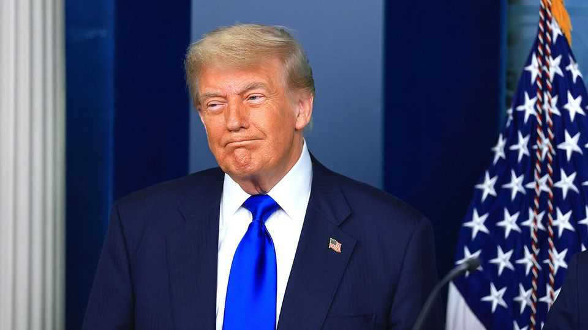

United States | Tariff tiff
Trump’s tariffs suffer a legal setback
The appellate court ruling sets up a showdown at the Supreme Court
September 4th 2025

DONALD TRUMP’S tariffs have been dealt a legal setback, but nine months from now, he may look back at the ruling by a federal appeals court as little more than a speed bump. The court ruled on August 29th that Mr Trump cannot single-handedly rejig America’s tariff schedules.  On September 3rd Mr Trump asked the justices to quickly hear and reverse that ruling. The tariffs will remain in effect while the justices mull that request. The case concerns the scope of Mr Trump’s authorities under the International Emergency Economic Powers Act (IEEPA), a statute enacted in 1977. It allows presidents to “regulate…importation” to “deal with any unusual and extraordinary threat…to the national security, foreign policy or economy of the United States”. Mr Trump cited two emergencies to justify

the sweeping duties he announced in February and in April, and has adjusted many times since: the fentanyl crisis and “large and persistent…trade deficits”.

Unlike other statutes that explicitly delegate Congress’s trade authority to presidents, the IEEPA does not mention “duties” or “levies” or “tariffs”. Mr Trump exceeded his authority by relying on the statute to manage trade, the appellate court held by a 7-4 margin. Four of the judges wrote separately to say that the IEEPA bars all presidential tariff-tweaking. But the majority took a middle path, contending that while some tariffs derived from the IEEPA might be fine, Mr Trump’s are over the line.

A similar case already at the Supreme Court’s doorstep may give the justices an opportunity to reckon with the most restrictive interpretation of the IEEPA. In May a family company that claims the tariffs pose an “existential threat” to its educational-toys business persuaded a federal court in the District of Columbia that the statute hands no tariff authority whatsoever to presidents. The plaintiffs want to leapfrog the federal appeals court in Washington, DC, to bring a “prompt and final resolution of the exceptionally pressing” question of the tariffs’ legality.

In recent years the Supreme Court has relied on two principles that could be seen to favour Mr Trump’s challengers. The “major-questions doctrine” requires Congress to authorise executive actions with vast economic and political significance. And according to the “non-delegation doctrine”, even if Congress does speak clearly, it cannot bend the constitution by handing over its power to set taxes.

If the court sides with Mr Trump, it will have to explain why it rejected Joe Biden’s plan to forgive student loans—on the grounds that Congress had not spoken clearly enough—yet sees no problem letting a president mount the most sweeping rewrite of America’s tariff policy in a century without explicit legislative sanction.

Mr Trump predicts the justices (one third of whom he appointed) will “help” him save the tariffs. He could be right. Justice Brett Kavanaugh wrote in a recent case that the major-questions and non-delegation doctrines do not apply “in the national security or foreign policy contexts”. He and the other

five conservative justices may balk at the squishiness of the appellate court’s recent interpretation of IEEPA and reject the DC district court’s even narrower reading of presidential authority.

The high court’s conservative bloc is likely to echo the “considerable deference” to Mr Trump’s judgments endorsed by dissenting judges on the appellate court. It has often indulged even novel claims of presidential power. In 2018 the court upheld Mr Trump’s ban on travel from predominantly Muslim countries and last year it gave presidents wide protection from criminal prosecution. Tariffs dressed up as emergency foreign-policy measures could receive similar solicitude.

But even if Mr Trump loses this one, he has other legal tools. The Trade Expansion Act of 1962 and the Trade Act of 1974 allow presidential action on imports, although with limits.  Oral argument at the Supreme Court could take place as early as November with a decision weeks or months later. But even with an expedited schedule, America’s experiment in tariffs-by- emergency-decree will have reshaped global commerce by the time the justices rule. ■

Stay on top of American politics with The US in brief, our daily newsletter with fast analysis of the most important political news, and Checks and Balance, a weekly note from our Lexington columnist that examines the state of American democracy and the issues that matter to voters.

This article was downloaded by zlibrary from https://www.economist.com//united-states/2025/08/30/trumps-tariffs-suffer-a-legal- setback