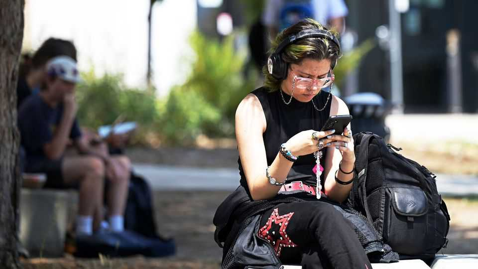
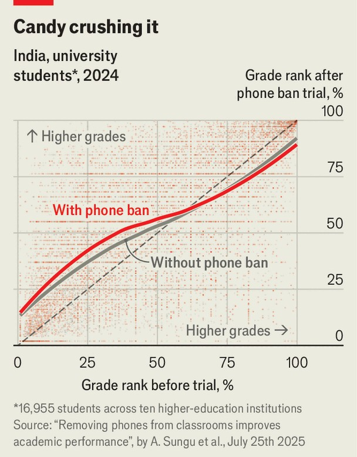

United States | Attention deficits
Banning smartphones in classrooms helps students
The first large-scale randomised control study yields a ringing endorsement
September 4th 2025

Banning phones in schools has emerged as a rare bipartisan policy across America. As the school year begins, millions of students in 17 states, from New York to Kentucky, will be newly prohibited from taking phones into the classroom, bringing the total to 35 states with such laws or rules. America is no outlier here. Around the world bans on phones are being enacted or proposed in at least 40% of national education systems, with the aim of helping students focus. But whereas political momentum for keeping classrooms phone-free is growing, researchers have noted that scientific evidence for the benefits is thin: a few small-scale studies with differing designs yielded mixed results.

A new working paper by Alp Sungu, a professor at the University of Pennsylvania’s Wharton School, with collaborators, offers clear evidence from the first large-scale randomised control (RCT) study. The study is groundbreaking, says Anne Maheux, an expert in adolescent development at University of North Carolina at Chapel Hill, and it delivers “strong causal evidence” that banning phones improves classroom results.

The study was ambitious. In ten higher-education institutions in India, 16,955 pupils taking 2,000 courses were randomly assigned to classrooms where they did or did not have to surrender their mobile phones. The phone- free students performed better academically. The increase was greatest among first-year students who were low performers and studying subjects outside of science and maths. The average improvement was on the order of 0.086 standard deviations in grade point average. This is small, but the effects of most educational interventions are small. For comparison, it is similar to “swapping a mediocre teacher with a very good one” for a term, says Dr Sungu.

That could make the difference between passing and failing, and potentially reduce dropout rates and increase graduation rates over time, says Louis– Philippe Beland, an economist at Carleton University in Ontario, who ran an influential study of phone bans in Britain. “For low-achieving students, even

modest differences can really matter,” he says. For stornger students having a phone made no difference, or was mildly positive (see chart).

The new study will not end the argument over phones in schools. That debate is taking place across wildly diverse socioeconomic settings, from rich countries in northern Europe to phone-saturated cities in the developing world, where opportunities for learning, peer pressure and the lure of online distraction may differ greatly. The new study was confined to India, which may have cultural differences that make the results exceptional. Findings within one age group do not necessarily apply to others. And the benefits of classroom bans were especially visible in non-STEM classes, for reasons the authors can only speculate about.

However, this randomised control study—the gold-standard in social science —lines up with some earlier work that identified similar effects in other age groups and contexts. Small-scale studies of pupils in their early teens in Norway and of secondary (high) schoolers in Britain also found that phone bans led to academic gains for economically disadvantaged and low- achieving pupils.

The study by Dr Sungu and his collaborators also found that bans created an environment more conducive to learning. Random classroom spot-checks found less student chatter and disruptive behaviour. In classrooms where phones were absent even teachers used their own phones less—how did they find the time in the first place?—and they also became more engaged with pupils. And removing phones reduces the scope for cheating. In a 2017 survey of high schoolers in America, Canada, Australia and the UK, nearly a third of American pupils reported using phones or other devices to cheat.

Bans are easy to implement, requiring no training and little or no investment. Perhaps more important, many pupils can see their merit. Once they experienced a ban for a term, students in the Indian study were 20% more likely to support prohibitions, with the largest increases in approval for the most restrictive policy option, phone-free schools.

Even if banning phones becomes a near universal, evidence-based policy, though, there are still tablets and laptops—intended as aids to classroom instruction, but offering many of the same temptations to distraction. Some

studies of computer use in college classrooms in America found grades and exam scores declined. Such alternative portals to so-called “cyberslacking” may help explain why a quasi-experimental study of a phone ban in Swedish secondary schools found no effect. Digital technology is highly integrated into teaching in Swedish education, the authors say, so implementing a ban in such a setting “may well be ineffectual”. American schools should take notice. ■

Stay on top of American politics with The US in brief, our daily newsletter with fast analysis of the most important political news, and Checks and Balance, a weekly note from our Lexington columnist that examines the state of American democracy and the issues that matter to voters.

This article was downloaded by zlibrary from https://www.economist.com//united-states/2025/09/04/banning-smartphones-in- classrooms-helps-students