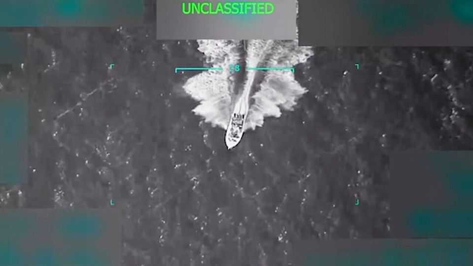

United States | Drone pilots of the Caribbean
The dubious legality of killing drug suspects at sea
Donald Trump orders a military strike on alleged “narco-terrorists”
September 4th 2025

“There’s more where that came from,” said President Donald Trump, celebrating a military strike on September 2nd on a boat that he said was full of drugs and “narco-terrorists” from Tren de Aragua, a Venezuelan gang. He later added on Truth Social: “Please let this serve as notice to anybody even thinking about bringing drugs into the United States of America. BEWARE!” This was smart politics. Drug gangs are extremely unpopular, not least because 80,000 Americans died of overdoses last year. If blowing suspected drug boats to pieces were to reduce that awful toll, Mr Trump could reasonably claim to be protecting American lives. Official video footage of the explosion dominated television news (see picture).

Previous presidents have used drones to assassinate suspected terrorists in places where they might prove impossible to arrest. Barack Obama ordered 563 “targeted killings” of alleged terrorists in turbulent countries such as Pakistan, Somalia and Yemen, as a consequence of which between 64 and 801 civilians died. Though controversial, these had a credible legal justification, since Congress had authorised the use of military force against al-Qaeda after it deliberately crashed planes into two New York skyscrapers and the Pentagon in 2001, killing 3,000 people.

Mr Trump is stretching this argument much further. He has designated drug cartels as “terrorists”. This is dubious: unlike al-Qaeda or Islamic State, the cartels kill people in pursuit of a commercial goal (selling drugs), not a political one. Mr Trump also claims that Tren de Aragua is conducting an “invasion” of the United States at the behest of the Venezuelan government. There is little evidence to support this claim, and an appeals court rejected it on September 2nd.

Polls suggest that American voters are happy to label drug gangs “terrorists”. But Mr Trump’s Humpty-Dumpty approach to language has real-world consequences. Alleged “invaders” rounded up in America have been sent to a hellish prison in El Salvador where they may never come to trial. The 11 “terrorists” on the alleged drug boat this week were in effect subject to extrajudicial execution.

There is precedent for using the American armed forces to support law enforcement. But the conventional approach to intelligence that a boat in international waters is heading to America full of drugs is to stop and search it, perhaps with the navy supporting the coast guard or Drug Enforcement Administration. If drugs are found, the crew can be arrested, tried and jailed. If the intelligence proves false, no one has been killed.

Mr Trump hopes that his show of force will deter smugglers. But if the supply of drugs is squeezed, the price tends to rise, calling forth new supply. Synthetic drugs such as fentanyl can also be made in America. So missiles may not reduce overdose deaths (which fell sharply last year, thanks to softer interventions).

Calling cartels “terrorists” will “create the cognitive space for the further militarisation of the drug war”, argues Brandan Buck of the Cato Institute, a think-tank. Much will depend on whether Mr Trump contents himself with blasting boats in international waters, or actually sends troops to attack gangs on Latin American soil. Doing so in Mexico against the will of Mexico’s government would cause a dire rift with a previously friendly country. Venezuela’s despot, Nicolás Maduro, was exaggerating when he described Mr Trump’s naval build-up in the Caribbean as “the greatest threat [to] our continent in the past 100 years”. But by how much? ■

Stay on top of American politics with The US in brief, our daily newsletter with fast analysis of the most important political news, and Checks and Balance, a weekly note from our Lexington columnist that examines the state of American democracy and the issues that matter to voters.

This article was downloaded by zlibrary from https://www.economist.com//united-states/2025/09/03/the-dubious-legality-of- killing-drug-suspects-at-sea