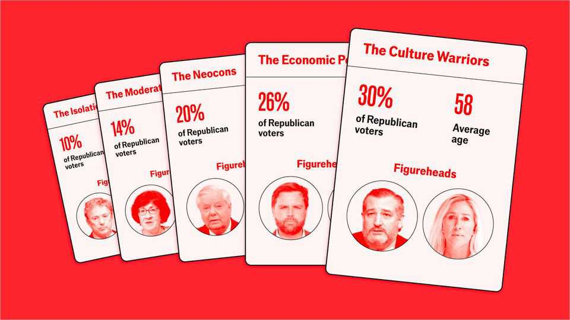

United States | Tribal politics
Five Republican factions jostle for the president’s favour
He has a unique ability to keep them marching in the same direction
September 4th 2025

WHAT UNITES the Republican Party today is a near-universal devotion to Donald Trump. But loyalty to the president masks some divisions among Republican voters. Anti-establishment populists jostle with old-school conservatives over tax cuts and welfare. Nationalists cheer the MAGA tariffs that business-minded conservatives loathe. Mr Trump’s success has been to bind these factions together. To map the tribes, The Economist analysed data from almost 14,000 Republicans who took part in the Co-operative Election Survey in 2024. Across dozens of policy questions, from zoning laws to TikTok, individual voters are idiosyncratic. But five distinct clusters emerge.

These factions can be plotted along a spectrum. On both immigration and taxation, for example, members of the Culture Warrior tribe are most likely to hold a conservative position, while Moderates are the most pragmatic. Neo-cons, Isolationists and Economic Populists fall somewhere in between (see chart).

The Moderates are the only tribe that includes a sizeable minority who are sceptical of Mr Trump. One in five members of this group did not vote in last year’s presidential election; one in six voted for Kamala Harris, the Democratic nominee. They tend to be sympathetic to Democratic policies on guns and immigration, while leaning to the right of the country as a whole. Senators Susan Collins and Lisa Murkowski are their champions.

The Culture Warriors sit on the opposite side of the party. This tribe is the richest. Its members are the most likely to own a gun and to be born-again evangelical Christians. These voters are the backbone of the party and they are particularly strident on “culture war” issues. Take abortion: 95% of them agree with the decision to overturn Roe v Wade. Only 7% agree that semi- automatic rifles should be banned. Senator Ted Cruz and Representative Marjorie Taylor Greene represent this group.

The three remaining tribes are broadly conservative, with some distinguishing characteristics. The Economic Populists are defined by their support for more redistributive economic policies, such as welfare spending. This tribe has a similar profile to the voters Mr Trump wooed away from the Democratic Party—they are the poorest segment of the party and the least likely to have a college degree. Senator Josh Hawley and Vice-President J.D. Vance are their most prominent advocates

The Neocons, by contrast, look more like the party’s traditional base. They are the oldest, whitest and most educated tribe. They are much more likely to be in favour of sending aid to Ukraine and weapons to Israel. Senator Lindsey Graham and Nikki Haley, the former governor of South Carolina, are their people.

The Isolationists are at the other extreme of foreign policy. Some 63% said that America should not be involved in the Russia-Ukraine conflict; 55% said the same for the conflict in Gaza. The Isolationists also tend to be less

trusting of institutions. Only 46% of them said they agreed that elections in the country are fair, compared with 64% of Republicans overall. Senators Rand Paul and Mike Lee are not on their own in this group.

No tribe is big enough to hold decisive sway: being their overall chief requires a balancing act. And despite their differences, the tribes have one big thing in common. Polling for The Economist by YouGov shows that more than three in four members of every cluster approve of Mr Trump’s performance, though levels of enthusiasm vary. When it comes to policies, the most unifying are building a wall along the Mexican border and scepticism of gender ideology, which command majorities in all five Republican tribes.

Some factions find their anchor in particular institutions. The House is brimming with culture warriors; the Senate, older and more traditional, still hosts neocons and some moderates. Across the executive branch the other tribes jostle endlessly for influence. Still some prominent figures come from outside these five tribes entirely—political nomads such as Elon Musk and Robert F. Kennedy junior, the eccentric health secretary.

To win the Republican nomination in 2028 Mr Trump’s heir must attempt to do what he does: appeal to all of these competing factions, while alienating none. He makes it look easy, yet it is anything but. ■

Stay on top of American politics with The US in brief, our daily newsletter with fast analysis of the most important political news, and Checks and Balance, a weekly note from our Lexington columnist that examines the state of American democracy and the issues that matter to voters.

This article was downloaded by zlibrary from https://www.economist.com//united-states/2025/09/04/five-republican-factions- jostle-for-the-presidents-favour