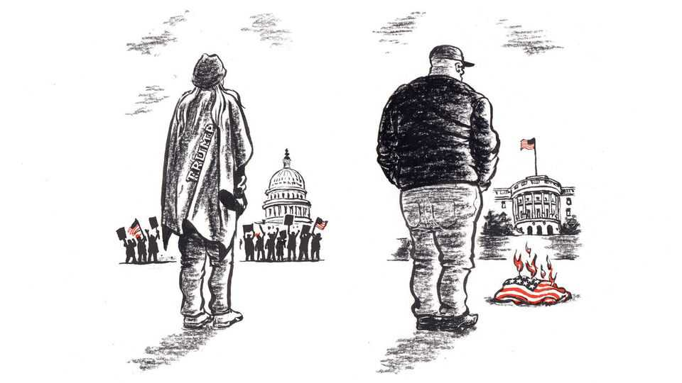

United States | Lexington
The rules for defending democracy under Donald Trump
For his government, invading the Capitol is honourable, but burning the flag goes too far
September 4th 2025

America was still fighting fascism overseas in 1945 when its military leaders alerted the troops that the menace could materialise at home, too. The War Department, as the Department of Defence was called until two years later, was issuing “orientation fact sheets” to soldiers, and the 64th edition, “Fascism!”, warned against complacency that America was proof against the danger. It wanted troops to recognise the nation’s vulnerabilities, including in themselves. “We all know that many serious problems will face us when the War is over,” the bulletin read. “If there is a period of economic stress it will create tensions among our people, including us as returning veterans.” Fascists, it continued, would make extravagant promises and then try to

divide Americans by pitting racial, religious and economic groups against each other, encouraging them “to hate rather than to think”.

As works of propaganda go, Fact Sheet 64 itself seems to have been out to encourage thought, not just compliance. It was patriotic, yet mindful that the nation was not perfect. It suggested “discussion” points and supplied “supplementary material”, including quotations from Franklin Roosevelt and Adolf Hitler. But it had a simple bottom line: “Only by democratically solving the economic problems of our day can there be any certainty that fascism won’t happen here.” Returning veterans needed to worry about the freedom of every American, because if anyone was stripped of their rights, “our own freedom and all democracy is threatened.”

Compare that straightforward message with the bewildering signals about rights and freedom coming from the administration of Donald Trump. It is prosecuting one veteran who burned the American flag in front of the White House in late August, while honouring another who died invading the Capitol. This is a puzzle that would surely have vexed the writers of Fact Sheet 64: how could the first veteran, in the eyes of the government, be a criminal and a threat to the union, but the second an innocent patriot?

Both veterans were provoked to protest by Mr Trump. Ashli Babbitt, who joined in the attack on the Capitol on January 6th 2021, served 14 years in the air force and National Guard, including tours in Iraq and Afghanistan. She believed the election in 2020 was stolen, and to stop Congress from certifying Americans’ votes, she was in the vanguard of those who overwhelmed police outside the Capitol. An officer shot her as, wearing a Trump flag for a cape, she tried to climb through the shattered window of a barricaded inner door near the House chamber, where trapped congressmen were bracing for battle. A witness, Markwayne Mullin, a Republican who was then a congressman and is now a senator, said at the time the officer “didn’t have a choice” and “saved people’s lives”. Two federal investigations exonerated him. But Ms Babbitt’s family said she would have peacefully surrendered if asked; Mr Trump has said she was “innocently standing there” and that she was “murdered” by a “thug”. This spring his administration agreed to pay nearly $5m to settle a wrongful-death suit by her family. In 2021 the air force denied her family’s request for a military

funeral service, but on August 28th it said it had reversed course after “reviewing the circumstances” of her death.

The other veteran, Jay Carey, was provoked not because he believes in Mr Trump, but because he sees the president as a fraud. On August 25th Mr Trump signed an executive order mandating prosecution for burning the American flag, saying that act challenged “the political union that preserves our rights, liberty, and security”. Mr Carey, who is 54, immediately decided to burn a flag. His duty, he says, was to defend Americans’ right to speech even if he found it offensive— “defend it to my death, because that’s what being in the military is.” He also wanted to show that Mr Trump’s order “was BS, that it had no teeth”.

Indeed, as Mr Trump’s order backhandedly acknowledged, the Supreme Court has ruled that flag-burning is speech protected by the constitution. After being arrested, Mr Carey was charged not with burning the flag but with petty misdemeanours related to lighting a fire on park land. Mr Trump and his top aides have been uncharacteristically quiet about Mr Carey’s defiance, possibly because he successfully called their bluff, or maybe because of his own standing as a veteran. A tank master gunner, Mr Carey served for more than 20 years, in both Iraq wars as well as Bosnia and Afghanistan, and he was awarded the Bronze Star.

Mr Carey, who compares Mr Trump to the Wizard of Oz, thinks he is accumulating power because frightened people let him. “You look behind the curtain, and he’s just a small man trying to make himself seem bigger,” he says. “We’re giving him that power.” Sitting in Washington’s Union railway station, near where he has joined a protest, Mr Carey uses one word for what he thinks Mr Trump has in mind: “Fascism.” With a tattooed hand he gestures towards giant armoured vehicles outside the doors. “Weapons of war,” he says. “That is a combat vehicle. The only way that should be sitting there is because it’s on display for a parade.”

Maybe the writers of Fact Sheet 64 would dispute Mr Carey’s analysis, but they would surely respect his vigilance. The bulletins were part of a morale- building programme created under George Marshall, then army chief-of- staff. He believed the more the troops knew, even about the problems and indignities of military life, the more they would appreciate what was at

stake. Mr Trump is taking a very different approach, trying to protect even officers from what he considers to be dangerous information by banning certain books from the libraries and curricula of the military service academies. But he does want to restore one hallmark of Marshall’s days, albeit a superficial one. “As ‘Department of War’ we won everything,” he said recently. ■

Subscribers to The Economist can sign up to our Opinion newsletter, which brings together the best of our leaders, columns, guest essays and reader correspondence.

This article was downloaded by zlibrary from https://www.economist.com//united-states/2025/09/04/the-rules-for-defending- democracy-under-donald-trump

The Americas

Mexico fears the United States will stop the flow of natural gas Luring partners and yet more debt: Mexico’s energy plan What is missing from a plan to tackle Haiti’s gangs