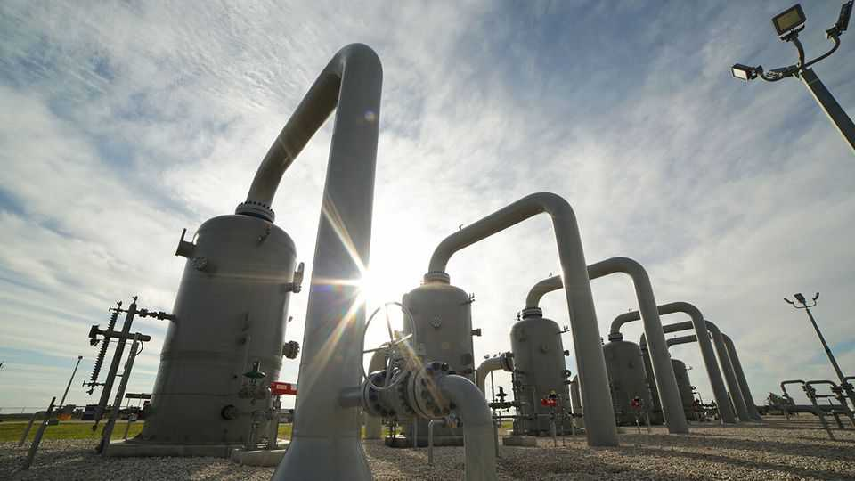
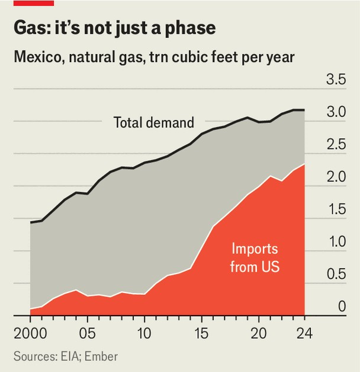
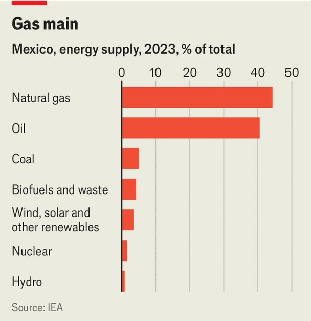

The Americas | Put that in your pipe and store it
Mexico fears the United States will stop the flow of natural gas
Sheinbaum must confront her country’s energy mess
September 4th 2025

Last year Mexico imported 2.34trn cubic feet of natural gas from the United States, up by nearly 40% from 2018. The increase is not just down to growing energy demand. Gas has become the backbone of Mexico’s energy system. It accounts for more than 60% of electricity generation, largely in combined-cycle plants. Natural gas is viewed as a “bridge” fuel as countries move away from coal and oil and towards clean energy. Mexico has been making use of its enviable access to the world’s cheapest supply of natural gas, produced just across the border in Texas. But that arrangement is politically fraught for President Claudia Sheinbaum.

Until the turn of the 21st century Mexico produced all the natural gas it needed. Then demand outpaced production by Pemex, Mexico’s national oil company (see next story). With the monopoly it then had, it produced gas only as a byproduct of its more lucrative oil operations. When gas output peaked in 2009 and power cuts followed, the shale boom in Texas presented a solution. Mexico built new pipelines and CFE, the state electricity firm, began producing ever more electricity at combined-cycle plants (see chart).

Sweeping energy reforms in 2013 should have reduced Mexico’s dependence on the imports. They opened the oil and gas sector to private investment, allowing for expanded pipelines and storage facilities. But when Andrés Manuel López Obrador, Ms Sheinbaum’s predecessor, took power in 2018, he kneecapped those plans. Mr López Obrador railed against dependency, but his passion for oil led him to double down on Pemex despite its declining fields and ballooning debts. He discouraged renewables and dismissed fracking. He suspended pipeline-contract payments, sidelined the private sector and dismantled the industry’s independent regulators. Without the money and expertise of outsiders, domestic production of oil and gas stagnated.

As dependency has deepened, it has come to the political fore. Donald Trump’s return to the White House stoked fears that he could turn off the

taps. In a more general sense Morena, Ms Sheinbaum’s party, frets about the loss of sovereignty implied by a reliance on foreign energy.

Should Mexico worry? Mr Trump has shown a readiness to weaponise whatever tools are available to him. Yet Oscar Ocampo of IMCO, a think- tank in Mexico City, says the idea that he would cut off Mexico’s gas is “absurd”: he has consistently pushed countries to buy more of America’s hydrocarbons, not less. And Luisa Palacios, an energy expert at Columbia University, says Mexico absorbs about 70% of America’s pipeline gas exports. The dependence is mutual.

Worries over energy sovereignty are shared by many governments. For Mexico, though, some say that is not the real fragility. “The problem is not the supplier. The problem is that we have no storage,” says Rosanety Barrios, a former energy official. When supply faltered during a freeze in Texas in 2021, Mexican factories and homes went dark within hours. The country has storage for just over two days of demand. By contrast, Spain can hold about 30 days’ worth; France more than 100.

And reliance on cheap gas, says Pedro Niembro of Monarch, a consultancy, has been a “double-edged sword”. “It has curtailed the development of new renewable energy,” he says. The US Department of Energy reckons Mexico

has the potential to produce enough to meet its electricity needs one hundred times over. But last year renewables contributed only 22% of electricty generation, falling short of the target of 35%. That leaves Mexico not only exposed to gas-price swings but also behind its peers in the energy transition.

Ms Sheinbaum, a climate scientist, shares much of her predecessor’s energy ideology but has more realistic ideas, though some of them might put her at odds with her Morena party. She has pledged to build storage capacity, upgrade pipelines and raise domestic-gas output by about 25% by 2030. She has also hinted at allowing fracking, though Pemex’s boss quickly denied this.

Ms Sheinbaum is more welcoming to public-private partnerships than her mentor, but she, too, thinks state firms should predominate. That risks supply. Pemex lacks both cash and expertise. Deepwater gas fields such as Lakach, now being revived with the involvement of Carlos Slim, a telecoms mogul, are costly and technically demanding. Private firms are interested, but the rules—and bitter memories from Mr López Obrador’s days—make them think twice. Mr Ocampo says he does not see a way for Mexico to be competitive.

Storage, better grids, policies to keep investors sweet: the path to less dependence on imported natural gas seems clear. Mexico should build the tanks, transmission lines and trust—and perhaps worry less about the taps.■

Sign up to El Boletín, our subscriber-only newsletter on Latin America, to understand the forces shaping a fascinating and complex region.

This article was downloaded by zlibrary from https://www.economist.com//the-americas/2025/09/04/mexico-fears-the-united-states- will-stop-the-flow-of-natural-gas