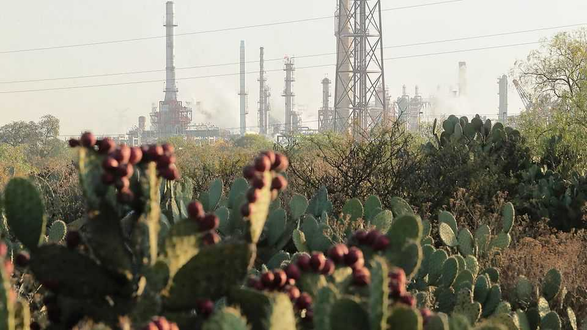
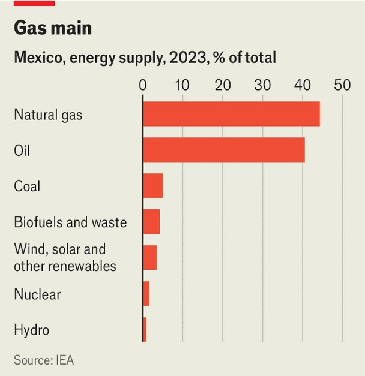

The Americas | Propping up Pemex
Luring partners and yet more debt: Mexico’s energy plan
The state oil firm needs a more radical treatment
September 4th 2025

When Claudia Sheinbaum took office a year ago, she inherited a fiscal albatross: Pemex, Mexico’s national oil company. It is the world’s most indebted state oil firm, with obligations topping $100bn. Production has slumped and suppliers are running after unpaid bills. Unlike Andrés Manuel López Obrador, her predecessor who tried to revive Pemex with subsidies and patriotic will, Ms Sheinbaum has at least acknowledged the mess. And on August 5th she unveiled a plan. Pemex’s problems go back decades. A giant oilfield discovery in the 1970s made it the economy’s motor. Successive governments milked it, starving it of investment. Debt ballooned; corruption flourished; pension obligations

swelled. Its exploration-and-production arm still makes money, but refining does not.

The firm’s woes deepened under Mr López Obrador, whose vision harked back to the petrol boom of the 1970s. He poured in subsidies, tax breaks and capital injections worth some $100bn over six years. His government froze a 2013 energy reform, curbed the private sector and ended oil auctions. He doubled down on refineries, building a new one in his home state of Tabasco (it has yet to produce anything on a commercial scale).

Oil production, which peaked in 2004 at 3.4m barrels per day, has fallen to about 1.6m. Natural-gas production has declined, too. Pemex’s domestic refineries are inefficient and dilapidated; their high-sulphur fuel oil clogs systems and raises costs and emissions. In 2020 Fitch and Moody’s, two rating agencies, downgraded Pemex to junk, calling it no longer just a corporate problem but a sovereign one.

The first part of Ms Sheinbaum’s reforms addresses Pemex’s considerable financial liabilities. Mexico’s government is using a complex arrangement involving a special-purpose vehicle, based in Luxembourg, that issues dollar-denominated bonds due in August 2030. Pemex gets access to the proceeds—so far $12bn—but keeps the debt off its (and the government’s)

balance-sheet. Alongside this, the government is creating a 250bn-peso ($13bn) investment fund, partly financed by development banks, to pay suppliers and bankroll projects. The goal is for Pemex to be financially self- sufficient from 2027 and its debt to fall to $77bn by 2030.

The plan’s second pillar looks at operations, aiming to boost daily production of liquid hydrocarbons to 1.8m barrels and of natural gas to 5bn cubic feet (from 3.7bn). Pemex is also supposed to invest in renewables such as green hydrogen. “Mixed contracts” with private partners are intended to lure investment.

As the scheme was revealed, Pemex’s bonds rallied and Fitch upgraded its rating. Cheaper borrowing will buy some breathing room—but not for long. It is “a bottle of oxygen that will eventually run out,“ says John Padilla of IPD, an energy consultancy. BBVA, a bank, reckons Pemex will need $12bn in 2025 and $20bn in 2026 just to cover maturing debt. That does not count supplier arrears of $20bn-25bn.

The operational part of the plan, too, will suffer for lack of cash, but also for lack of expertise. Boosting production will be hard. Pemex’s current fields are running dry and there have been few recent discoveries. What remains are scraps and complex reservoirs, such as deepwater ones, that are difficult and pricey to tap.

In theory mixed contracts will let private firms provide cash and competence. But deepwater projects need billions and tip-top technology, and by law Pemex must keep at least a 40% stake in them. Shell and Chevron have abandoned exploration licences after disappointing results. Nevertheless, some private firms are quietly showing early interest.

Meanwhile, Pemex’s structural shortcomings persist. lts board is dominated by political appointees. Weak independent regulators no longer provide discipline. And its wage and pension bills are eye-watering (workers can retire after only 30 years of service). Pemex needs far tougher measures to slim down and focus, or else it will remain a deadweight on Ms Sheinbaum —and on Mexico.■

Sign up to El Boletín, our subscriber-only newsletter on Latin America, to understand the forces shaping a fascinating and complex region.

This article was downloaded by zlibrary from https://www.economist.com//the-americas/2025/09/04/luring-partners-and-yet-more- debt-mexicos-energy-plan