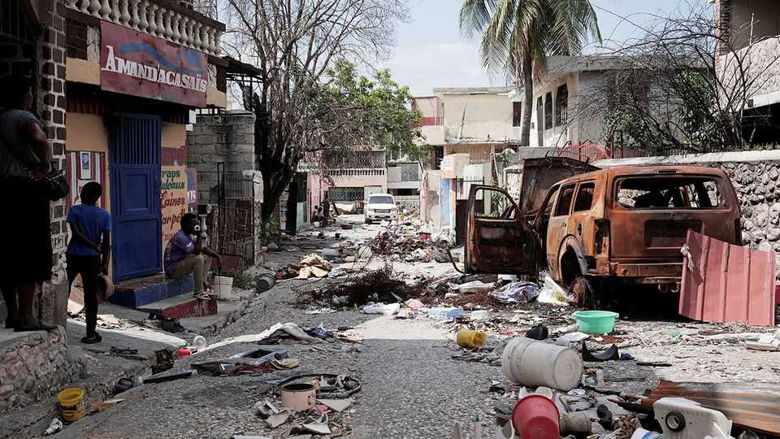
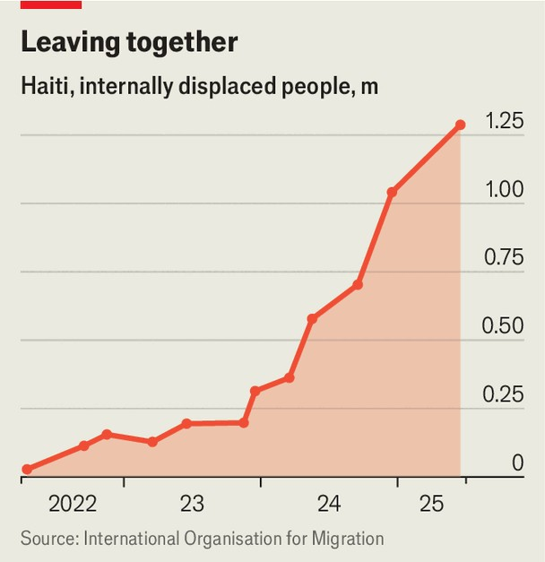

The Americas | You and what army?
What is missing from a plan to tackle Haiti’s gangs
Boots on the ground can only solve some of the country’s ills
September 4th 2025

Last week Jimmy “Barbecue” Chérizier, the leader of Viv Ansanm, a Haitian gang coalition, made a curious announcement on social media. He said his men would abandon several neighbourhoods in Port-au-Prince, the capital, which they had pillaged. He encouraged residents who had fled in fear to return to their ruined homes. The name Viv Ansanm, or Living Together, rings hollow to most Haitians, who are dying under the gangs’ yoke. So why this apparent munificence from their leader? Rumours swirled. Was it to placate the United States, which a fortnight earlier put a $5m bounty on his head? Had he struck a deal with Haiti’s government to show mercy to some of the capital’s people?

“We’ve seen this before,” says PierreEspérance, a longtime human-rights activist now leading the National Human Rights Defence Network. “The gangs are gone but the police have not re-entered those neighbourhoods. ‘Barbecue’ will be back in three months.” Perhaps, then, he merely wanted the residents back so they could again be extorted by his men.

Port-au-Prince has in essence been under Viv Ansanm’s occupation for 18 months. A Kenyan-led mission that arrived in June 2024 barely exceeded 1,000 police at its peak, and was never well enough funded to quell the violence. By now more than 11% of the population—1.3m people, half of them children—have been displaced (see chart).

Now the Trump administration has a plan, presented to the UN Security Council on August 28th: the “Gang Suppression Force” (GSF), a 5,500- strong international security operation to be supported by a new UN field office in Port-au-Prince.

Its first hurdle will be to secure support within the UN itself, including the Security Council. China and Russia have little interest in helping the United States resolve problems in its backyard, let alone in getting the UN to pay for it.

Then there is the question of government. Haiti has not had an elected one of any kind since the last president, Jovenel Moïse, was assassinated in 2021. In April last year the unelected cabinet appointed a Transitional Presidential Council to run things. Its mandate expires when an elected president is again installed, or in February 2026, whichever comes first. Given the probability that gangs would kidnap, rape and loot with impunity during any poll, it is clear which would come first.

And the GSF plan has little budgeting detail. Dipping into the UN’s coffers would yield little. “Haiti remains shamefully overlooked and woefully underfunded,” says António Guterres, the UN’s secretary-general. Only 8% of the UN’s $908m humanitarian budget for Haiti is actually in the bank— making it, he says, “the least-funded humanitarian appeal in the world”.

America’s plan, therefore, has met with little enthusiasm. “The whole policy is very disjointed,” said Keith Mines, a former director for Latin America at the recently dismantled United States Institute of Peace. In desperation to find a policy that works, “everybody is just trying to hit any button they can press”, he says.

The simplest button to press would be to get funds. But donors have lost faith in Haiti’s dysfunctional institutions. Last month Laurent Saint-Cyr took over as head of the Transitional Presidential Council, a rotating post. He and the prime minister, Alix Fils-Aimé, are both businessmen, and both are considered to be close to the country’s tainted private sector, which includes people under sanctions imposed by the United States, Canada and the UN.

What troubles Haitians more is that both are also suspected of secretly negotiating with gang leaders, calling to mind the deals reached in El Salvador between that country’s gangs and President Nayib Bukele. There, order was restored, but at the eventual price of mass detentions and widespread alleged human-rights abuses.

Mr Guterres told the Security Council last week that he was “encouraged” by the efforts of Messrs Fils-Aimé and Saint-Cyr, including better co- ordination with the police. But Mr Espérance says simply: “We don’t see that.” Insecurity and lawlessness are only growing, he says. At least 8,000

people have been killed in gang-related violence in the past 18 months, and the UN’s officials warn that extrajudicial killing by the police is on the rise.

Most Haitians lament that shady deals would let gang members escape justice. But how else might they get a return to something like a normal life? An ugly compromise may be the only way out of the nightmare—but one made in the open. Jake Johnston, a veteran observer of Haiti at the Centre for Economic and Policy Research in Washington, says: “There needs to be justice for victims.” That requires far more than just a gang-suppression force.■

Sign up to El Boletín, our subscriber-only newsletter on Latin America, to understand the forces shaping a fascinating and complex region.

This article was downloaded by zlibrary from https://www.economist.com//the-americas/2025/09/04/what-is-missing-from-a-plan-to- tackle-haitis-gangs

Asia

Protests test Indonesia’s democracy India is retiring its most celebrated warplane Sri Lanka is still reeling from its economic collapse A lesson in Trump-charming