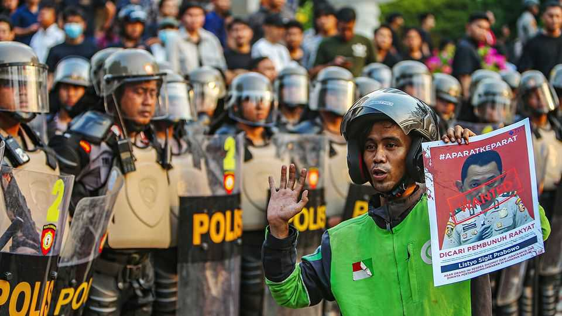

Asia | Old habits die hard
Protests test Indonesia’s democracy
How will President Prabowo deal with dissent and discontent?
September 4th 2025

BRIGHT GREEN jackets worn by motorbike-taxi drivers are everywhere on the streets of Jakarta, Indonesia’s capital. Affan Kurniawan, a 21-year-old, was wearing one while delivering food on the night of August 28th. By chance, his route took him through a demonstration outside Indonesia’s parliament. As he made his way through the crowd, an armoured police vehicle charged the protesters. It hit Mr Affan and then drove over him, killing him. Video of the incident quickly spread on social media, outraging Indonesians. The following day thousands of green-jacketed drivers turned out to accompany Mr Affan’s funeral procession. Demonstrators flooded streets across the country, demanding accountability for his death and a long list of

reforms. After sunset, protest leaders told their followers to go home, but crowds remained on the streets. In the chaos unknown vandals set two regional-parliament buildings alight, in the cities of Makassar and Mataram. The following day looters sacked the houses of five officials, including Sri Mulyani Indrawati, the finance minister. Student organisers of the protests say that agents provocateurs are responsible for the damage, not them.

The unrest is a crucial test for Prabowo Subianto, a former general who won a landslide victory in last year’s presidential election and who has little patience for dissent. In a speech on August 31st he said that he supports the right to peaceful assembly, but that some of the demonstrations tended towards terrorism and sedition. He ordered the armed forces and police to take the strongest possible lawful actions against rioters. The following day police went after students walking back to campus from a rally, and arrested the leader of a rights-advocacy organisation. But many in Jakarta have decided to stay off the streets, leading to a tense calm.

Mr Prabowo also promised to investigate and hold accountable the police officers responsible for Mr Affan’s death, and to deal with one of the protesters’ biggest gripes, the behaviour of lawmakers in his mega-coalition, which includes nearly all the parties in the legislature. A plan by MPs to give themselves a housing allowance of $3,000 a month (in a city where the monthly minimum wage is little more than a tenth of that) will be reversed, he said, and overseas junkets paused. But these concessions do not tackle the root causes of the demonstrations: unhappiness about the economy and Mr Prabowo’s attempt to squelch political-party opposition.

On paper, the economy is doing well. Economic growth accelerated to an annual rate of 5.1% in the second quarter, according to official data. Inflation has been docile, near 2%. But beneath the surface there is trouble. The price of some staples has risen faster than broader measures of inflation. A kilo of rice in Indonesia is 34% pricier than three years ago, for example. Meanwhile, the labour market appears to be worsening. Reports of layoffs are pervasive. The number of unemployed university graduates has leapt by 25% since August 2022. Consumer confidence has dipped.

This year the share of bank loans to households that are non-performing has surged to its highest level on record. “I can barely make ends meet, and I

hear that members of parliament are enriching themselves,” says Dewi (not her real name), a 23-year-old teacher in a town five hours from Jakarta, in central Java province. She says many of her peers have left the country because of poor career prospects.

Mr Prabowo’s missteps on economic policy have not helped. In January he ordered an immediate 9% cut to the government’s budget. Layoffs and cuts to essential services followed. He ploughed the savings into a free-school- lunch programme and a new sovereign-wealth fund under his direct control. The fund took over state-owned enterprises and now receives their dividends, leading to a sharp drop in the government’s revenues. It in turn reduced transfers to local and provincial governments, forcing some to more than double taxes.

In a working democracy, opposition legislators would vent voters’ frustration with these policies in parliament, pressing the government to change course. But the other hallmark of Mr Prabowo’s administration has been his attempt to shut down opposition by co-opting it. All but one of the eight parties in the lower house have joined the ruling coalition, and Mr Prabowo continues to woo the holdout. Worse, he has talked of making such an arrangement “permanent”, suggesting that there would be no tolerance for opposition political parties in the legislature. He argues that this better reflects Indonesian culture than adversarial systems do, harking back to the political set-up under Indonesia’s first president, Sukarno.

If protests resume, how will Mr Prabowo respond? He could use them as a chance to consolidate power. In 1998 he allegedly worked with Islamist thugs to sow discord during the dictatorial rule of Suharto, his father-in-law —supposedly so that the unrest would allow Suharto to declare martial law and remain in power. Mr Prabowo has always vehemently denied that he worked with the thugs. And the unrest cost Suharto the support of his cabinet, leading him to step down. Some observers think that Mr Prabowo is now using agents provocateurs as a pretext to amass power and crush dissent. Unlike this father-in-law, he would be unlikely to resign.

But one foreign diplomat who knows Mr Prabowo well doubts that he will resort to repression or violence. “Like all populists, he wants to be popular,”

the diplomat says. Disorder does not serve that end, nor would a crackdown. ■

This article was downloaded by zlibrary from [https://www.economist.com//asia/2025/09/02/protests-test-indonesias-democracy](https://www.economist.com//asia/2025/09/02/protests-test-indonesias-democracy)