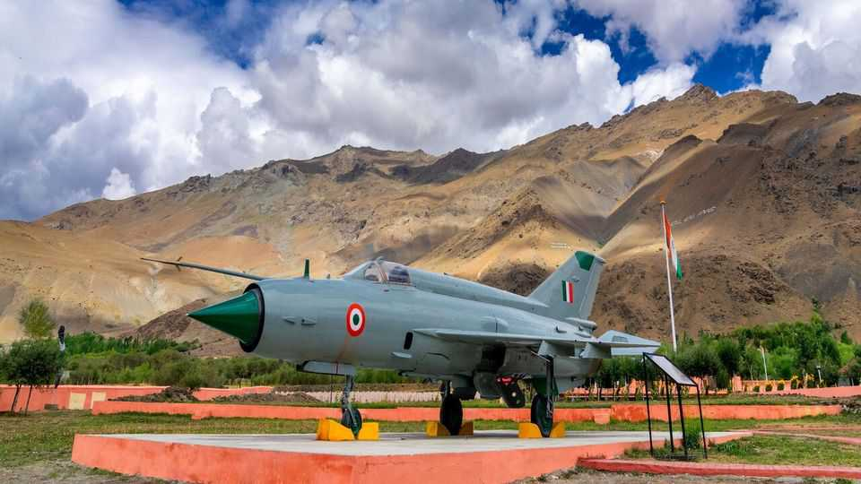

Asia | A Soviet relic is retired
India is retiring its most celebrated warplane
The MiG-21 served in every Indian war for 50 years. It leaves a big gap
September 4th 2025

IN 1963 India was in a tricky spot. It had just been thumped by China in a war in which the Indian Air Force (IAF) had stood by helplessly. America had sold Pakistan advanced fighter jets a few years earlier. Enter the Soviet Union’s MiG-21. The fighter jet propelled India into the supersonic age, cementing the country’s reliance on Soviet hardware. On September 26th, after 62 years of service, India will retire a warplane that came to acquire iconic status—and a reputation for killing its pilots. The MiG-21, which is still operated by several countries, was created in the 1950s as a lightweight interceptor, designed to climb fast to reach the enemy over short distances. It quickly became the workhorse of the Indian fleet: around 900 aircraft passed through the IAF, most of them made in India

under Soviet licence. The early version, celebrated for shooting down Pakistani planes in the 1971 war over Bangladesh, was used for air-to-air combat within visual range. A later version, the MiG-21 Bison, equipped with a better radar, could strike at longer distances.

In 2021, on the 50th anniversary of the liberation of Bangladesh, India’s then president presented his counterpart with a replica of the MiG-21, reflecting the esteem in which it was held. But the adulation always sat alongside unease. The jet’s wing design, narrow tyres and turbojet engine generated maximum power only at high airspeeds. This meant that flying too slowly on landing could be deadly. Over 400 Indian MiG-21s crashed over 60 years, killing 200 pilots and 60 civilians, resulting in a grim moniker from the Indian press: the flying coffin. The latest crash was in 2023, when an accident killed three villagers.

That did not stop the IAF from pressing the jet into service long after it became dangerously vulnerable to modern technology. In 2019 a Bison was sent up to meet Pakistani jets during tit-for-tat air strikes, because it could get to the action quicker than India’s newer but much heavier Su-30. It was promptly shot down. Its extravagantly moustachioed pilot, Wing Commander Abhinandan Varthaman, pictured sipping tea in Pakistani custody, acquired cult status on his return. Indian officials claim that in 2019 the MiGs shot down Pakistan’s American-made F-16s. Western officials dispute that. When India launched air strikes on Pakistan in May this year, the MiG-21s were used again.

In practice, the IAF had assumed it would start getting rid of its MiGs in the 1990s, like many other countries. Their long service had nothing to do with the plane’s legendary history, but rather with a lack of alternatives. The plan was that the Tejas, an Indian-designed and -built jet, would take over its duties. But the Tejas was slow to arrive and was disliked by many in the IAF. At the same time, India’s government ploughed cash into upgrading a pair of French and Russian jets, the Mirage-2000 and MiG-29, and into buying a new French one, the Rafale, rather than replacing the huge MiG-21 fleet wholesale. That has left a motley fleet of jets.

Modern jets are more capable than older ones; one Rafale might do the work of several MiGs. But quantity still matters. They cannot be in two places at

once. India lost five jets to Pakistani missiles on the first night of the conflict in May, according to Western intelligence assessments. China now has around three combat aircraft for every Indian one, a higher ratio than a decade ago. As the MiG-21 flies into the sunset, that gap could grow. ■

Stay on top of our India coverage by signing up to Essential India, our free weekly newsletter.

This article was downloaded by zlibrary from https://www.economist.com//asia/2025/09/04/india-is-retiring-its-most-celebrated- warplane