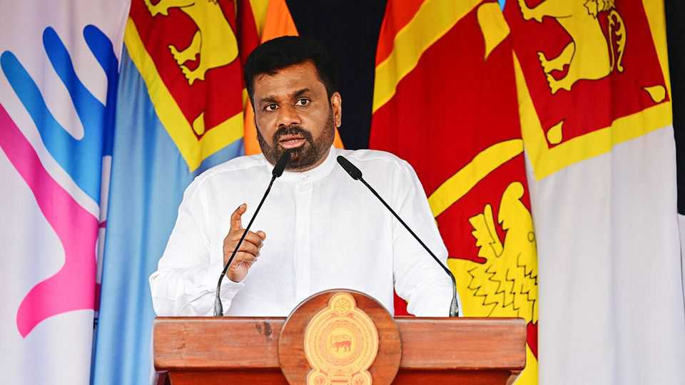
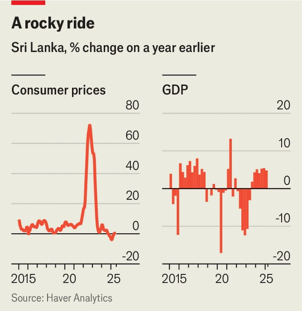

Asia | Grace period
Sri Lanka is still reeling from its economic collapse
And its new government’s honeymoon may be ending
September 4th 2025

OPENED IN AUGUST with the stated ambition of making Sri Lanka “India’s Macau”, the City of Dreams development in downtown Colombo houses a casino, luxury hotels, high-end shops and a champagne-and- cocktail bar “floating amid the clouds”. The gleaming but for now largely deserted halls of the vast complex seem a symbol of renewal: a far cry from the mass civil unrest of just three years ago and the accompanying economic collapse—rampant inflation, fuel shortages, mass poverty and foreign-debt default. Sri Lanka has indeed staged a remarkable recovery. But for a country still grappling with the effects of an economic implosion, combined with the scars from a bloody 26-year civil war that ended in 2009, recovery is not

good enough. Sri Lanka still craves political stability, economic growth and national reconciliation.

At least for now, it has the first of these. A year ago, fed up with years of incompetence under the mainstream parties, Sri Lankans elected a new president, Anura Kumara Dissanayake (known as AKD), and then in November gave his National People’s Power (NPP) coalition a huge parliamentary majority. The NPP is dominated by the Janatha Vimukthi Peramuna party (JVP), which led two armed insurgencies in the 1970s and 1980s espousing an ideology uniquely combining Marxism and Sinhala- Buddhist nationalism. In government, however, it has meekly accepted an IMF programme negotiated in 2023 by the previous president, Ranil Wickremesinghe.

AKD remains personally popular, according to analysts in Colombo. His government is widely praised as marking a clear break from the cronyism and nepotism that it supplanted. It has pursued corruption allegations against its predecessors, including Mr Wickremesinghe, who was arrested on August 22nd, accused of using state funds for a private trip to London in 2023 (he denies wrongdoing and insists that state funds were not used for this trip). Harindra B. Dassanayake, a Colombo-based analyst, says the NPP has successfully transformed Sri Lanka’s “axis of polarisation” from the “national” question about the status of Tamils to one defined by popular resentment of a corrupt elite.

In this it is helped by a divided and discredited opposition made up of three main parties, one led by Mr Wickremesinghe, and two by the sons of other former presidents. None articulates a clear vision of what they would be doing differently. One of them, Namal Rajapaksa, son and nephew of two former presidents blamed for the policy blunders that led to the debacle of 2022, thinks that to gain power in future, an opposition coalition will be needed. He accuses the JVP of “100% following the Chinese Communist system, so they have total control of things”. It is true the JVP has a Leninist structure—central committee, six-man Politburo and all—so where power lies is not transparent.

So far, it has disappointed those supporters who hoped for radical change, and its honeymoon may be drawing to a close. Thanks to the IMF programme, swingeing austerity measures, debt-rescheduling and the global post-covid recovery, inflation has been reined in, with prices largely stable year-on-year. Tax revenue as a share of GDP has climbed from a low of 7.3% in 2022 to an estimated 13.9% this year. Sri Lanka’s economy is growing again—by 5% last year (in line with the government’s and the IMF’s medium-term target). But the growth forecast for this year and the next two is a measly 3-4%. Anil Jayantha Fernando, the deputy finance minister, concedes that this level of growth is “not adequate”.

Mr Fernando is also “highly worried” about persistent poverty. GDP per person has only just caught up with its level in 2018. And, most worrying for a government elected to help the poor, a World Bank report in April found that the poverty rate, with the line set at $3.65 per person per day, is at 24.5%, nearly double what it was in 2019. Malnutrition had increased among children under five from 12.2% in 2021 to 17% in 2024; household incomes remain well below pre-crisis levels.

Nor is it obvious where growth and prosperity are to come from by 2028, when principal payments on Sri Lanka’s debt step up sharply. The composition of Sri Lanka’s exports has not changed much for decades:

dominated by tea, rubber and, above all, apparel, which accounted for 38% of goods exports in 2024, with some 40% of that going to America.

Many in Sri Lanka were relieved at the number the country drew in the Donald Trump tariff lottery in July—just 20%, the same as Bangladesh, a competitor, only a smidgen above the 19% applied to South-East Asian rivals such as Indonesia and Thailand, and far below the punitive 50% India faces. Hasitha Premaratne, managing director of Brandix, one of Sri Lanka’s largest garment exporters, says the uncertainty has been a big problem, but that order volumes have not yet dropped.

The government is investing great hope in tourism: City of Dreams is, in a sense, official policy. Arrivals rose from 1.5m in 2023 to 2m last year, and the government is hoping for 3m this year, but the industry complains it is not doing enough to promote the country. Sri Lanka’s legion of overseas workers, whose remittances reached nearly $700m in July, are also contributing to what is now a current-account surplus. Economists say these workers’ composition has changed. They are still mainly domestic servants and construction workers in the Middle East, but a growing proportion comes from the earnings of higher-paid professionals. Many have left for good. A population of 23m has produced a diaspora between 2m and 3m.

The diaspora is also seen as an important source of potential investment. But its willingness to return is impeded by the bitterness left by the war, and the massacre of civilians that accompanied the government’s victory, in which a UN panel of experts estimated as many as 40,000 civilians were killed. Tens of thousands of people disappeared during the conflict, which was fought over the failed bid by the Tamil (largely Hindu) minority in the north and east to secure its own homeland.

Last year the NPP and AKD won many votes in the Tamil north, partly on hopes they would begin to tackle Tamils’ grievances. But local-election results in May, in which the NPP did less well, suggested disillusionment had already set in. On that issue, too, its honeymoon cannot be extended indefinitely. ■

This article was downloaded by zlibrary from https://www.economist.com//asia/2025/09/04/sri-lanka-is-still-reeling-from-its- economic-collapse