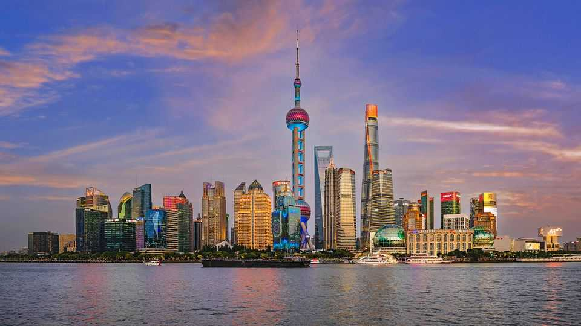
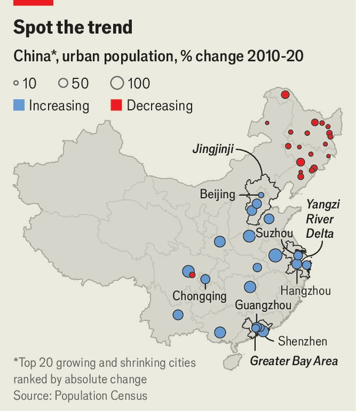

China | Urban development
China’s urban planners could determine the future of city life
They are betting big on interconnected city clusters
September 4th 2025

In THE first decade of Xi Jinping’s rule, builders in China poured more concrete than America did in all of the 20th century. Urban areas expanded by 40%. No longer. In the past five years the debt-fuelled property market has slumped. Evergrande, once China’s largest developer, has collapsed: on August 25th it was delisted from Hong Kong’s stock exchange. Many cities today are plagued by sprawl, smog and gridlock, and are littered with tens of millions of empty flats. China’s leaders say they want a new approach, aimed at making cities more pleasant rather than more massive. That is far harder than it sounds.

On August 28th the Communist Party published an ambitious plan. By 2035 it wants cities to be “liveable, beautiful, resilient, civilised and smart”. The hope is that they foster the growth of innovative, high-tech firms and house consumers increasingly willing to spend on nearby shopping, restaurants and services. New digital tools, many turbocharged by artificial intelligence (AI), will help cities run more smoothly. Pollution and traffic jams could become far less common. Read between the lines, however, and it is clear that the party also wants state-of-the-art surveillance systems to boost its control.

China’s megacities remain among the world’s largest. Shanghai holds 22m people; Beijing 19m. The 50 largest cities account for more than half its GDP. When Mr Xi took power in 2012, about half of the population was living in urban areas. Now, two-thirds do, an increase of some 220m people —more than the population of Brazil. The urbanisation rate is still lower than that of most rich countries: America’s is over 80%. But China’s may hit 70% by 2030.

Many cities in the north-east, a chilly rustbelt, are shrivelling as their citizens hunt economic opportunities on China’s southern and eastern coasts (see map). Overall, the movement of people from villages into urban areas is slowing. In the 2010s the urbanisation rate was increasing by 1.1 percentage

points a year on average; in the 2020s that has dropped to 0.6 a year. But officials have never seemed keen on unchecked internal migration. The hukou, China’s residency system, has controlled movement by excluding rural migrants from access to schools and other benefits. Smaller cities have largely ditched hukou restrictions, but Beijing and Shanghai remain unfriendly to migrant workers.

In the party’s new plan, “city-clusters” will be increasingly powerful engines of growth in the next decade and beyond. They are the means through which the rest of the plan will be realised. These clusters consist of one or two large hub cities and their smaller neighbours, linked by high-speed rail. Nearly a decade ago officials picked out 19 potential clusters, including three critical coastal ones: Beijing-Tianjin and neighbouring areas (known as Jingjinji); Shanghai and other cities in the Yangzi River Delta; and Hong Kong with its neighbours in the Pearl River Delta.

Some clusters are already hives of industry. Perhaps the most promising is in the Pearl River Delta, says Dan Wang of Eurasia Group, a consultancy. The Greater Bay Area (GBA), as that region is known, contains 86m people across vibrant cities such as Guangzhou, Shenzhen and Hong Kong. Infrastructure is the key to its continuing success—and the success of clusters that wish to emulate the GBA.

Laying tracks between huge labour markets allows employees, knowledge and innovation to spread quickly. Shenzhen’s underground train tracks already stretch for 600km (London’s are around 400km long), and another 200km are under construction. Guangzhou’s are 700km long. Better links could give the GBA a productivity boost comparable to the one British cities enjoyed in the wake of the Industrial Revolution, reckons Alain Bertaud of New York University.

Officials also hope more ”liveable“ city-clusters can help spur consumption that the spluttering economy needs. Deng Anqing, a 40-year-old from a village in central China, moved to Beijing in his 20s but was unable to afford a house until 2022 when he moved to Suzhou, a canal-crossed city on the Yangzi River Delta. It hardly matters that Suzhou has fewer white-collar jobs. He can still work at a publishing firm in Shanghai—just 30 minutes away by bullet train. And he feels freer to spend. “Now that I have my own

home in Suzhou, I buy the furniture I like, all kinds of things I like, and I can decorate,” he says. “There’s a sense of belonging.”

Hangzhou, another city in the Yangzi Delta cluster, is a model for how clusters are trying to use “smart” technologies to improve city life. It feeds data from cameras, government records, traffic lights and police reports into a “city brain” powered by AI, aided by Alibaba, a local tech giant. Officials claim that analysis of the brain has helped them track pollution, reduce congestion and aid emergency services. This year the brain was also upgraded to provide digital services for Hangzhou residents. Other cities round China are racing to build their own brains.

But the ubiquitous street cameras of these “smart” cities also provide a real- time window for the police on potential trouble spots. China’s cities typically have low levels of crime, but officials are paranoid about protests. High-tech surveillance is coupled with the old-fashioned sort. Civilian volunteers watch out for suspicious street activity. Their observations can then be uploaded to the brain.

Difficult questions remain over how exactly China will manage to turn its city clusters into world-beating champions. For one thing, the party’s new plan says there must be no “large-scale expansion” of cities. Instead of pouring concrete, the emphasis will be on improving what is there already. ANZ, an Australian bank, estimates that more than half of new demand in China’s property market over the next decade will stem from upgrading existing houses rather than building new ones. Stung by the property slump, officials say flats should be built for use as primary residences, not as investments, and flashy skyscrapers will be discouraged. They will also direct urban development projects; consultation with citizens will be minimal.

Another issue is how to pay for improvements. There are no cost forecasts in the party’s new plan for cities. Just patching up basic urban infrastructure like drainage systems and ageing gas pipelines could cost 4trn yuan ($560bn) over the next five years, according to a previous estimate by the state planning agency. That leaves aside spending on fancier projects like data centres to power city brains. “People-centred” reforms under discussion will not be cheap either, from making public services more open to migrants

from the countryside to subsidising rented housing for new graduates. Cities used to be able to rake in cash by selling land to developers, but this only exacerbated the property frenzy. Big fiscal reforms are therefore still needed to help local governments find new sources of revenue.

How to adapt to a changing climate is also a challenge. Drought already afflicts the city-cluster around Beijing. Much of its drinking water has to be pumped from southern sites that are hundreds of kilometres away. And both the GBA and the Yangzi River Delta are vulnerable to typhoons and rising sea levels. (China already loses 1% of GDP to floods each year on average, the World Bank estimates.) The government is building more sea walls, with over 400km under construction at present. And it is also trying to “spongify” urban areas, so they can absorb rain more efficiently, by creating more parks and artificial wetlands.

A test case for China’s urban plans is Xiong’an. A pet project of Mr Xi, who has called it a “city of the future”, it has been under construction since 2017 in wetlands south of Beijing. It is supposed to embody the party’s green, high-tech vision of urban life. But despite 835bn yuan of spending, it has yet to become a “hub of innovation”, as state media describe it. China’s old approach to cities is over, but its new one has yet to prove itself. ■

Subscribers can sign up to Drum Tower, our new weekly newsletter, to understand what the world makes of China—and what China makes of the world.

This article was downloaded by zlibrary from https://www.economist.com//china/2025/09/04/chinas-urban-planners-could-determine- the-future-of-city-life