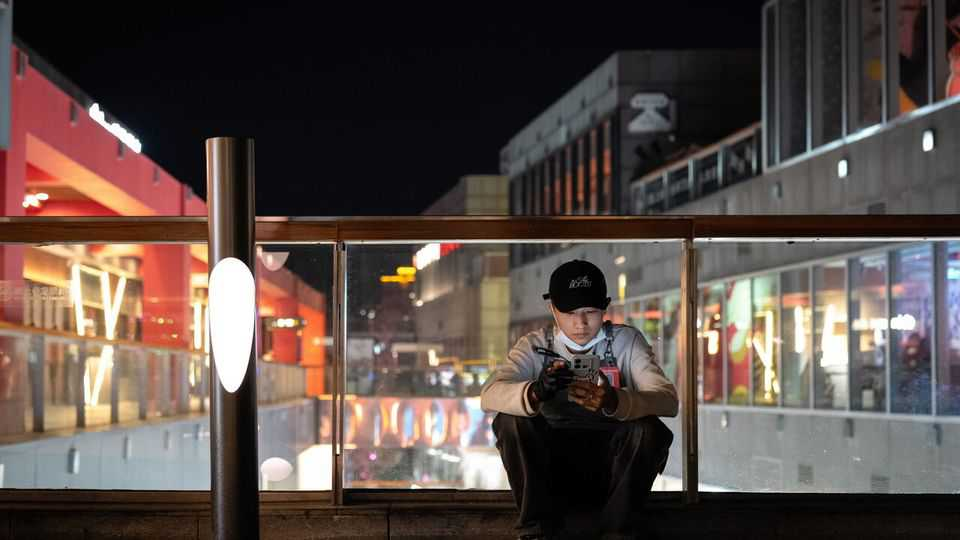

China | Shortcuts and social statements
The weird and wacky life hacks of China’s youth
Melted ice-cream or carbonara sauce?
September 4th 2025

PICTURE YOURSELF as the hero in a Chinese martial-arts novel. Intent on honing your powers or perhaps attaining immortality, there are two paths available to you. Do you choose zhengxiu, the orthodox one that typically demands decades of meditation in a cave? Or do you risk xiexiu, the heretical way? It is swifter. But it also involves moral compromise. In the novels, those who opt for the latter usually end up either corrupt or dead. Traditional mores warn against those who cheat established systems. But xiexiu has acquired a new lease of life among certain youngsters. Detached from its literary origins, it now denotes a departure from the proper way: more efficient, more creative or simply less bound by convention. In recent months videos tagged with the term have drawn

billions of views on Douyin and Xiaohongshu, a pair of social platforms. Businesses have joined the fun, selling products in strange combinations. Some departures are just rebranded life hacks, such as rendering lard in a microwave or learning English through fan fiction. Others veer into the absurd: reading advanced mathematics as a cure for insomnia, dining in the nude to shame oneself into getting in shape or melting ice cream to make carbonara sauce.

Many of those embracing the trend are young adults, who see xiexiu as a middle path between striving hard (“996” office culture in China pushes unfortunate employees to work from 9am to 9pm, six days a week) and “lying flat” (resigning oneself to lacklustre employment to avoid intolerable stress). More than a shortcut, xiexiu signals disillusionment. A wobbly economy, rising housing costs and shaky job prospects have already made the path through adulthood more precarious. In July, the unemployment rate for people aged 16 to 24 in cities stood at 17.8%. So why not stray towards xiexiu?

Last month, the social account of Guangming Daily, one of the party’s main mouthpieces, declared the fad a cheerful way for the young to counter uncertainty and gain initiative. The commentary stopped short of calling it a rebellion, instead describing it as “a way to seek improvement”. Easier perhaps, to let the young channel their angst through quirky hacks than to confront the sticky truth about their prospects. But an inclination towards xiexiu should not be dismissed. “Heretical practice isn’t really about teaching you how to cook—it’s teaching you how to rethink,” reads one clear-eyed comment. ■

Subscribers can sign up to Drum Tower, our new weekly newsletter, to understand what the world makes of China—and what China makes of the world.

This article was downloaded by zlibrary from https://www.economist.com//china/2025/09/04/the-weird-and-wacky-life-hacks-of- chinas-youth