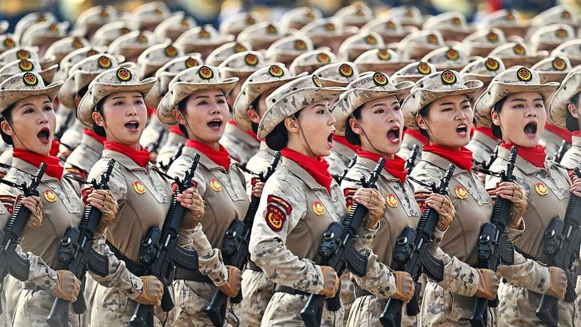

China | Marching orders
All eyes on China’s massive military parade
Xi Jinping flexes some muscle
September 4th 2025

On September 3rd China held its first parade in six years, commemorating the 80th anniversary of the end of the second world war. It marks the day in 1945 when Japan’s army surrendered to the Chinese government. The military extravaganza was presided over by Xi Jinping, China’s leader. “Today, humanity again has to choose between peace and war, dialogue and confrontation, win-win co-operation or zero-sum games,” he declared. New weaponry wowed spectators: supersonic and hypersonic missiles, underwater drones and robot wolves were all on display. Also in attendance were 26 national leaders, including North Korea’s Kim Jong Un and Russia’s Vladimir Putin. In response, President Donald Trump accused the pair of conspiring against America with Mr Xi. ■

Subscribers can sign up to Drum Tower, our new weekly newsletter, to understand what the world makes of China—and what China makes of the world.

This article was downloaded by zlibrary from https://www.economist.com//china/2025/09/04/all-eyes-on-chinas-massive-military- parade