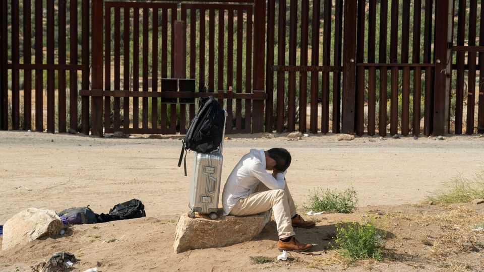

China | Changing their minds
Chinese migrants risked their lives to reach America. For what?
Far fewer of them are trying to sneak across the southern border
September 4th 2025

AH GAN, a partially blind Chinese man in his mid-40s, crossed the US- Mexico border in the summer of 2024. He spent three months traversing the jungles and deserts of the Americas with his wife and two children in pursuit of a dream. America meant freedom and opportunity, he thought, a chance to escape the political censorship and economic malaise of post-pandemic China. One year later, his family is barely getting by on his wife’s delivery- job income. Ah Gan worries that she will be detained by masked agents of the US Immigration and Customs Enforcement (ICE) roaming the streets. He has escaped Chinese censorship, but now fears speaking ill of the Trump administration. “I never thought I’d have to worry about speech crime in America,” he says. “It’s tragic.”

Ah Gan, who asked to use a pseudonym for his protection, is one of more than 67,000 Chinese migrants who flowed across America’s southern border between 2022 and 2024. A small number were genuine asylum-seekers fleeing political persecution. Most were economic migrants, some of whom wanted to live in a freer society replete with opportunity. Almost all applied for asylum as a way to stay in America and work despite having crossed the border illegally. They hoped to join the 2.2m immigrants from mainland China already living in America.

Since then the flow of migrants has slowed to a trickle. At the peak in December 2023, nearly 6,000 Chinese migrants were crossing the southern border each month. But in July this year only 80 encounters were recorded. Ecuador’s suspension of visa-free entry for Chinese nationals in July 2024 is one reason. It blocked the main route Chinese migrants were taking into the United States via South America. The other is Donald Trump’s crackdown at the border. On the campaign trail he promised to stop Chinese newcomers specifically; he claimed, without offering evidence, that they were “building an army”. Asylum acceptance rates have gone down, from 50% for Chinese applicants nationwide in mid-2023 to 20% in May 2025.

Yet deportations remain rare because relations between the two countries are at a low ebb. China stopped accepting American flights full of returnees in 2018 amid trade tensions and diplomatic squabbling. Deportations then only resumed in June 2024. The Biden administration oversaw just five large removal flights. Only one has taken place since Mr Trump’s second term began, according to public records. China is “not refusing, but not co- operating enthusiastically either”, says Chen Chuangchuang, a New York- based lawyer who works with Chinese migrants. Mr Trump has successfully used tariffs and sanctions to press other countries into receiving deportees— but not China.

What are the risks of return? Those deported to China are usually detained for a few days, interrogated, fined and released, says Mr Chen. Some have their passports confiscated. They may also be charged with illegal border crossing, which is punishable by up to one year of imprisonment (or three in extreme cases). Some migrants now think it is not worth staying in America and have returned to China voluntarily to avoid these risks. Others discuss moving to countries such as Canada. Genuine asylum-seekers will face

much harsher punishment if they return to China. Most are keeping their heads down, says Liu Zhuohua, a political dissident who crossed the Darién Gap, a stretch of rainforest between South and Central America, and reached the United States in 2023 after spending years in prison for “subversion of state power” in China.“It’s a lot of psychological pressure,” he says. “But I’m not going back, no matter what.” ■

Subscribers can sign up to Drum Tower, our new weekly newsletter, to understand what the world makes of China—and what China makes of the world.

This article was downloaded by zlibrary from https://www.economist.com//china/2025/09/04/chinese-migrants-risked-their-lives-to- reach-america-for-what

Middle East & Africa

Rampant and relentless: Israel’s settlers make their move Iran’s imminent nuclear dilemma The world’s surprise boomtown: Baghdad A terrifying synthetic-drug surge in Africa A new frontier for skyscrapers