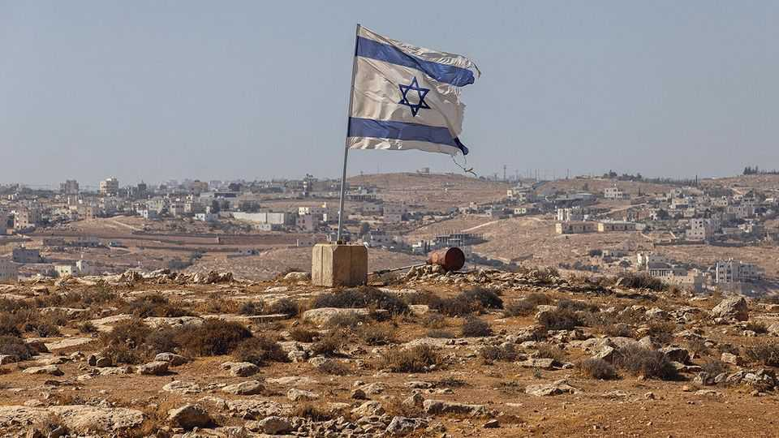
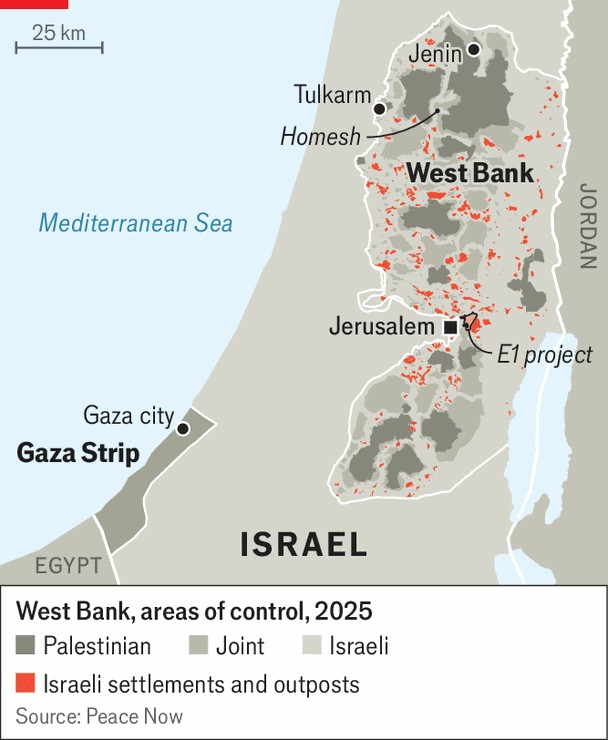

Middle East & Africa | The next phase of the Middle East war
Rampant and relentless: Israel’s settlers make their move
They are unleashing a plan to sabotage two states
September 4th 2025

On september 1st, as Israeli children began the school year, toddlers entered their new nursery in Homesh, a Jewish settlement in the occupied West Bank. Like many other Israeli schools and nurseries in the West Bank, it was built with government support and funding. But Homesh is different: it was one of the settlements dismantled 20 years ago under Ariel Sharon’s “disengagement” plan, when Israel withdrew from Gaza and a small part of the West Bank. For settlers and their far-right allies, Homesh’s reopening is a vindication. They long vowed to return to the evacuated settlements; now, with a handful of families back, they have their first success. It shows the sway settlers hold

today. Israel’s war in Gaza has emboldened them and their political allies; they are increasingly applying their tactics in Gaza to the West Bank.

“The children who will start their day here with laughter and singing are the true answer to anyone who thought the settlements would be uprooted,” said Bezalel Smotrich, Israel’s finance minister, at the opening of the nursery in Homesh. Mr Smotrich, himself a settler and one of the most powerful members of Binyamin Netanyahu’s government, made no specific reference to the settlements abandoned in 2005 in Gaza. But since the war there began 23 months ago, he has taken part in rallies where religious-nationalist groups have openly called for the displacement of the 2.1m Palestinians living in the Gaza Strip and for mass settlement by Israelis.

Mr Netanyahu insists that Israel does not intend to remain in Gaza. But he has offered no timeline or path for withdrawal. Gaza’s devastation may be leading to the eventual fulfilment of the vision long championed by Mr Smotrich and his allies: permanent Israeli control and the displacement of Palestinians, in Gaza and in the West Bank. Orit Strock, the settlements minister and a party colleague of Mr Smotrich, last year described the situation as “a period of miracle”.

In Gaza that “miracle” has seen tens of thousands killed, over 70% of buildings destroyed or damaged and Gazans pushed into embattled enclaves covering around 25% of the territory. These will shrink even further as the Israel Defence Forces (idf), which has begun its latest assault on Gaza city, advances again. New routes paved by the idf bisect the narrow coastal strip, it says for military purposes. But settlers have drawn up maps of potential communities that correspond to these areas. Settler organisations are already recruiting people for planned outposts.

That same agenda is advancing in the West Bank. Half a million settlers currently live there among 3.3m Palestinians. But their grip on the land matters more than their numbers, and it is tightening. Over 100km of new roads (for Israelis only) have been cut through Palestinian areas over the past couple of years, cementing Israeli dominance. At the same time the government is authorising new building projects. Last month it greenlit 3,750 settler homes in the West Bank. Most are in the e1 project, strategically placed to cut the West Bank in half and prevent contiguity in any future Palestinian state (see map). “There isn’t much demand now for these homes,” admits an Israeli housing official. “But the point of the settlers is to establish control in as many points as possible.”

Beyond official policy, settlers use violent intimidation to expand control. They have forced members of isolated rural Palestinian communities to abandon their homes and farms. This has often taken place with the tacit support of the IDF, which has protected settlers in clashes with Palestinians. Senior officers deny this is official policy; they claim it is the result of the “unsanctioned initiatives” by low-level commanders and individual soldiers.

Yet Israel’s operations in the West Bank increasingly echo those it employs in Gaza. Assaults on militant strongholds in Jenin and Tulkarm, cities nominally under Palestinian Authority control, have become prolonged

campaigns that have flattened entire neighbourhoods and displaced around 40,000 Palestinians.

Gaza’s war is shaping the West Bank, the core of a Palestinian state, in other ways. France, Britain, Canada and Australia, frustrated at their inability to end the killing in Gaza, plan to recognise Palestinian statehood this month. Other Western countries that were once keen allies of Israel may do the same.

Recognition may be a powerful symbol, but it will not make a Palestinian state a reality. Worse, it risks accelerating what is already happening on the ground. Some Israeli ministers have been urging Mr Netanyahu to formally annex the West Bank in response. Mr Netanyahu has suggested doing so before, usually during election campaigns to rally his nationalist base. But he has held back under pressure from America and more recently as a result of the Abraham accords, whereby Israel established diplomatic ties with some Arab states. Israel promised the United Arab Emirates that annexation was off the table.

A range of Israeli ministers are proposing everything from a “symbolic” annexation of some settlements to establishing Israeli sovereignty over 82% of the West Bank, with the main Palestinian cities left in isolated enclaves. “Netanyahu doesn’t want to rock the boat too much and is happy for annexation to hover as a threat, without deciding on a clear strategy. Just as he has done regarding Gaza,” says an official. Even if Israel hesitates over annexation, by letting his far-right partners dictate matters in both Gaza and the West Bank Mr Netanyahu is inflicting disaster on the Palestinians now and dooming their hopes of a future state. ■

This article was downloaded by zlibrary from https://www.economist.com//interactive/middle-east-and-africa/2025/09/03/rampant- and-relentless-israel-s-settlers-make-their-move