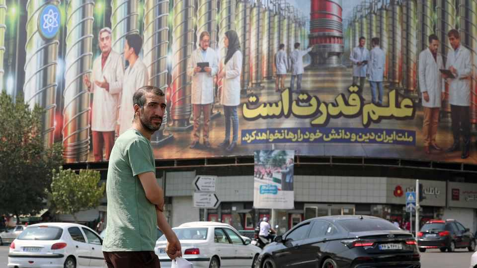

Middle East & Africa | Never-ending negotiations with Iran
Iran’s imminent nuclear dilemma
The prospects for a new deal look slim, but other options are hardly better
September 4th 2025

The nuclear deal of 2015 between Iran and world powers has been a dead letter for years. America withdrew in 2018. Iran stopped meeting its commitments soon after. Rafael Grossi, the head of the UN’s nuclear watchdog, calls it an “empty shell”. Yet in diplomacy as in quantum physics, life and death can be ambiguous. On August 28th Britain, France and Germany notified the UN Security Council that Iran was violating its obligations under the deal, known as the Joint Comprehensive Plan of Action (JCPOA). That started a 30-day countdown to bring Iran back into compliance. If the talks fail, a spate of UN sanctions lifted by the JCPOA, including an arms embargo, will be reimposed.

The process, dubbed “snapback”, was a novel device. Once triggered, the sanctions are automatically restored unless the Security Council votes to do otherwise, which prevents Russia and China from wielding their vetoes to block them.

Iran has been in breach for years. The JCPOA allowed it to stockpile no more than 300kg of uranium enriched to 3.67% purity, the level used for nuclear power. In May the UN’s International Atomic Energy Agency (IAEA) said Iran had accumulated 8,413kg of the stuff, almost 409kg of it refined to 60%, a short hop from weapons-grade. Still, the Europeans had been reluctant to invoke snapback, fearing it might push Iran towards even more belligerence.

The calendar forced their hand. The snapback provision expires on October 18th. Next month Russia assumes the presidency of the Security Council, which might allow it to gum up the works with procedural tricks. Invoking it when they did was the last gasp of a dying agreement.

Now Iran must decide how to respond. Some lawmakers in parliament are pushing for defiance. They have drafted a bill that urges the regime to withdraw from the Nuclear Non-proliferation Treaty (NPT), halt further negotiations with the West and suspend co-operation with the IAEA. The dilemma for Iran is that such steps might provoke a harsh reaction. Withdrawing from the NPT, for example, would be taken as a sign of hostile intent; it risks inviting another round of air strikes from Israel or America, which both bombed Iran’s nuclear facilities in June.

The government could ignore the bill, buying time for talks. “The window of diplomacy is still open,” said Kaja Kallas, the EU’s foreign-policy chief, in a meeting on September 1st with Mr Grossi. Maybe so—but only a crack. Compliance with the old deal would not satisfy Donald Trump, who wants Iran to relinquish its uranium-enrichment programme altogether.

Iran, however, continues to argue that enrichment is a sovereign right. It might compromise on the size of its uranium stockpile, as it did under the JCPOA, but it refuses to dismantle the programme entirely. To avert snapback, in other words, negotiators would have to lay the foundation for a new agreement by the end of the month—a tall order.

That leaves a third option: buy time. Russia has proposed extending the snapback deadline by six months. The Europeans have been willing to discuss the idea, but worry it is a stalling tactic. If the sanctions are reimposed, Iran may wager it can cope. Some of its big trading partners are liable to ignore them, and a chaotic Trump administration may struggle to rally the UN to enforce them. Iran could offer to talk with America about a new deal and with the IAEA about renewed inspections.

The concern is that Iran might use the time to restart its nuclear programme. No one can say for certain how badly it was battered by the strikes this summer. The iaea has not been allowed to visit the most sensitive sites since the war. Mr Trump continues to claim that they were obliterated. Some of America’s diplomats and spies think this assessment too rosy, but dare not contradict him in public.

The damage was no doubt severe. Without proper inspections, though, Iran’s nuclear programme has entered its own state of quantum uncertainty, making it hard to know when the next moment of crisis will occur. ■

Sign up to the Middle East Dispatch, a weekly newsletter that keeps you in the loop on a fascinating, complex and consequential part of the world.

This article was downloaded by zlibrary from https://www.economist.com//middle-east-and-africa/2025/09/04/irans-imminent- nuclear-dilemma