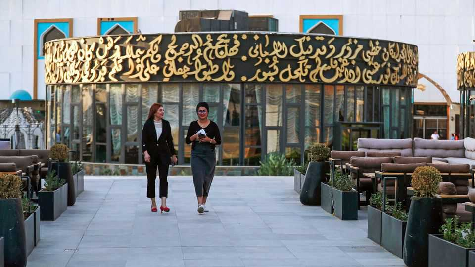

Middle East & Africa | Let the good times roll
The world’s surprise boomtown: Baghdad
Iraq’s population has grown by 20m since America’s invasion
September 4th 2025

Cranes sprout above the Baghdad skyline. The shriek of electric saws echoes across the city. Under the heavy summer sun, workers lay a new pavement outside a chic fromagerie. Baghdad is enjoying a construction boom. Iraq looks remarkably stable—and that is drawing foreign investors and reshaping its capital. The government has big plans “to improve services and infrastructure after years of war and instability”, Muhammad al-Sudani, the prime minister, tells The Economist. Since taking office in October 2022, his government has built 20 new bridges and overpasses in Baghdad (one, an aide claims, in just 80 days). At least four new hospitals have opened, including Iraq’s first dedicated cancer centre and a Korean-designed intensive-care hospital. Over

1,700 schools have been built or rebuilt. Half a dozen posh hotels are set to open. bp has resumed operations and talks are under way with ExxonMobil and Chevron, international oil giants.

Several factors explain the development frenzy. Improved security is helping. By post-2003 standards, Iraq has never been as calm. Reforms in the banking sector have made credit more accessible. Oil and construction revenues that once flowed to Beirut or Geneva are increasingly being spent in Iraq.

Mr Sudani has made it his mission to push public and private projects through Iraq’s sluggish bureaucracy. He often behaves less like a politician and more like a foreman, ringing up managers and making unannounced visits to building sites. He oversees powerful investment committees that can swiftly approve projects. “What we used to do in a year or two, they can now do in one sitting,” says Namir al-Akabi, chairman of Amwaj, one of Iraq’s largest real-estate firms, which is throwing up apartment blocks across Baghdad.

Progress goes beyond the capital. Mr Sudani has digitised many government services. The passport office in Baghdad issues new travel documents within 45 minutes; officials claim they are the fastest in the world. Until 2023, annual customs income had never exceeded 900bn Iraqi dinars ($690m). This year it is expected to exceed 3trn dinars. The days of dodging fees by importing containers of iPhones as bananas are over, thanks to digitisation, says one un official.

Government salaries are no longer paid in cash. Payments for government services, such as those speedy new passports, can be made only with a bank card. Five years ago almost no one in Iraq had one; today they are essential.

Other changes have proved trickier. Notably Mr Sudani has avoided direct confrontation with the Iranian-backed militias that have allowed the Islamic Republic to control much of Iraq’s politics and economy. “I want them to invest. I want them to get busy with prosperity. I want to divert them from violence,” he has said, according to an ally. Many have indeed formed companies and are bidding for government contracts. Iran’s proxies in Iraq

stayed out of its 12-day war with Israel, perhaps vindicating Mr Sudani. “The cats got too fat to fight,” says one Iraqi observer.

But others argue that Mr Sudani’s approach simply gives the militias cover to enrich themselves and tighten their grip on the state. Critics say that the prime minister is merely folding them into the state without holding them accountable. In July fighters from Kataib Hizbullah, a militia with close ties to Iran, raided an office at the ministry of agriculture to protect a director accused of corruption facing dismissal. Mr Sudani promised to bring those responsible to justice. But so far he has not done so. Instead, the incident has shown how free the militias are to act when their interests are threatened.

Few believe Mr Sudani can confront them head on. The failure of Iraqi forces to rescue Elizabeth Tsurkov, a Russian-Israeli researcher kidnapped in Baghdad by Kataib Hizbullah in 2023, highlights the limits of Mr Sudani’s power. “I don’t know where she is,” he said. “If we knew, we would have gone and brought her back… Give us a point, a location in Iraq, and our security forces will arrest her kidnappers and release her.”

Mr Sudani’s record has other holes. He has done little to slim down Iraq’s bloated civil service: over 10m Iraqis draw government pay cheques— among the world’s highest public-to-private ratios. His efforts to reform Iraq’s energy have failed, largely due to resistance from groups linked to the militias. Corruption persists.

Iraq’s potential is nonetheless enormous. Its population, around 46m according to a census in 2024, is young and growing by nearly a million each year. There are now 20m more Iraqis than there were before the American invasion.

Elections are due in November. Mr Sudani wants a second term to finish what he has started. But even if Iraqis welcome his reforms, they may not ensure his victory. Many in the Shia Co-ordination Framework, an umbrella group for Iran-backed factions, see Mr Sudani as a threat to their interests. If they unite against him, his progress could prove fleeting. ■

Sign up to the Middle East Dispatch, a weekly newsletter that keeps you in the loop on a fascinating, complex and consequential part of the world.

This article was downloaded by zlibrary from https://www.economist.com//middle-east-and-africa/2025/09/04/the-worlds-surprise- boomtown-baghdad