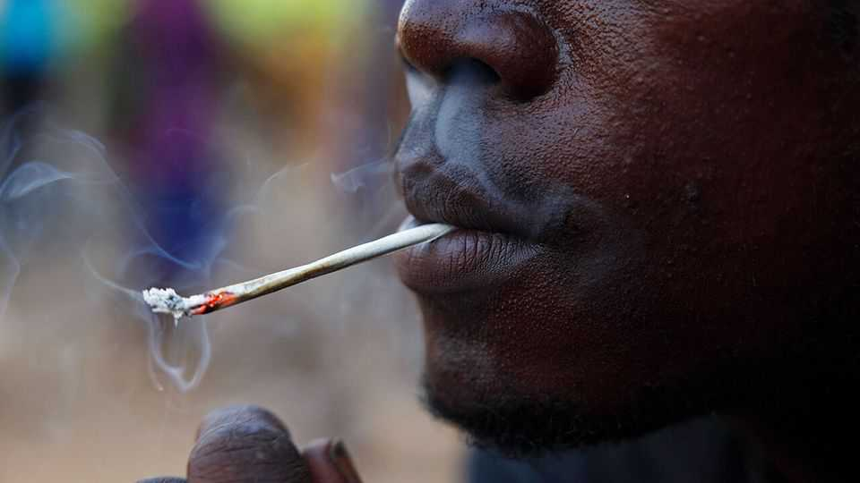

Middle East & Africa | Dangerous highs
A terrifying synthetic-drug surge in Africa
The new drugs are cheap, addictive and hard to police
September 4th 2025

NYEMA SLIPS through the back door of a support centre for young people in Freetown, the capital of Sierra Leone. “I don’t want them to search my bag,” the 25-year-old former student explains her reason for avoiding the front entrance. She first discovered the centre when its volunteers offered her pre-exposure prophylaxis to protect her from HIV. But today she is back for help with something else: staying off kush, a potent mix of synthetic opioids and cannabinoids. Nyema is one of countless youngsters in Sierra Leone and across west Africa who are struggling with addiction to kush. Cheap, highly addictive drugs based on synthetic opioids have swept the region’s streets and campuses. Governments have had little success in stemming the epidemic.

Combined with the lack of jobs and opportunities in African countries, the drugs’ spread threatens the future prospects of many young Africans.

It is not the first drug epidemic to menace west Africa. Sierra Leone has long been a regional gateway for cocaine and heroin. Tramadol, a painkiller used to help with opioid withdrawal, became a popular street drug in the 2010s, shipped mostly through Nigeria but travelling as far inland as Niger. Regulatory changes in 2018 in India, where most of it was sourced, made it more expensive, dampening demand.

Yet kush, which has partly filled the gap left by tramadol, is more dangerous. It is cheap, at just $0.40 a dose, and extremely addictive. Recent testing by the Global Initiative against Transnational Organised Crime, an NGO, found many varieties contain nitazenes, a relatively new class of synthetic opioids that are also thought to be responsible for an increase in drug deaths in Britain. They can be 25 times more potent than fentanyl, a main culprit of America’s opioid epidemic that is itself 50 times more potent than heroin, meaning users need only a small amount to achieve the same effect.

As with fentanyl in America, the psychoactive ingredients are easy to import and cook up in local back-room kitchens. This keeps prices low and makes it harder to crack down on the trade. Components are shipped via courier services from China, Britain and the Netherlands, often disguised as mechanical lubricants or “flavour sprays”. They are then dissolved in acetone (sold as nail-polish remover). The liquid is sprayed on marshmallow leaves, which are ground into powder and smoked. Users rarely know exactly what they are taking, increasing the risk of accidental overdoses. In Sierra Leone, dealers are increasing the potency as customers have built up tolerance to “milder” varieties.

The drug is wrecking lives. Like Nyema, many users first try it as students and end up dropping out of school or university. Dr George Eze, a professor at the psychiatric hospital in Freetown, says most kush users he has treated had some education. “The dizziness, the sleepiness, you’ll sleep your future away,” says Nyema.

Kush use is associated with self-harm and psychosis. The first patient Dr Eze saw for a kush addiction had lacerations down his arm after he smashed it through a television screen, adamant that he saw his girlfriend on it. Kush also aggravates other health risks. Malnutrition from suppressed appetite makes users vulnerable to other diseases. Many end up selling sex to fund their addiction, putting them at increased risk of sexually transmitted infections.

Precise numbers on the toll are hard to come by, but a report by the Clingendael Institute, a Dutch think-tank, estimated in February that kush had killed thousands of people across west Africa. Everyone your correspondent met in Freetown knew at least one addict. The mayor has set up a dedicated burial team to collect the bodies of those who have died on the capital’s streets of overdoses or diseases worsened by kush use. Sierra Leone has been holding mass burials and cremations of victims since 2022. The country’s only psychiatric hospital is treating many more people for conditions associated with drug use than it did just a few years ago.

Governments are aware of the problem. Sierra Leone and neighbouring Liberia declared a public-health emergency in early 2024 following a steep increase in deaths and hospitalisations related to kush. In Sierra Leone, a new task-force set up by the president and spanning multiple ministries is supposed to tackle the crisis. “We identify drug users, we take them into facilities, go through rehab and then try to reintegrate them,” says Foday Sahr, who runs the task-force. The anti-drug agency is stepping up efforts to alert people to the dangers of kush. Mr Sahr claims that the number of drug- related deaths has been declining for the past year as a result of government action. However, he admits that drug use is not going down.

African governments may make some headway by increasing funding for task-forces like Mr Sahr’s, improving co-operation between regional authorities and modernising anti-drug policy, which currently penalises users and those “hanging around” drug dens, but does little to deter dealers and producers. Yet reining in the epidemic would require a global effort to clamp down on supply chains, including closer scrutiny of Chinese exports and tighter controls on synthetic opioids in Europe. Governments also need equipment to test what they are dealing with.

Little of that is forthcoming. For now, countries are left with piecemeal efforts to wean people off kush or at least protect them from the worst consequences of addiction. Withdrawal is difficult and can be fatal. Nyema says she last smoked kush “yesterday” and begins to cry. “It’s a part of me now…but I’m reducing it. I’m trying.”■

Sign up to the Analysing Africa, a weekly newsletter that keeps you in the loop about the world’s youngest—and least understood—continent.

This article was downloaded by zlibrary from https://www.economist.com//middle-east-and-africa/2025/09/04/a-terrifying- synthetic-drug-surge-in-africa